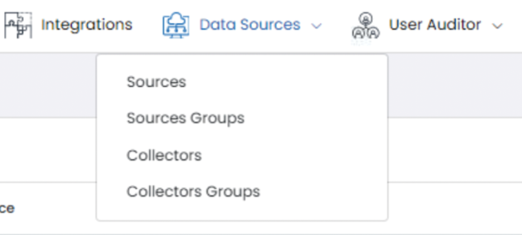
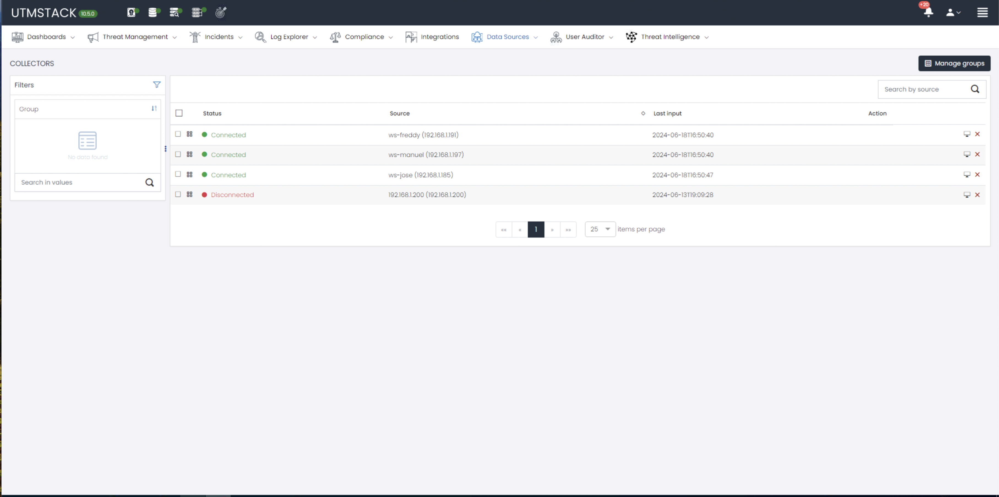
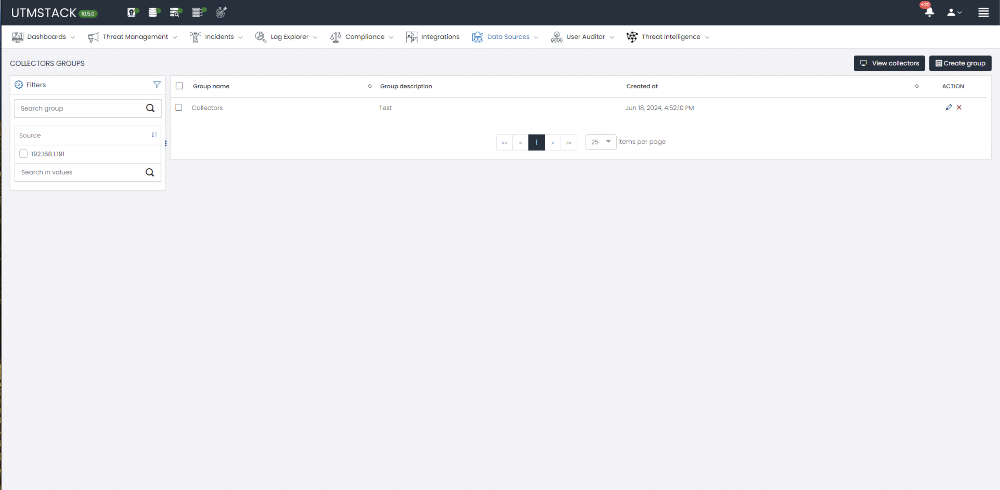

# Collectors

The new 'Collector Management' view allows users to manage installed collectors. This functionality is designed to improve the monitoring and control of collectors within the network.

## New Features in the Data Sources Menu

The latest update introduces enhanced functionalities within the "Data Sources" menu, specifically under the "Collectors" and "Collectors Groups" sections. These new features are designed to streamline the management and organization of data collectors and their groups.

## Collectors
Collector Management View: This new view allows users to efficiently manage installed collectors. Users can view, edit, and update collector configurations directly through this interface.

## Group Assignment

### Description:
Allows users to assign collectors to different groups for organized management.

### Steps to use this feature:

Select the desired collectors.
1. Choose a group from the dropdown list.
2. Confirm the assignment.
3. Filtering by Names

## Filtering by Names

### Description: 
Facilitates the search for specific collectors using a name filtering system.

1. Enter the name of the collector in the search field.
2. The results will automatically update to show only the collectors that match.

## View Collector Details

### Description: 
Allows viewing detailed information about each collector.

1. Click on the desired collector.
2. A window will display all the relevant details.

### Deletion of Collectors
### Description: 
Offers the option to delete collectors that are no longer needed.

## Collector Groups

Group Management Tools: Users can now create, modify, and manage groups of collectors. This functionality aids in organizing collectors according to different criteria or operational needs, enhancing overall network management.

