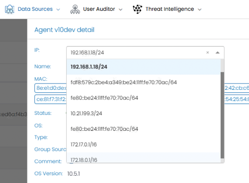

# Data Sources in UTMStack

The **Data Sources** section in UTMStack allows managing and monitoring data collectors from various devices and platforms. The interface includes the following features:

## Filters
- **Group**: Filter sources by assigned group.
- **Type**: Filter by collector type (e.g., `generic`, `wineventlog`, `linux`).
- **Search in values**: Search sources by name or IP address.

## Sources Table
The table displays detailed information for each source:
- **Status**: Indicates connection status:
  - `All connected`: All sources are connected.
  - `Connected`: Source is connected and sending data.
  - `Disconnected`: Source is offline or not sending data.
- **Source**: Name or IP address of the source.
- **Types**: Collector type:
  - `generic`: Generic data source.
  - `wineventlog`: Windows event log collector.
  - `linux`: Linux log collector.
- **Last Input**: Date and time of the last received input.
- **Action**: Manage each source:
  - Delete (`X`) a source.
  - View source details (`screen icon`).

## Actions and Management
- **Manage source view**: Customize the table view.
- **Manage groups**: Organize sources into custom groups.
- **Add device**: Add new data sources to the system.
- **Search by source**: Quick search by name or IP address.

## Pagination and Display
- **Items per page**: Control the number of visible sources per page.
- Page navigation to access all registered sources.

## Usage Example
In the example shown:
- Sources are monitored with different statuses (`Connected`, `Disconnected`).
- Collectors of type `generic`, `wineventlog`, and `linux` are used.
- Last input is displayed for each source, helping identify inactive sources.

This section allows efficient management of data sources for continuous and effective security monitoring.

## Automatic Hostname and IP Address Update

### Feature Description
In UTMStack, **agents** now have the capability to automatically update the **hostname** when the machine name changes. Additionally, it is now possible to **update the IP address** directly from the agent's detail screen.

### How It Works
1. **Hostname Update**:
   - When the machine's name is changed, the agent automatically detects the change and updates the **hostname** in the host list without manual intervention.
   - This change is immediately reflected in the **sources table**.

2. **IP Address Update**:
   - In the agent detail screen, a list of **IP addresses** associated with the agent is displayed.
   - To update the monitoring IP:
     - Select the **desired IP** from the list.
     - The selected IP is automatically updated in the **corresponding host**.
     - This ensures the agent continues to be monitored correctly without restarting the service or making additional configurations.

### Result

### Benefits
- **Automation**: No need for manual updates of hostname or IP.
- **Continuous Monitoring**: The updated IP ensures continuous security monitoring.
- **Efficiency**: Reduces human errors by automating the update process.