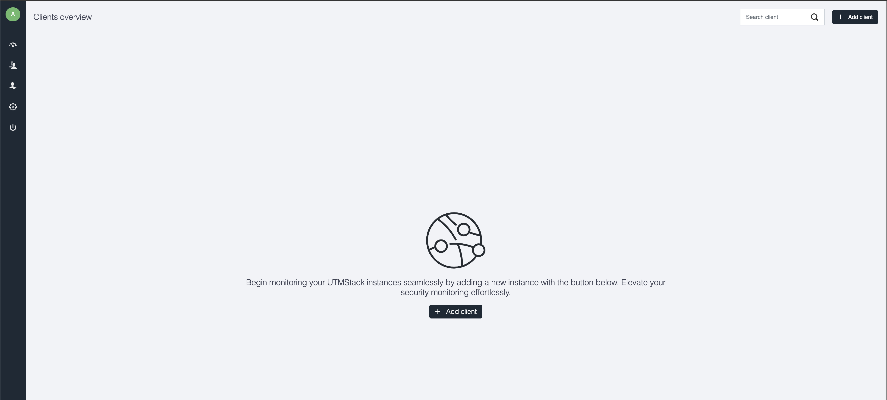
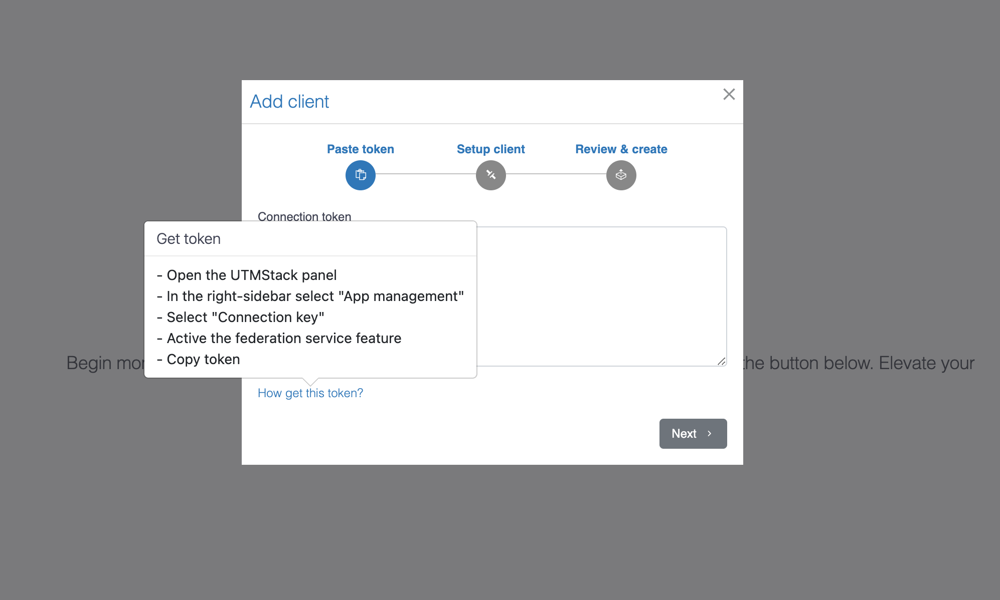
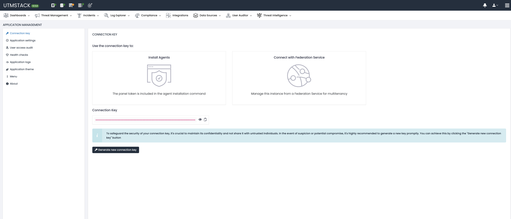
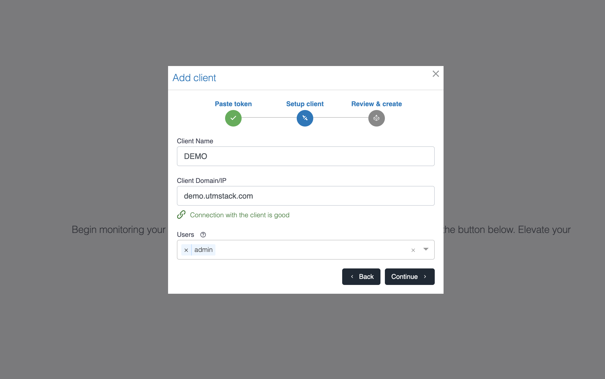
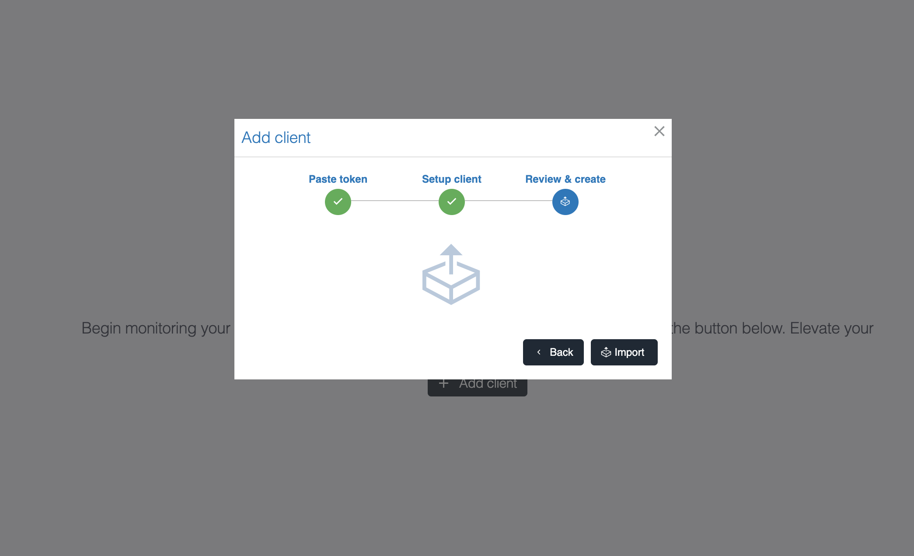
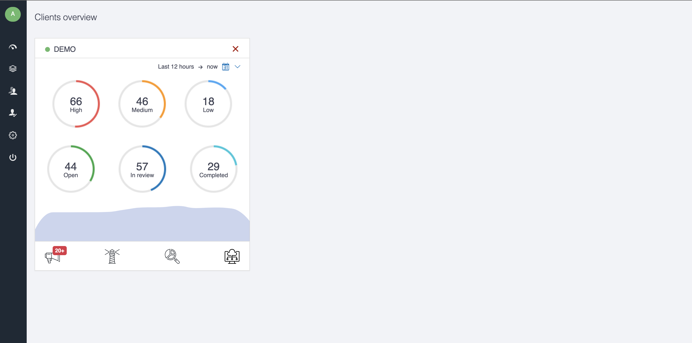

# How to import the UTMStack instance into the Federation Service

This section provides a step-by-step guide on how to import a UTMStack instance into the Federation Service. By following these instructions, you’ll be able to integrate your UTMStack instance, enabling centralized management and enhanced security monitoring across federated environments. This process ensures seamless communication and data sharing between UTMStack and the Federation Service.

### Step 1: Log in to your UTMStack Federation Service instance

### Step 2: Click on + Add Client and follow the steps. Add the connection token of your UTMStack instance.

### Step 3: Copy the connection key and paste it into the Federation Service under + Add Client

### Step 4: Paste the client name, the client domain or IP of your UTMStack instance, and the user {admin}

### Step 5: Click Import to create the box in your UTMStack Federation Services

### Step 6: Finally, you will be able to see your UTMStack instance imported and interact with it.

