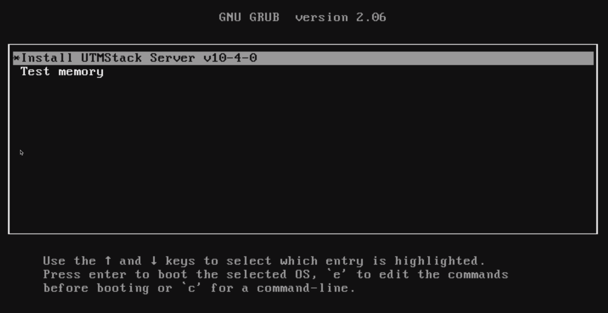
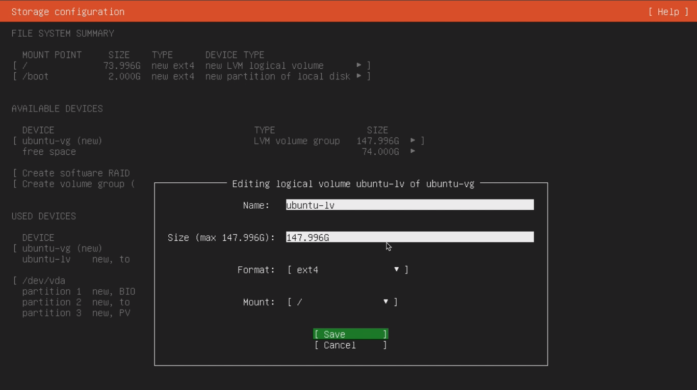
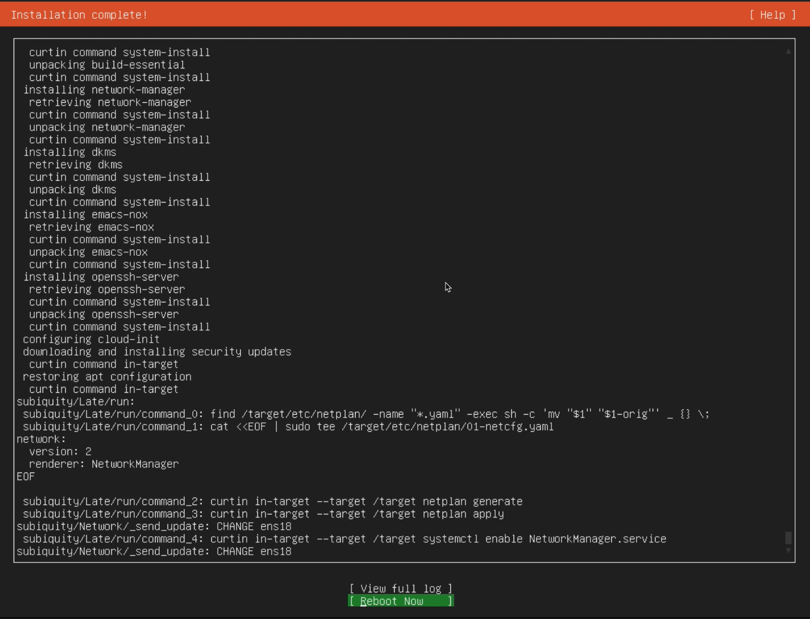
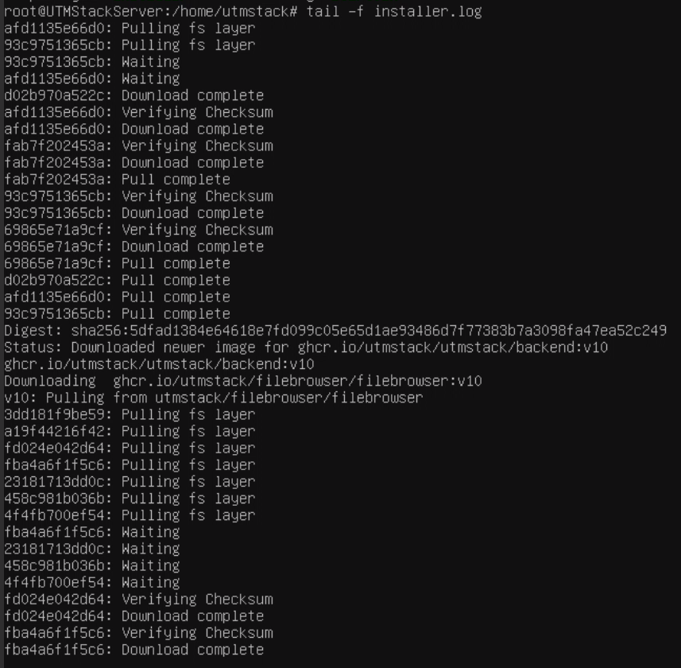
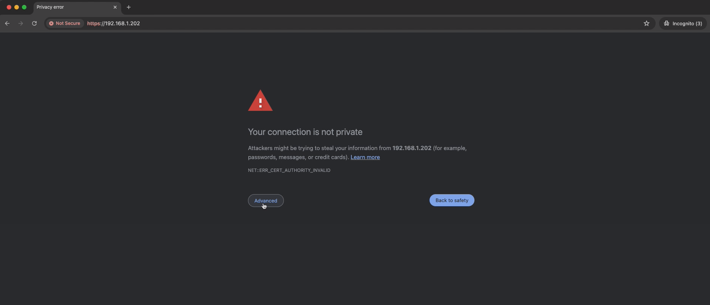
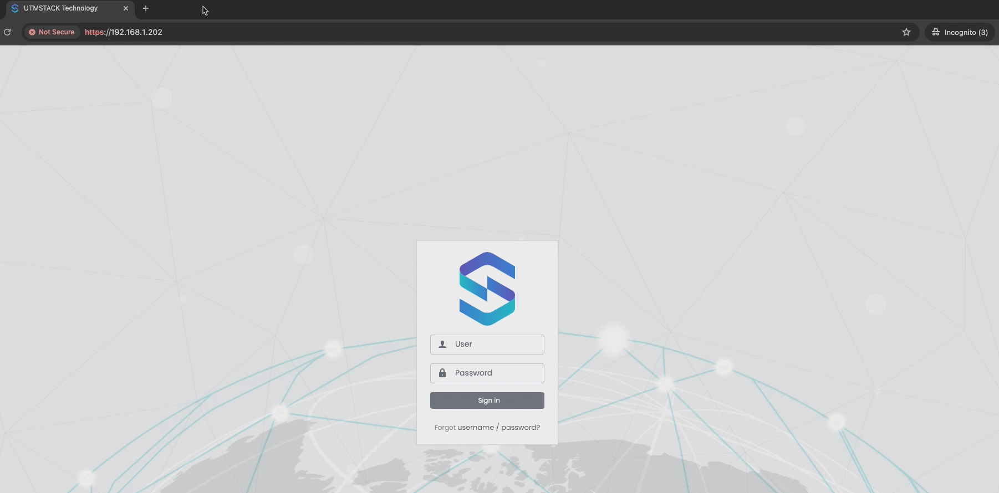

# Introduction to Installing UTMStack from ISO
This section guides you through the step-by-step process of installing UTMStack using an ISO image. Before starting, ensure that your system meets the minimum installation requirements for optimal performance. 

For detailed information on the prerequisites, refer to the **<a href="./SystemRequirements">System Requirements</a>** section before proceeding with the steps outlined in this guide.

### Supported CPU Architectures for Virtualized Environments

#### CPU configuration in virtualized environments can impact system performance and compatibility. UTMStack supports the following CPU architectures in QEMU/KVM environments:

1.	**86-64-v2** (QEMU): Based on the 64-bit x86 architecture with a second-generation instruction set, offering improved compatibility and optimized performance.
2. **86-64-v2-AES (QEMU)**: Similar to x86-64-v2, but with support for encryption acceleration through the AES-NI (Intel Advanced Encryption Standard New Instructions) instruction set, enhancing security and encryption speed for sensitive applications.
3. **86-64-v4 (QEMU)**: A fourth-generation architecture incorporating a broader set of advanced instructions and performance improvements compared to previous versions.
4. **Host (KVM)**: This option allows the virtual machine to use the host processor’s features directly, maximizing performance and compatibility with specific hardware.

### Step 1: Download the ISO
- Visit the official download page and get the latest ISO file. [Download ISO](https://utmstack.com/install/).

### Step 2: Start the Installation Process

1. Once booted, you'll see the **installation menu**. Choose the **Install UTMStack Server** option to begin.
2. Follow the on-screen instructions to configure disk partitions and other settings.



### Step 3: Assign the Disk and Size

1. In this stage, you will be presented with a storage configuration screen where you can edit logical volumes.
2. Select the device and set the size of the logical volume you want to allocate. In this example, the logical volume "ubuntu-lv" is being edited, and its size is configured to the maximum available.
3. Ensure that the format is set to `ext4` and the mount point is `/`.
4. Click **Save** to save the configuration.



### Step 4: Complete the Installation and Reboot

1. Once the installation is complete, you will see a message indicating "Installation complete!".
2. Click on **Reboot Now** to restart the system.



3. After the reboot, the system will prompt you to log in.
   - **Username**: `utmstack`
   - **Password**: `utmstack`

4. Enter the credentials to access the system.

### Step 5: Server Initialization and Automatic Configuration

1. After the reboot, the server will continue to configure automatically. This process might take several minutes depending on your internet speed, as UTMStack is setting up the necessary components.

2. You can monitor the configuration process by using the following commands:
   ```bash
   $ sudo su
   ```
   [enter password for utmstack]
   ```
   # tail -f /home/utmstack/installer.log
   ```


### Step 6: Finalize Installation and Access the Web Interface

1. Once all containers are installed and the stack is restarted, you can verify the final details of the installation by checking the output file shown in: 

```
   # cat /root/utmstack/utmstack.yml
```

2. After confirming that the installation has completed successfully, open a web browser on your computer or virtual machine.

3. Enter the IP address obtained from the previous steps into the browser. 

4. When you see a warning about the connection not being private, click on **Advanced** and then **Proceed** to accept the certificate.



- You will then be redirected to the UTMStack login page.



At this point, your UTMStack installation is fully operational.
