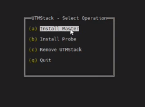
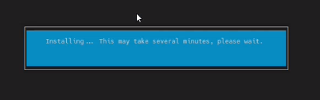
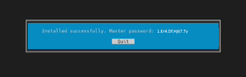

# Linux Installation Guide

This guide will walk you through the process of installing UTMStack on a Linux system using the official installer script. Please follow the steps below to ensure a successful installation.

## Step 1: Prepare the System

Before starting the installation, make sure that your system meets the minimum requirements and is up to date. Run the following commands to update the package list and install the necessary dependencies:

``` bash
sudo apt update
sudo apt install wget
```

## Step 2: Download the Installer Script

Download the latest version of the UTMStack installer script from the official UTMStack website. You can use the following command to retrieve the script:

``` bash
wget http://github.com/AtlasInsideCorp/UTMStackInstaller/releases/latest/download/installer

```

## Step 3: Grant Execution Permissions

Change to the root user to ensure proper execution of the installer script:

``` bash
sudo su
```

Set execution permissions for the installer script using the following command:

``` bash
chmod +x installer
```

## Step 4: Run the Installer

Now, you are ready to run the installer script and begin the installation process. The installer script provides two options for installation: with or without parameters.

### Installation Options
When using the CLI for the UTMStack installation, you have the option of installing with or without parameters.

### Without Parameters (Unattended Installation)
To perform an unattended installation, execute the installer without any parameters:

``` bash
./installer
```

### With Parameters
If you prefer to customize the installation process, you can use parameters to define specific configurations. For example, to install UTMStack as a master server and set the database password, use the following command:

``` bash
./installer master --db-pass "ExAmP1EpaSSWORD"
```

Make sure to replace "ExAmP1EpaSSWORD" with your desired password. 

For probe installation, use the following command:

``` bash
./installer probe --db-pass "Master's DB password" --host "Master's IP or FQDN"

```

Replace "Master's DB password" with the actual password for the master server's database, and "Master's IP or FQDN" with the IP address or fully qualified domain name of the master server.

{: .note}
UTMStack password requirements
at least 3 capital case letters.
at least 5 lower case letters.
at least 5 numbers.
at least 3 special characters.
Allowed special characters: , . _

After executing the installer script with the desired parameters, you will see a screen like the following:




Select the appropriate option based on the type of installation you are performing. 

Once the installation begins, you will see a progress screen like the following:



The installer script will take care of downloading the necessary packages, configuring them according to your specified parameters, and deploying them onto the respective machines.

Please note that the installation process may take some time depending on the system and the options selected.

When the installation is complete, you will see a message box displaying "Installation Successful" along with the master password. **It is crucial to save this password for future use**:



{: .important}
Trubleshooting:
If you find any errors during the installation, please check the installation log for more details: /var/log/utm-setup.log

{: .note}
You can found the password and other generated configurations in /root/utmstack.yml

## Step 5: Configuration of UTMStack
After successfully installing UTMStack on your servers, it is important to configure the necessary services to ensure proper functionality. This step involves setting up best-practice firewall rulesets to control network traffic effectively. Additionally, you have the option to integrate third-party applications like M365 to enhance UTMStack's capabilities.

To learn more about the specific firewall rules you need to create for UTMStack, please refer to the **<a href="./FirewallRules.md">Firewall Rules</a>** section for detailed instructions.


## Step 6:  Installing and Configuring an SSL/TLS certificate

Step 1: Switch to the root user

``` bash
sudo su
```

Step 2: Stop the frontend container

``` bash
docker stop frontend
```
Stopping the frontend container ensures that the web server is temporarily halted, allowing for necessary changes to be made to the server configuration.

Step 3: Install NGINX and start it

``` bash
apt install nginx
systemctl start nginx
```
This command installs the NGINX web server, which will be responsible for serving the website and handling HTTPS connections.

Step 4:  Install Certbot with NGINX plugin

``` bash
apt-get install certbot python3-certbot-nginx
```

This command installs Certbot, a tool for obtaining and managing SSL/TLS certificates, along with the NGINX plugin, which enables seamless integration between Certbot and NGINX.

Step 5: Obtain and install the certificate (Example using Let's Encrypt)

``` bash
certbot certonly --preferred-challenges=dns --email your_email@example.com --agree-tos -d your_domain.com
```

In this example, we are using a certificate from Let's Encrypt as a demonstration. Let's Encrypt provides free SSL/TLS certificates that are valid for 90 days.

Step 6: Disable NGINX

``` bash
systemctl disable nginx
```

Step 7: Copy the certificate files

To use your custom certificate with UTMStack, you need to copy the certificate and private key files to the appropriate location on the server. Follow these steps:

1. Upload both files to the server into the folder /utmstack/cert/.

2. Rename the certificate file to utm.crt and the private key file to utm.key.

``` bash
cp /etc/letsencrypt/live/your_domain.com/fullchain.pem /utmstack/cert/utm.crt
cp /etc/letsencrypt/live/your_domain.com/privkey.pem /utmstack/cert/utm.key
```

Make sure to replace your_domain.com with the actual domain name for which you obtained the certificate.

By copying the certificate and private key files to the specified location, UTMStack will be able to use the custom certificate for secure communication.

Step 8: Start the frontend container

``` bash
docker start frontend
```

Step 9: Restart other services

``` bash
docker restart logstash
```

Step 10: Optional - Verify the running containers

``` bash
docker ps
```

This command lists the currently running Docker containers, allowing you to confirm that the necessary containers, including the frontend and other relevant services, are running as expected.


## Step 7: Accessing the UTMStack Platform
Once you have successfully installed the UTMStack master server, you can now access the platform and start using it for your cybersecurity needs. Follow these steps to log in to the UTMStack platform:

Open your preferred web browser.

Enter the HTTPS URL of your server's name or IP address in the browser's address bar. For example, if your server's IP address is 192.168.0.100, you would enter https://192.168.0.100.

Press Enter to load the UTMStack login page.


On the login page, you will be prompted to enter your admin username and password.

Enter "admin" as username and the password that was generated by the installer for the default user.

Click on the "Sign In" button to authenticate and access the UTMStack platform.
