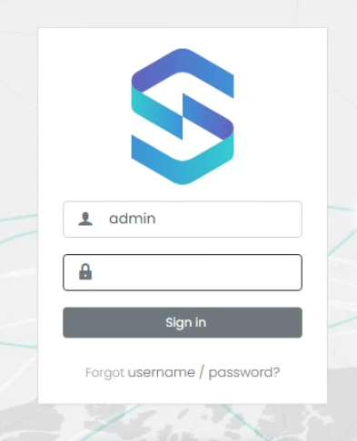

# UTMStack Server Setup Guide

This guide will walk you through the process of setting up the UTMStack Server. The server is the central component of UTMStack and is responsible for managing the security operations and data collection.

# Linux Installation Guide

This guide will walk you through the process of installing UTMStack on a Linux system using the official installer script. Please follow the steps below to ensure a successful installation.

## Step 1: Prepare the System

Before starting the installation, make sure that your system meets the minimum requirements and is up to date. 

Please refer to the **<a href="./SystemRequirements">System Requirements</a>** page in the UTMStack documentation for detailed information about the recommended specifications for your environment.

Execute the following commands to update the package list and install the required dependencies on your Ubuntu 22.04 LTS system:

``` bash
sudo apt update
sudo apt install wget
```

## Step 2: Download the Installer Script

Download the latest version of the UTMStack installer script from the official UTMStack website. You can use the following command to retrieve the script:

``` bash
wget http://github.com/utmstack/UTMStack/releases/latest/download/installer

```

## Step 3: Grant Execution Permissions

Change to the root user to ensure proper execution of the installer script:

``` bash
sudo su
```

Set execution permissions for the installer script using the following command:

``` bash
chmod +x installer
```

## Step 4: Run the Installer

Now, you are ready to run the installer script and begin the installation process.

Execute the installer without parameters:

``` bash
./installer
```


The installer script will take care of downloading the necessary packages.

Please note that the installation process may take some time depending on the system and the options selected.


{: .important}
Trubleshooting:
If you find any errors during the installation, please check the installation log for more details: /var/log/utm-setup.log

{: .note}
You can find the password and other generated configurations in /root/UTMStack.yml

## Step 5: Configuration of UTMStack
After successfully installing UTMStack on your servers, it is important to configure the necessary services to ensure proper functionality. This step involves setting up best-practice firewall rulesets to control network traffic effectively. Additionally, you have the option to integrate third-party applications like M365 to enhance UTMStack's capabilities.

To learn more about the specific firewall rules you need to create for UTMStack, please refer to the **<a href="./FirewallRules">Firewall Rules</a>** section for detailed instructions.


## Step 6:  Installing and Configuring an SSL/TLS certificate

Go to **<a href="./SSLConfiguration">Configuring an SSL/TLS certificate</a>** section for detailed instructions.

## Step 7: Accessing the UTMStack Platform
Once you have successfully installed the UTMStack server, you can now access the platform and start using it for your cybersecurity needs. Follow these steps to log in to the UTMStack platform:

Open your preferred web browser.

Enter the HTTPS URL of your server's name or IP address in the browser's address bar. For example, if your server's IP address is 192.168.0.100, you would enter https://192.168.0.100.

Press Enter to load the UTMStack login page.



Once UTMStack is installed, use admin as the user and the password generated during the installation for the default user to login. You can find the password and other generated configurations in /root/UTMStack.

{: .note}
Note: Use HTTPS in front of your server name or IP to access the login page.

{: .note-title }
> Default credentials for Ubuntu Server when using the ISO installer:
>
>  User: utmstack
>  Password: utmstack

Click on the "Sign In" button to authenticate and access the UTMStack platform.
