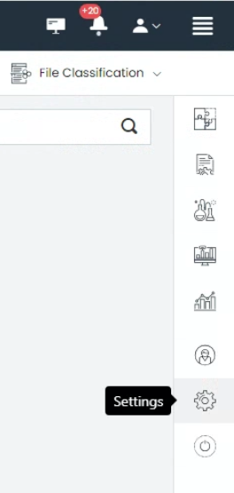
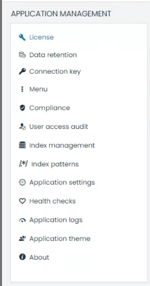

# UTMStack Installation Guide

Welcome to the UTMStack installation guide. This guide will walk you through the step-by-step process of installing UTMStack, ensuring a seamless setup and configuration of the platform. Please follow the instructions carefully to ensure a successful installation.

## System Requirements

Before proceeding with the installation, it is important to ensure that your system meets the minimum requirements to run UTMStack effectively. Please refer to the **<a href="./SystemRequirements">System Requirements</a>** page in the UTMStack documentation for detailed information about the recommended specifications for your environment.

## Installation Steps
The UTMStack installation process consists of three main steps:

1. **Choose the Architecture**: Before starting the installation, you need to decide on the architecture for your UTMStack deployment. This step determines the components and services that will be installed. Refer to the  **<a href="./Architecture">Architecture Page</a>** for a detailed description of each architecture option.
     

2. **Installing the Federated Service (Optional)**:
  If you have chosen the Federated architecture in Step 1, follow the instructions in the  **<a href="./FederationServiceInstallation">Federated Server Installation Guide</a>** after ensuring your system meets the recommended specifications mentioned in the **<a href="SystemRequirements">Federated Service Requirements</a>** page.
   

1. **Setting up the Master Servers**: The master server is the central component of the UTMStack architecture, responsible for managing and coordinating all other UTMStack components and services.
 
    To set up the master server, you need to create a virtual machine (VM) or physical machine that will host the UTMStack software. The VM should have a requirements of **4 cores**, **8 GB of RAM** and **256 GB of disk storage** for each **50 devices**. (Assuming you will retain 30 days of live logs). Once the VM is created, it needs to be configured with the operating system **Ubuntu Server 22.04 LTS**.
   
   *** Integration Requirements *** : To ensure optimal system performance, certain additional requirements beyond the minimums must be considered. Each integration being introduced should reserve at least 1GB of space. This reservation is crucial to ensure proper data storage and efficient system operation as a whole.

   *** Logging Volume Considerations ***: Furthermore, it's important to take into account the volume of logs generated and processed within 10-minute intervals. If this volume exceeds 1GB within any time interval, immediate communication with the support team is required. This communication is essential to ensure system stability and performance, as well as to address any potential issues related to log management.

     For detailed instructions on setting up the master servers, please refer to the **<a href="./MasterServerInstallation">Master Server Setup Guide</a>** in the UTMStack documentation.
     

4. **Personalizing and Configuring UTMStack**: Once you have completed the installation of UTMStack, the next step is to personalize and configure the UTMStack services to optimize its performance and functionality. Follow the instructions below to personalize and configure UTMStack:

    1. **Access UTMStack Management Interface**: Open a web browser and enter the URL or IP address to access the UTMStack management interface.

    2. **Log in**: Use the provided credentials to log in to the UTMStack management interface.

    3. **Navigate to Settings**: Locate the settings menu, accessible through a hamburger menu icon on the right side of the interface.
   
   

    4. **Personalize UTMStack**: Explore the various settings modules available, such as license, data retention, compliance, user access audit, and more. Customize these settings according to your organization's needs and security policies.

    

     For more detailed instructions on settings , please refer to the **<a href="../UTMStackComponents/Configuration/Readme">Configuration Section</a>** in the UTMStack documentation.
     

    5. **Save and Verify**: Save the configurations and ensure that all UTMStack services are running correctly. Verify that the desired functionality is achieved and that the system is operating optimally.

    By personalizing and configuring UTMStack, you can tailor the system to meet your organization's specific needs and optimize its performance for effective log management and security monitoring.

Congratulations! You have successfully completed the installation process for UTMStack. Ensure that you perform thorough testing and verification to confirm the proper functioning of the platform.