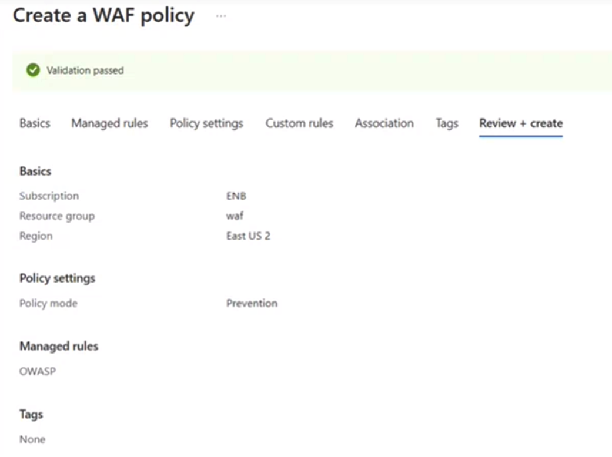
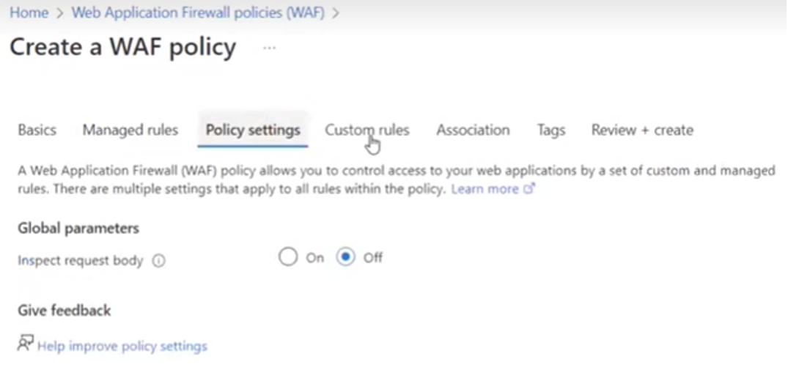
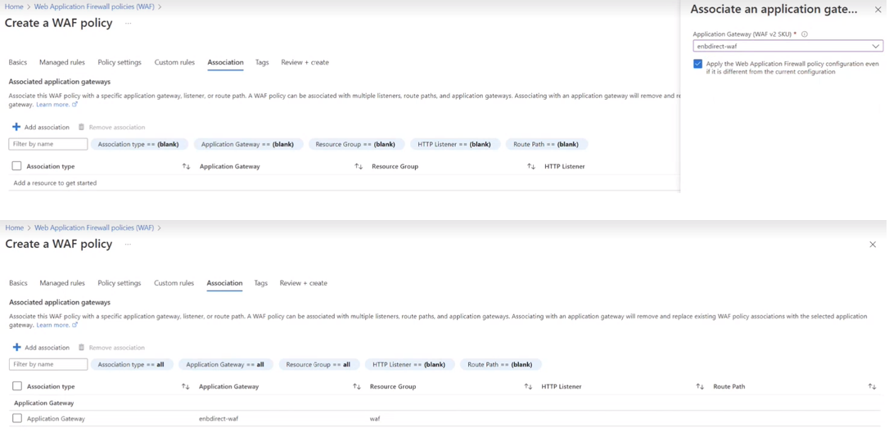

# Installing a WAF Policy: A Step-by-Step Guide

Azure Web Application Firewall (WAF) is a cloud-native service that protects web apps from common web-hacking techniques such as SQL injection and security vulnerabilities such as cross-site scripting.

Installing a WAF policy is a critical step in protecting your web applications from security threats. With the right guidance, the process can be straightforward. This step-by-step guide will walk you through setting up a WAF policy on Microsoft Azure's portal, including configuring the policy's settings, managing rules, and associating it with a Front Door profile. By following these instructions and regularly testing and monitoring, you can ensure that your WAF policy effectively safeguards your web applications against common attack vectors.

## Installing WAF Policy

1. Access the Microsoft Azure portal and use the search engine at the top of the screen to search for and select "Web Application Firewall (WAF) policy."

2. On the Basics tab of the Create WAF policy page, provide the following information and accept the defaults for the rest of the configuration:

| Configuration            | Value|
|--------------------------|-----------------|
| Directive of (Policy for)| Select WAF global (Front Door)|
| Subscription             | Select your Azure subscription   |
| Resource group           | Select the name of the Front Door resource group  |
| Name of the board        | Type a unique name for the WAF policy |
| Directive Status         | Set to Enabled    |
| Policy mode              | Select Prevention |

1. In the Managed rules section, configure the same rules that are active in production. For example, if there are 3 rules unchecked in the "Request-Application-Attack-SQLI" policy, ensure those rules are also disabled in this configuration.

2. In Policy settings the default values are left as follows:
   

3. Under Association select + Associate a Front Door profile, enter the following settings and select Add:

      

4. Perform tests to ensure that the WAF is working properly.
5. 
6. Monitor the WAF regularly to detect and correct any issues.

By following these steps and regularly testing and monitoring your WAF policy, you can effectively protect your web applications from security threats.