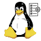
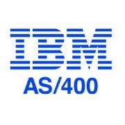
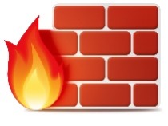
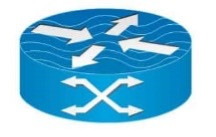
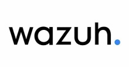

# UTMStack Integrations

UTMStack comes out of the box with a wide range of built-in integrations for most mainstream technologies.
Enabling an integration allows UTMStack to correlate logs coming from the corresponding data source on your network and detecting threats reliably.
Each specific integration has its own guide.
Our team is always working on a new integration, but here is the list of what we have developed so far:

| No. | Name                          |                                                                                                                                  |
| :-: | :---------------------------- | :------------------------------------------------------------------------------------------------------------------------------: |
|  1  | VMWare Syslog                 |                                                     |
|  2  | Windows Agent                 |                                 |
|  3  | Syslog                        |                                                     |
|  4  | Linux Agent                   |                                       |
|  5  | SOC AI                        |                                                      |
|  6  | ESET Endpoint Protection      |           |
|  7  | Kaspersky Security            |                  |
|  8  | Bitdefender                   |                                      |
|  9  | Traefik                       |                                                  |
| 10  | Google Cloud Platform         |                  |
| 11  | AWS Cloudwatch                |                                   |
| 12  | Office365                     |                                            |
| 13  | Azure                         |                                                        |
| 14  | Logstash                      |                                               |
| 15  | MongoDB                       |                                                  |
| 16  | MySQL                         |                                                        |
| 17  | Redis                         |                                                        |
| 18  | Kafka                         |                                                        |
| 19  | Elasticsearch                 |                                |
| 20  | PostgreSQL                    |                                         |
| 21  | Kibana                        |                                                     |
| 22  | Cisco Switch                  |                                          |
| 23  | Cisco ASA                     |                                                |
| 24  | Cisco Meraki                  |                                    |
| 25  | FortiGate                     |                                            |
| 26  | Sophos XG                     |                                               |
| 27  | Fire Power                    |                                          |
| 28  | MikroTik                      |                                               |
| 29  | Palo Alto                     |                                             |
| 30  | SonicWall                     |                                            |
| 31  | GitHub                        |                                                     |
| 32  | Nats                          |                                                           |
| 33  | Json Input                    |                                               |
| 34  | MacOS                         |                                                        |
| 35  | OsQuery                       |                                                  |
| 36  | Linux Auditing Demon          |                  |
| 37  | Deceptive Bytes               |                           |
| 38  | High Availability Proxy       |                |
| 39  | File Classification           |               |
| 40  | Apache                        |                                                    |
| 41  | Internet Information Services |          |
| 42  | Nginx                         |                                                        |
| 43  | Sophos Central                |                              |
| 44  | SentinelOne Endpoint Security |  |
| 45  | IBM AS400                     |                                             |
| 46  | UFW                           |                                                              |
| 47  | Rsyslog                       |                                                  |
| 48  | Netflow                       |                                                  |
| 59  | Salesforce                    |                                         |
| 50  | Suricata                      |                                               |
| 51  | Wazuh                         |                                                        |
| 52  | ESET NOD32                    |                                          |
| 53  | FortiWeb                      |                                              |
| 54  | IBM AIX                       |                                                   |
| 55  | Check Point                   |                                       |
| 56  | pfSense                       |                                                  |
