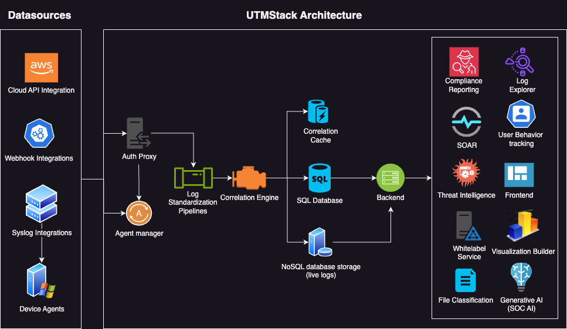

# UTMStack: Elevate Your Cybersecurity with Open Source SIEM and XDR

Welcome to the UTMStack documentation - your passport to the future of cybersecurity. 

## [Experience UTMStack in Action!](https://utmstack.com/demo)

## Unleashing Power and Precision
UTMStack is not just another security tool; it is a revolutionary system blending SIEM (Security Information and Event Management) and XDR (Extended Detection and Response) technologies, transforming them into a powerhouse of real-time correlation and threat intelligence. 

### **Why UTMStack?**
- **Real-Time Threat Intelligence**: Armed with over 30 billion Indicators of Compromise (IoC), UTMStack identifies and mitigates threats in real-time.
- **AI-Powered Analysis**: Experience the synergy of human expertise and artificial intelligence ensuring precise threat detection and response.
- **Holistic View**: Seamless integration with the existing infrastructure for a comprehensive view of your security posture.
- **Compliance Management**: Effortlessly meet GDPR, GLBA, HIPAA, SOC, and ISO standards.

[Watch How UTMStack Transforms Security Management](https://www.youtube.com/watch?v=Rqbl65cJMuA)

## Combat Advanced Persistent Threats (APTs)
In the evolving digital landscape, APTs represent a sophisticated and stealthy menace. UTMStack is your fortress, a meticulous guardian that tirelessly works to identify and neutralize intricate threats employing real-time log data correlation, threat intelligence, and malware activity patterns from diverse sources.

## How UTMStack Stands Apart
Your antivirus might be a formidable defense against malware, but when it comes to APTs, UTMStack takes cybersecurity to the next level.

### **Adaptable and Intelligent**
- **AI Integration**: Streamline alert investigations and classification, reducing analyst workload and enhancing accuracy.
- **Real-Time Action**: Swift detection and responsive actions against threats ensuring your organization's digital safety.

[Discover the Intelligence of UTMStack](https://www.youtube.com/watch?v=lKkydWFiu4Y)

## Compliance and Security Hand in Hand
Navigating the intricate web of regulatory requirements is effortless with UTMStack. From HIPAA to GDPR, achieve and demonstrate compliance with intuitive dashboards and detailed reports. Every log, every alert, every action is recorded, analyzed, and stored to simplify audits and ensure accountability.

### **Security at Its Core**
- **Isolation and Protection**: Every instance shielded, every data encrypted, every access controlled.
- **Global Standards**: Adherence to international security and compliance norms ensuring global applicability.

## Join the Future of Cybersecurity with UTMStack
Don’t just stay ahead of threats; anticipate, analyze, and annihilate them with UTMStack. Every feature, every module is meticulously crafted, empowering you to transform data into actionable insights, vulnerabilities into fortifications, and threats into opportunities for strengthening security.

[Launch Your Own 24/7 Security Operations Center with UTMStack!](https://utmstack.com/demo)

"UTMStack - Where innovation meets invincibility, and security becomes an enabler of innovation!"
