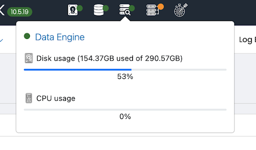
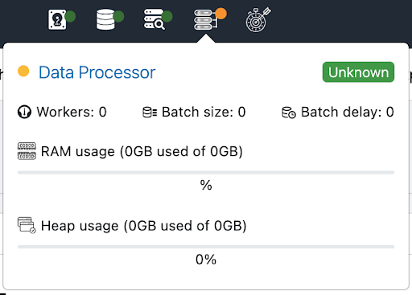

# UTMStack Monitoring and Troubleshooting Guide

## Introduction

In recent versions of UTMStack, the **Data Engine Status** indicator has undergone changes. Specifically, RAM and Heap usage details have been removed from the UI, and users may notice the **status appearing in orange**.

This document explains:
1. What the **orange status** means.
2. How to determine system health.
3. Where to look for troubleshooting information.

## Understanding the Data Engine Status

The **Data Engine Status** is displayed in the top left corner of the web interface. Here’s what each color represents:

| Status Color | Meaning |
|-------------|---------|
| 🟢 Green | The Data Engine is running normally. |
| 🟠 Orange | The Data Engine is **operational but may be experiencing high query load, low available space, or resource overload**. It is still functioning, and this is not a critical issue. |
| 🔴 Red | The Data Engine is **down** and requires immediate attention. |

## How to Troubleshoot the Data Engine Status

### 1. What Does the Orange Status Mean?
If the **Data Engine status is orange**, it does **not** mean the system is failing. Instead, it indicates that:
- The **Data Engine is running** but is currently **overloaded by queries**.
- The **available space is low**.
- **System resources** (CPU, memory, disk usage) may be **stretched**.

This status is **temporary** and does **not require immediate concern** unless it persists or affects performance.

### 2. How to Determine if There is a Problem
To verify if the system is working correctly:
- **Check the Log Explorer View**: If logs are still coming in, the system is functioning.
- **Check the Dashboard Data**: If data is still being displayed and updated, everything is fine.
- **If logs or dashboard data are missing**, further investigation is required.

#### Contact UTMStack Support
If logs are missing, dashboards show no real-time data, and troubleshooting doesn’t resolve the issue, contact **UTMStack support** for assistance.
