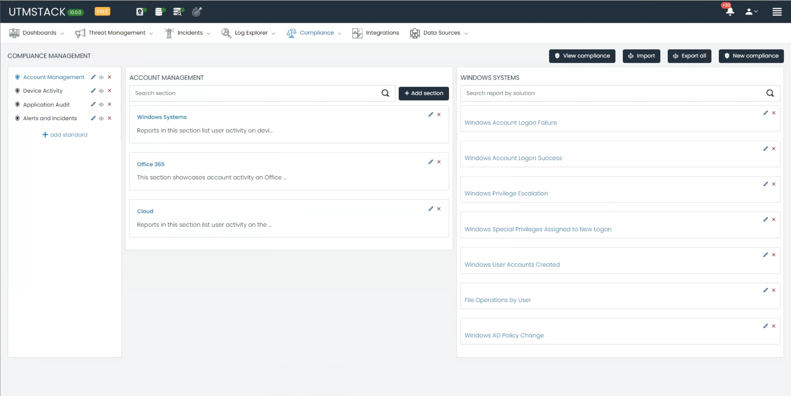
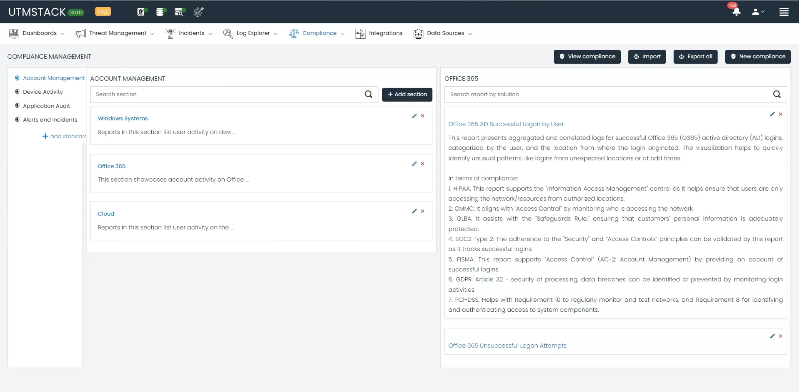
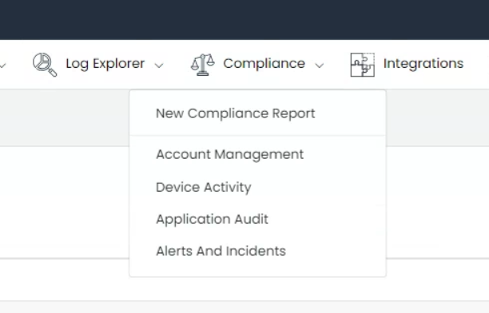
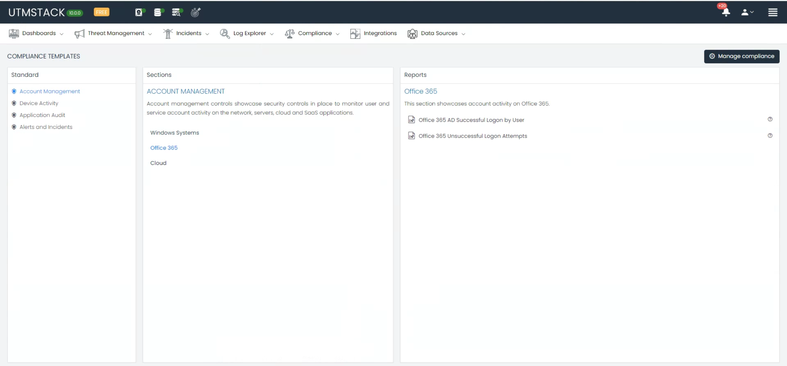
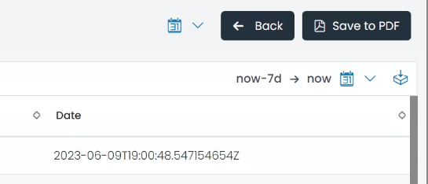
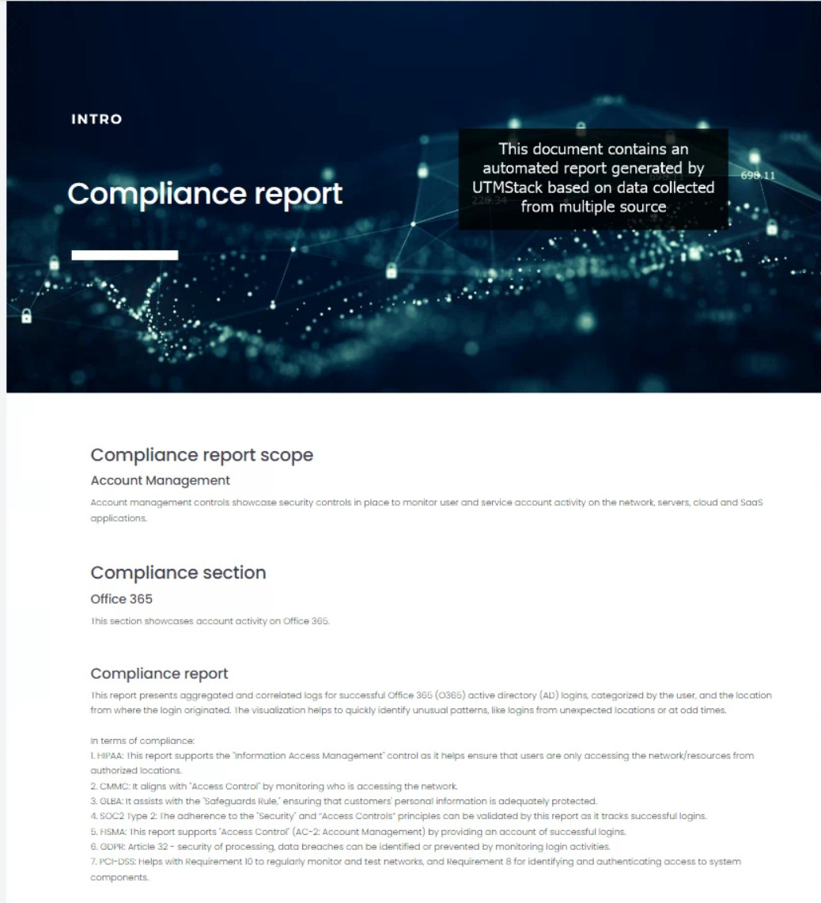
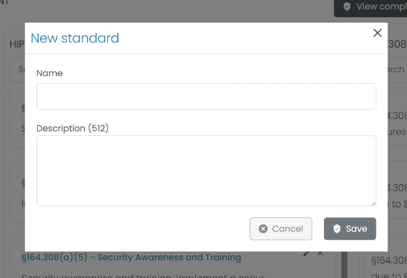
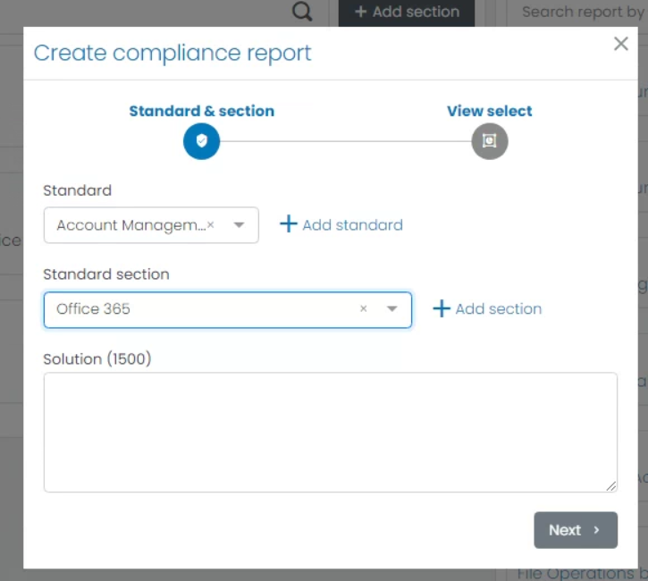
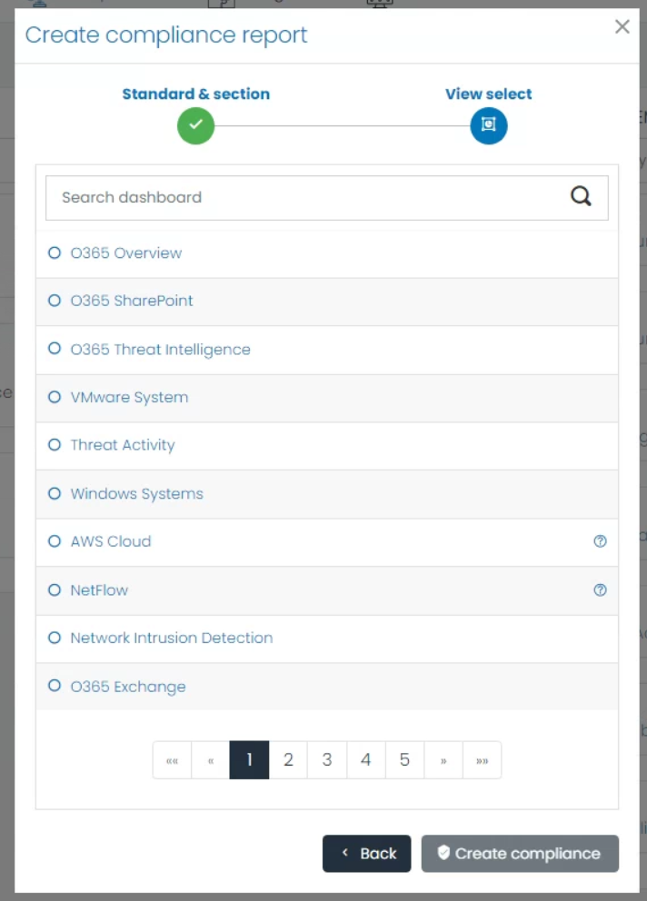
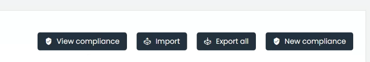

# Compliance Management

Welcome to our in-depth guide on the **Compliance Management** module, a key feature of our cybersecurity software platform. This module aids organizations in achieving and maintaining compliance across various industry-specific regulations. By accommodating a multitude of standards, our Compliance Management module provides a holistic view of your organization's regulatory compliance status.

Each standard is categorized. By default, the categories available are:

- **Account Management**
- **Device Activity**
- **Application Audit**
- **Alerts and Incidents**

Each standard has its dedicated section.

For example, if you wish to monitor the Office 365 Account Activity regarding successful logins, you can navigate to the relevant category. Upon selecting it, you'll receive a detailed description of the report and the compliance standards it addresses.

## Supported Compliance Standards
Our module supports several critical compliance standards, ensuring that your organization stays compliant in various sectors:

### 1. Health Insurance Portability and Accountability Act (HIPAA)
HIPAA is a U.S. federal law that sets national standards to protect sensitive patient health information from unauthorized disclosure. The HIPAA section within the Compliance Management module incorporates reports specifically designed to monitor compliance with critical HIPAA provisions, such as sections §164.308(a)(1)(ii)(A)(D), §164.312(b), and others. Each report aims to facilitate the implementation of policies and procedures to detect and manage security violations effectively.

### 2. General Data Protection Regulation (GDPR)
GDPR is a comprehensive data protection law in the European Union (EU), which regulates the processing of personal data. The software offers pre-configured reports to ensure that your data processing operations adhere to GDPR's core principles.

### 3. Gramm-Leach-Bliley Act (GLBA)
GLBA, also known as the Financial Modernization Act of 1999, controls how financial institutions handle the private information of individuals. The GLBA section in the module contains reports tailored to key GLBA provisions, assisting you in maintaining GLBA compliance.

### 4. System and Organization Controls 2 (SOC 2)
SOC 2 report focuses on a business’s non-financial reporting controls relating to security, availability, processing integrity, confidentiality, and privacy of a system. The software provides essential reports aligned with the Control Criteria (CC) of SOC 2 to facilitate the achievement and maintenance of SOC 2 compliance.

### 5. Federal Information Security Management Act (FISMA)
FISMA is a U.S. federal law that mandates federal agencies to develop, document, and implement an information security and protection program. The module provides pre-defined reports monitoring compliance with FISMA's crucial sections.

### 6. Cybersecurity Maturity Model Certification (CMMC)
CMMC certification is a requirement for businesses bidding on U.S. Government contracts. The CMMC section within the module provides reports specifically designed to monitor compliance with different CMMC Levels.

### 7. Payment Card Industry Data Security Standard (PCI-DSS)
PCI-DSS is a set of standards for managing and securing credit card-related personal data. The PCI-DSS section in the Compliance Management module provides reports aligned with specific PCI requirements, ensuring that your credit card data processing activities remain within the bounds of PCI-DSS standards.

## Export a Report

Upon accessing the **Platform Menu**, you'll find the **Compliance** submenu. Here, you can choose to either create a new compliance report or delve into various compliance standard dashboards.

By selecting a standard, you'll be directed to the **Compliance Template Section**. This is where you decide which report to export.

Upon clicking on a report, you'll be presented with an overview, options to modify the date range, and the capability to generate a PDF using a professionally designed template available on the platform.

## Comprehensive Compliance Management

Beyond the features described above, the **Compliance Management Dashboard**—located in the application management section—grants complete control over compliance standards. You're equipped to edit, remove, or append sections and reports to meet specific needs.

### Add Standard

Understanding that each organization has unique compliance requisites, our module is engineered for flexibility. It allows the addition of new compliance standards aligning with specific business needs.

To introduce a new standard, proceed to the **Compliance Management** section. Here, the 'Add Standard' button will guide you through a straightforward interface for detailing the new standard.

### Adding Reports

We appreciate the importance of detailed reporting for each compliance standard. Our module thus empowers you to supplement new reports to an existing compliance standard.

To do this, pick the preferred standard and section to which the report should belong. Next, select from a list of existing report dashboards to incorporate into your chosen compliance segment. This ensures thorough coverage of all regulatory facets.

### Import/Export

Acknowledging the need for system interoperability, the **Compliance Management** module boasts a robust import/export function. This tool aids in the proficient handling and transfer of compliance data.

To **export** the prevailing compliance information, a comprehensive JSON file is produced, encapsulating all essentials of your standards, sections, and reports. By utilizing the 'Export All' button, a complete portrayal of your compliance configuration is readily compiled, ensuring data integrity.

For **importing**, should there be a necessity to infuse the module with compliance data from an alternative system, the 'Import All' button facilitates this. Simply upload the corresponding JSON file, and the module will fluidly merge the data, aligning with your prior system's setup.

