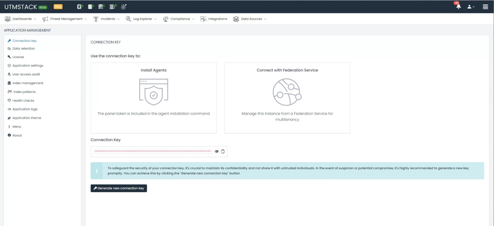

# Connection Key

## Overview

The Connection Key is a fundamental component of UTMStack, serving as a secure token to establish trusted communication between components within the system. It plays a crucial role in the following processes:

### Install Agents

- **Purpose**: The Connection Key is utilized as a panel token that is integrated within the agent installation command line. This token ensures that the agent is authenticated and allowed to communicate with the central panel, thereby maintaining a secure environment.

- **Process**: When installing agents on target machines or devices, the Connection Key is included in the command line instructions to successfully authenticate and link the agents to the central panel.

### Connect with Federation Service

- **Purpose**: This key also enables the management of the UTMStack instance through a Federation Service, specifically for the purpose of multitenancy. This is essential for environments where multiple separate entities or administrative domains require access to the system.

- **Process**: The Connection Key facilitates secure connection to a Federation Service, ensuring that all federated instances are properly managed and maintained within a centralized framework.

{:important}  
**Security Tip**: To maintain the security integrity of your Connection Key, it’s vital to change it regularly and immediately if there is any suspicion of compromise. Avoid sharing the key with untrusted parties.

### Generating a New Connection Key

- If you need to generate a new Connection Key, you can do so easily by clicking the “Generate new connection key” button. This action will create a new, unique key to replace the old one and will require updating the key across all deployed agents and services that use it.

{:important}
**Important**:

- Always ensure that the new key is distributed securely and updated in all configurations to prevent service disruption.
- Keep a secure backup of your Connection Key in a safe location.
