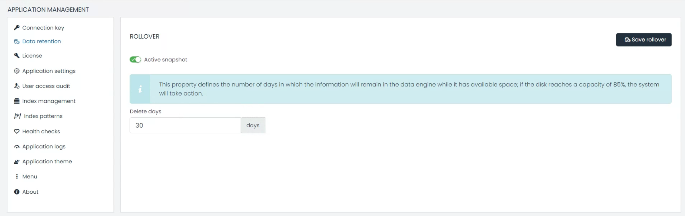
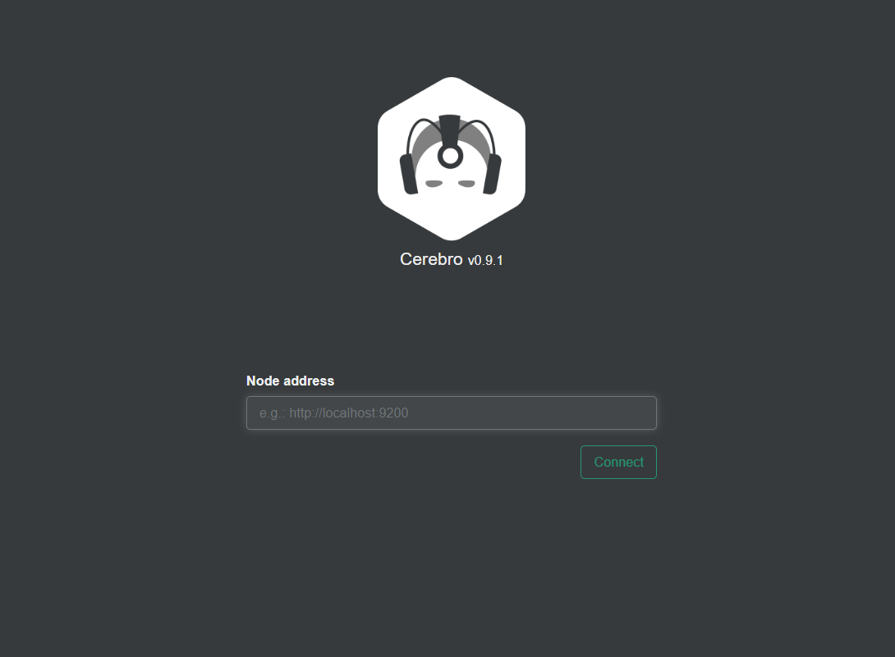
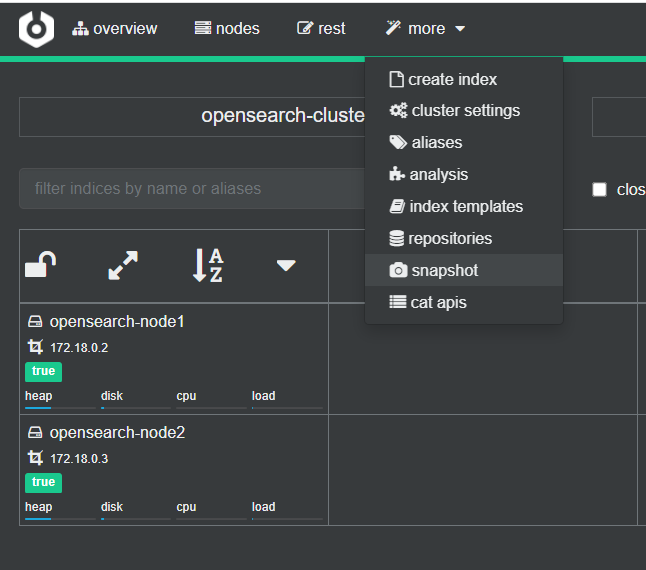

# Data Retention



### 1. Index Rollover

UTMStack’s Index Rollover feature ensures optimal data management by automatically deleting indices once they meet specific conditions, such as data size or age.

#### How to Configure Index Rollover:

1. Go to `Application Management` > `Data Retention`.
2. Set the desired retention period in days.
3. Click 'Save' to confirm your changes.

**Key Features**:

- **Delete Days**: This allows you to define how long the data will be kept. After this period, data is flagged for deletion, which can help in optimizing space and maintaining system performance.

{:important}  
**Note**: The system automatically takes action when the disk usage reaches 85%, ensuring it doesn't affect system performance.

### 2. Snapshot Archiving

#### Understanding Hot and Cold Storage:

- **Hot Storage**: This is where actively accessed data resides. It's designed for real-time access, ensuring swift operations.
- **Cold Storage**: This storage type is meant for archived data. While not regularly accessed, this data is critical for audits, compliance, or retrospective analysis.


Snapshot Archiving is an essential feature for safeguarding data over extended periods. Even as indices are removed based on retention settings, snapshots ensure that a record of this data is retained.

#### Configuring Snapshot Path in Linux:
Snapshots are automatically saved to `/utmstack/opensearch/backups`. To redirect these snapshots to another drive or remote location:


1. **Mount the Remote Drive or Different Drive**:
```bash
sudo mount -t nfs REMOTE-SERVER:/remote/path /utmstack/opensearch/backups
```

Ensure to replace `REMOTE-SERVER:/remote/path` with your actual server and path details.

2. **Add to `/etc/fstab` for Persistence**:
    Add the mount details to `/etc/fstab` to ensure the remote drive remains mounted after system reboots.

3. Test the Configuration
Ensure that the mount works as expected.

```bash
sudo mount -a
```

### 3. Restoring Data Using Cerebro:

While UTMStack doesn't include Cerebro, the tool is crucial for snapshot management and restoration, enabling the transition of data from cold to hot storage.

#### Working with Cerebro:

1. **Installation & Access**:
   - Use the [official Cerebro installation guide](https://github.com/lmenezes/cerebro).
   - Once installed, access its interface, typically found at [http://localhost:9000](http://localhost:9000).

2. **Restoration Process**:
   - Link Cerebro with your opensearch node for seamless data restoration.
  
   - In the more dropdown menu, select "snapshot"
  
   - in the snapshot view select a repository to restore the backup.


