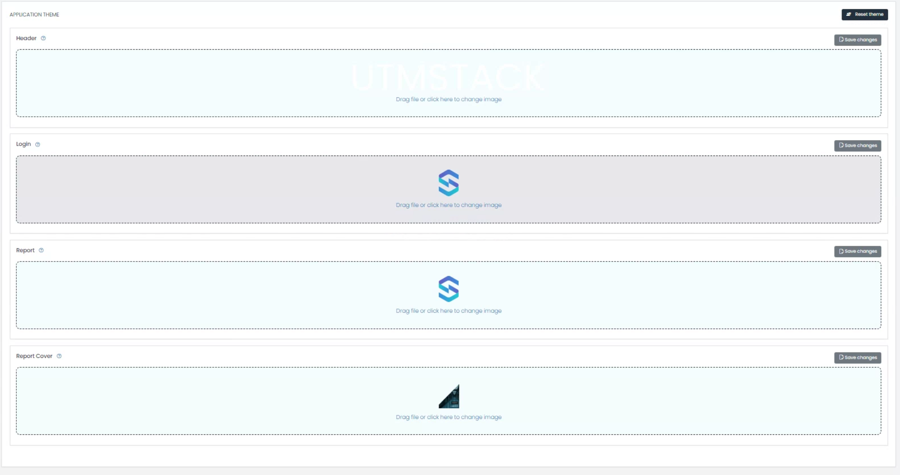

# Configuration

This section will guide you through various configuration options available within UTMStack, ensuring you optimize the platform according to your organizational needs.

## 1. Application Settings

Go to Application Settings Section for more details

## 2.  Configuring Index Rollover

Index Rollover aids in managing data by allowing the creation of a new index after predefined conditions are met, such as data size or age.

### Steps:

1. Navigate to `Application Management` > `Data Retention`.
2. Set the conditions under which the indexs should be deleted, for instance, after reaching a certain age.
3. Click on 'Save' to finalize your settings.

This is a critical property that dictates how long the data will be retained in the data engine. It's governed by both time (number of days) and space availability.

- **Delete days**: Set the number of days for data retention, e.g., `30 days`. 

 {:important}  
  **Consideration**: If the disk's capacity reaches 85%, the system will automatically take action.

### Snapshot Archiving

Snapshot archiving is a crucial feature for organizations to save data snapshots for extended periods, providing an option to restore them if necessary.

## 4. Custom Logos and Report Covers

Customize UTMStack's appearance to align with your organization's branding.

### Configuring Custom Logos

1. Navigate to `Settings` > `Application Theme`.
2. Upload your desired logo for the Header, Login, Report and Report Cover.
3. Save your settings.

