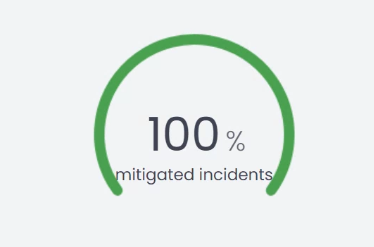
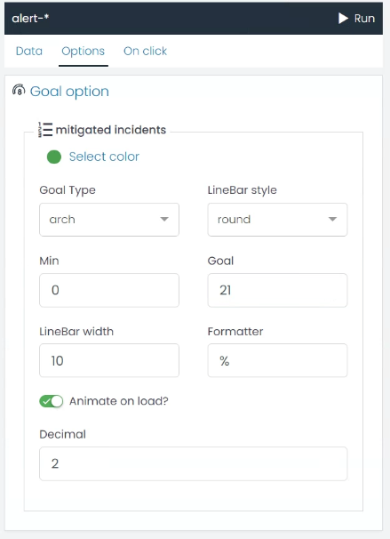

## Goal Chart

A Goal chart is a visualization tool used to represent progress towards a specific target or goal. It's a powerful way to show progress and motivate performance. UTMStack offers a Goal chart with customizable options to suit your specific requirements. 

Here are the options that you can configure while creating a Goal chart:

* **Color**: You can select the color of the goal chart.
* **Goal Type**: Choose the type of Goal chart. You have the option to choose 'semi','arch' or 'full'.
* **LineBar style**: Choose the style for the LineBar in the Goal chart. You can select 'round' or 'butt'.
* **Min**: This is the starting point or minimum value of your goal.
* **Goal**: This is the target or the goal you aim to reach.
* **LineBar width**: Adjust the width of the LineBar.
* **Formatter**: This option allows you to choose how the value is represented. If you want the value to be represented as a percentage, you can select '%'.
* **Animate on load?**: This option allows you to decide if you want the chart to animate when it loads.
* **Decimal**: Adjust the number of decimal places you want to display in your Goal chart.

These options offer a high degree of flexibility and can be adjusted to create a Goal chart that aligns with your specific needs.

