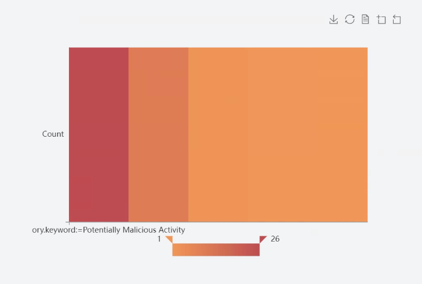
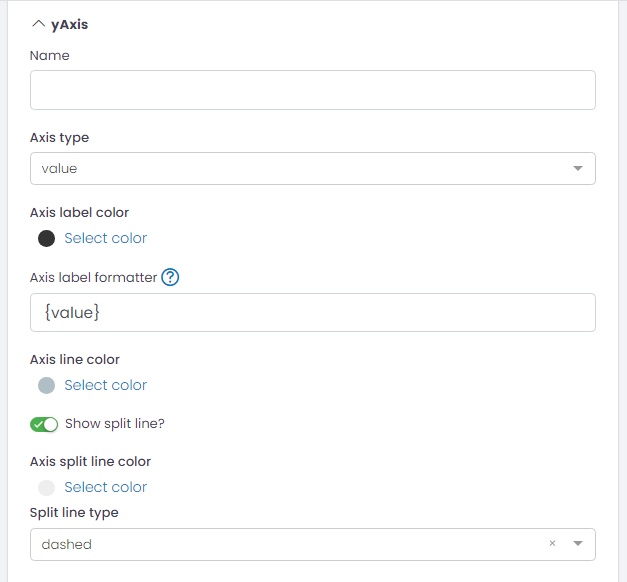
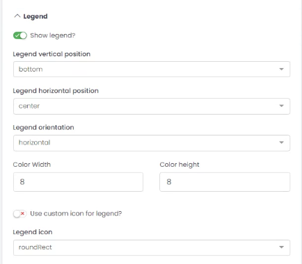
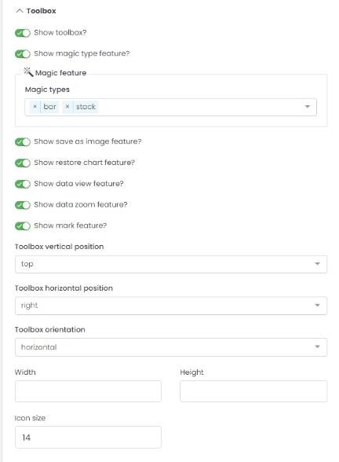
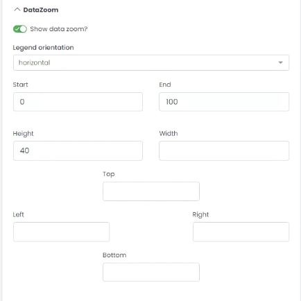
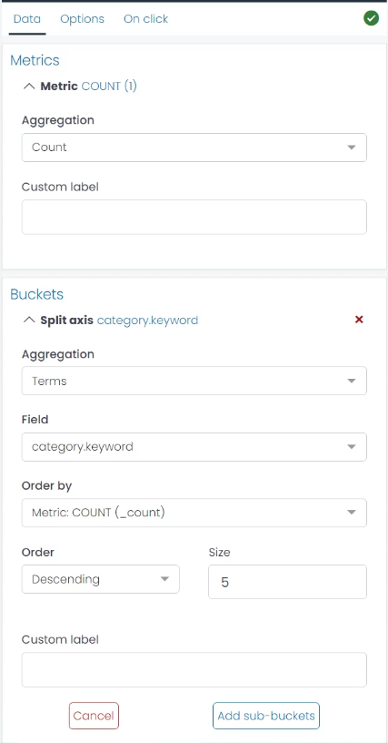

# Heat Map
Heat Map is a type of chart that represents data in a two-dimensional format, with colors representing values. The color intensity of the cells in the map corresponds to the data values they represent, allowing you to easily spot trends and patterns in your data. Heat Maps are especially effective for displaying large amounts of data that vary in scale and range.

## Chart Customization Options

In UTMStack's visualization editor, various aspects of your chart can be personalized to meet specific needs. The following sections explain the settings available under the Options tab when creating these chart.

### yAxis

* **Name**: Provide a name for the Y-axis.
* **Axis Type**: Specify the type of data on the Y-axis, typically 'value'.
* **Axis Label Color**: Customize the color of the axis labels.
* **Axis Label Formatter**: Format the axis label. Its support string template. Default is {value}.
* **Axis Line Color**: Customize the color of the axis line.
* **Show Split Line?**: Option to show/hide split lines.
* **Axis Split Line Color**: Customize the color of the split lines.
* **Split Line Type**: Choose the style of the split lines (e.g., 'dashed').

### xAxis
This section has the same configuration options as the yAxis, but applied to the X-axis.

### Legend

* **Show Legend?**: Option to display/hide the legend.
* **Legend Vertical Position**: Choose the vertical position of the legend (e.g., 'bottom').
* **Legend Horizontal Position**: Choose the horizontal position of the legend (e.g., 'center').
* **Legend Orientation**: Choose the orientation of the legend (e.g., 'horizontal').
* **Color Width/Height**: Adjust the size of the color boxes in the legend.
* **Use Custom Icon for Legend?**: Option to use a custom icon in the legend.
* **Legend Icon**: Choose the shape of the legend icons (e.g., 'roundRect').

### Toolbox

* **Show Toolbox?**: Option to display/hide the toolbox.
* **Show Magic Type Feature?**: Option to enable/disable magic type features.
* **Magic Feature**: Enable magic types to switch between different chart types.
* **Show Save as Image Feature?**: Option to enable/disable saving chart as an image.
* **Show Restore Chart Feature?**: Option to enable/disable the feature to restore the chart to its original state.
* **Show Data View Feature?**: Option to enable/disable the data view feature.
* **Show Data Zoom Feature?**: Option to enable/disable the data zoom feature.
* **Show Mark Feature?**: Option to enable/disable the mark feature.
* **Toolbox Vertical Position**: Choose the vertical position of the toolbox (e.g., 'top').
* **Toolbox Horizontal Position**: Choose the horizontal position of the toolbox (e.g., 'right').
* **Toolbox Orientation**: Choose the orientation of the toolbox (e.g., 'horizontal').
* **Width/Height**: Adjust the size of the toolbox.
* **Icon Size**: Adjust the size of the toolbox icons.

### Colors

 Adjust the color sequence for your chart data series.

### Grid
  * **Top/Left/Right/Bottom**: Adjust the chart margins.

### DataZoom

* **Show Data Zoom?**: Option to enable/disable the data zoom feature.
* **Legend Orientation**: Choose the orientation of the data zoom (e.g., 'horizontal').
* **Start/End**: Set the initial view of the data in percentage.
* **Height/Width**: Adjust the size of the data zoom control.
* **Top/Left/Right/Bottom**: Adjust the margins for the data zoom control.

### Example: Creating a Heat Map for Incident Categories

If you aim to create a Heat Map visualization that provides an insight into the count of various alertd categories in your alerts index, follow these steps:

**Step 1: Select Metric Aggregation**
You'll start with defining your metric aggregation. For this case, you're counting the number of alerts in each category, so select the 'Count' aggregation.

**Step 2: Configure Bucket Aggregation**
Next, define your bucket aggregation. Here, you will use the 'Terms' aggregation on the 'alert.category.keyword' field. This organizes your alerts data into different categories.

**Step 3: Adjust Scale and Color Range**
Now it's time to choose a suitable color scale. For clarity, you might want to use a 'Sequential' color scale, which assigns cooler colors to lower alert counts and warmer colors to higher alert counts. Remember, the goal is to allow for easy visual differentiation between high and low incident counts.

**Step 5: Generate Your Visualization**
After all these settings are done, click on 'Run'. This will generate your Heat Map, where you can identify the most frequent incident categories in your alert index at a glance.

By using this Heat Map, you can promptly pinpoint which categories of alerts are more common, enabling you to focus your resources and attention more effectively.

