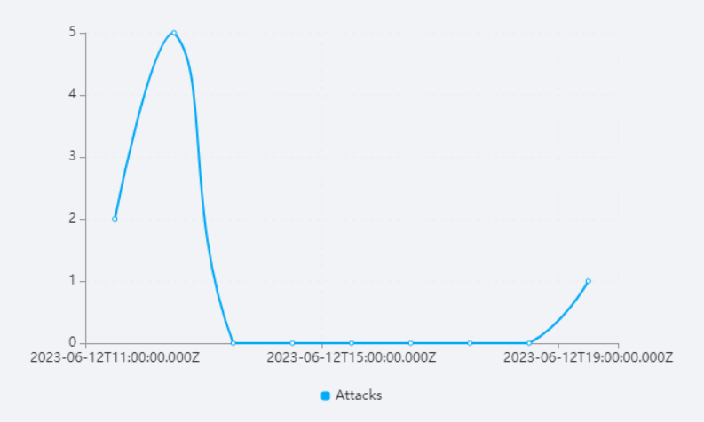
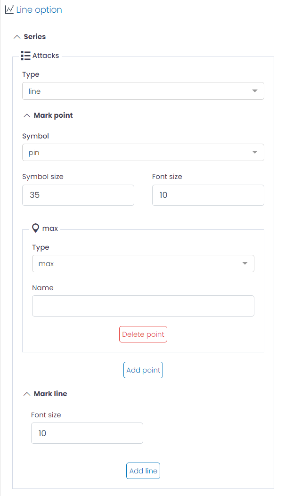
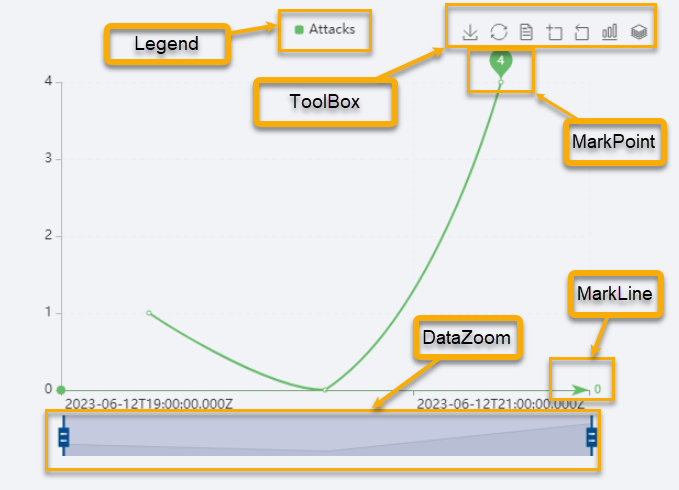

# Line, Area LineBar, Bar and Bar Horizontal charts

UTMStack provides a versatile set of charting options to visually represent your data, including Line, Area, Bar, and others. These charts are excellent for displaying data trends over time, mapping data on an X/Y axis, and highlighting changes in values between different data points.

## Chart Customization Options

In UTMStack's visualization editor, various aspects of your chart can be personalized to meet specific needs. The following sections explain the settings available under the Options tab when creating these charts.

### Series

* **Type**: Change the chart type, such as to a bar chart.
* **Mark Point**: Mark specific points on the line for emphasis. The configuration includes:
  * **Symbol**: Define the symbol used to mark the point. For instance, you could choose 'pin' to represent marked points as pin symbols.
  * **Symbol Size**: Adjust the size of the symbol used to mark the point.
  * **Font Size**: Determine the size of the font used in the mark point.
  * **Type**: Set the type of mark point, options include 'min', 'max', or 'avg'.
  * **Name**: Provide a custom name for the mark point. This name will be displayed in tooltips and legends when hovering over the point or when it's included in the legend.

* **Mark Line**: Similarly to Mark Point, you can also highlight a specific line for emphasis.

### yAxis

* **Name**: Provide a name for the Y-axis.
* **Axis Type**: Specify the type of data on the Y-axis, typically 'value'.
* **Axis Label Color**: Customize the color of the axis labels.
* **Axis Label Formatter**: Format the axis label. Its support string template. Default is {value}.
* **Axis Line Color**: Customize the color of the axis line.
* **Show Split Line?**: Option to show/hide split lines.
* **Axis Split Line Color**: Customize the color of the split lines.
* **Split Line Type**: Choose the style of the split lines (e.g., 'dashed').

### xAxis
This section has the same configuration options as the yAxis, but applied to the X-axis.

### Legend

* **Show Legend?**: Option to display/hide the legend.
* **Legend Vertical Position**: Choose the vertical position of the legend (e.g., 'bottom').
* **Legend Horizontal Position**: Choose the horizontal position of the legend (e.g., 'center').
* **Legend Orientation**: Choose the orientation of the legend (e.g., 'horizontal').
* **Color Width/Height**: Adjust the size of the color boxes in the legend.
* **Use Custom Icon for Legend?**: Option to use a custom icon in the legend.
* **Legend Icon**: Choose the shape of the legend icons (e.g., 'roundRect').

### Toolbox

* **Show Toolbox?**: Option to display/hide the toolbox.
* **Show Magic Type Feature?**: Option to enable/disable magic type features.
* **Magic Feature**: Enable magic types to switch between different chart types.
* **Show Save as Image Feature?**: Option to enable/disable saving chart as an image.
* **Show Restore Chart Feature?**: Option to enable/disable the feature to restore the chart to its original state.
* **Show Data View Feature?**: Option to enable/disable the data view feature.
* **Show Data Zoom Feature?**: Option to enable/disable the data zoom feature.
* **Show Mark Feature?**: Option to enable/disable the mark feature.
* **Toolbox Vertical Position**: Choose the vertical position of the toolbox (e.g., 'top').
* **Toolbox Horizontal Position**: Choose the horizontal position of the toolbox (e.g., 'right').
* **Toolbox Orientation**: Choose the orientation of the toolbox (e.g., 'horizontal').
* **Width/Height**: Adjust the size of the toolbox.
* **Icon Size**: Adjust the size of the toolbox icons.

### Colors

 Adjust the color sequence for your chart data series.

### Grid
  * **Top/Left/Right/Bottom**: Adjust the chart margins.

### DataZoom

* **Show Data Zoom?**: Option to enable/disable the data zoom feature.
* **Legend Orientation**: Choose the orientation of the data zoom (e.g., 'horizontal').
* **Start/End**: Set the initial view of the data in percentage.
* **Height/Width**: Adjust the size of the data zoom control.
* **Top/Left/Right/Bottom**: Adjust the margins for the data zoom control.

These settings allow you to create a more engaging and informative visualization tailored to your specific needs.

