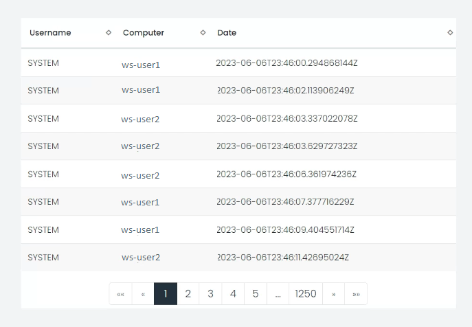
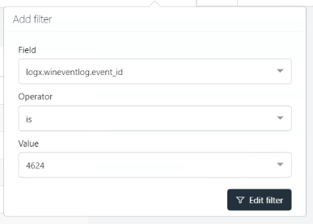
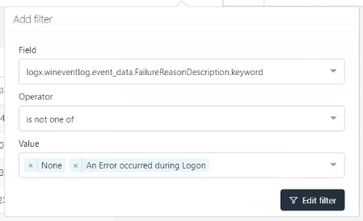
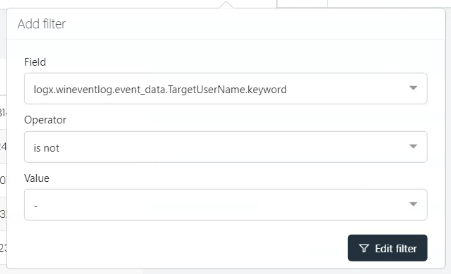
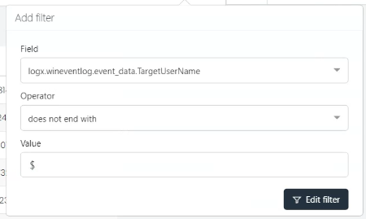
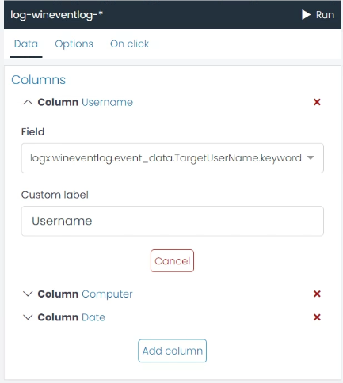
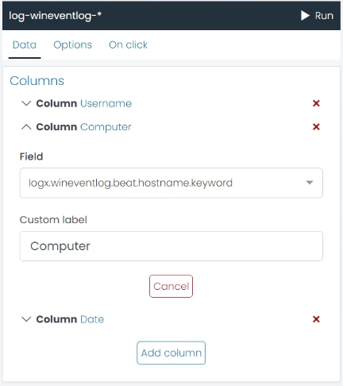
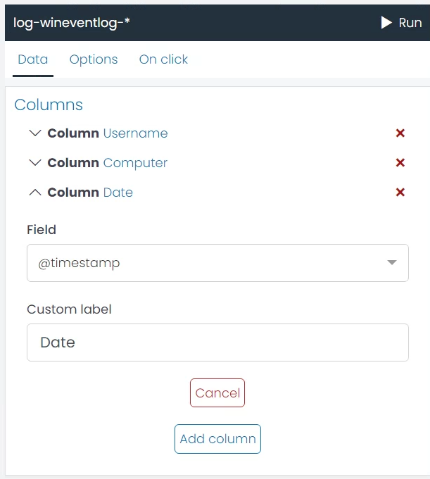

# List Chart

List charts provide a way to display your data in a tabular form, offering an easy-to-read structure. This makes it perfect for detailed views of individual records.

List charts come in handy when you need to compare individual data points, highlight specific data, or when details for each data point are essential. Moreover, they offer an excellent way to visualize nominal and small range ordinal variables.

## Options

When creating a list chart with UTMStack's visualization editor, you can customize several features to better present your data. Here are some available options under the `Options` tab:

### Table option

* **Dynamic page size?**: This option allows the table to automatically adjust its page size based on the size of the browser window. If disabled, you will need to manually specify the number of rows per page.

* **Can it be exported to CSV?**: If enabled, this option allows users to download the table data as a CSV file.

### Columns 

In the `Data` tab, you can define the structure and the content of your list by specifying the fields you wish to include as columns.

* **Column**: Here, you can set the column's label as it will appear in the chart.

* **Field**: This option allows you to select the data field that will populate the column.

* **Custom label**: You can also provide a custom label for this column. This name will be displayed in the chart.

With these settings, you can create a detailed and informative visualization tailored to your specific needs.

## Example: Creating a List Chart for User Logon Success Details

If you want to create a List chart that presents a detailed view of successful user logon activities in your system, follow these steps:

## Step 1: Add Filters

Start by applying filters to narrow down your dataset to only include successful logon activities.

1. **Filter 1**: To focus on logon activities, select the field `logx.wineventlog.event_id`, set the operator to `is`, and the value to `4624`. This isolates the events specific to user logon activities.

   

2. **Filter 2**: To exclude unsuccessful logon attempts, use the field `logx.wineventlog.event_data.FailureReasonDescription.keyword`, set the operator to `is not one of`, and provide the values `None` and `An Error occurred during Logon`.

   

3. **Filter 3**: To eliminate instances where the username isn't available, select the field `logx.wineventlog.event_data.TargetUserName.keyword`, set the operator to `is not`, and provide the value `-`.

   

4. **Filter 4**: To avoid including system-generated logon activities, use the field `logx.wineventlog.event_data.TargetUserName`, set the operator to `does not end with`, and provide the value `$`.

   

## Step 2: Select Columns

Once your filters are set, go to the `Data` tab and specify the columns for your list.

1. **Username**: To include a 'Username' column that shows the username for each logon event, click 'Add Column', select the field `logx.wineventlog.event_data.TargetUserName.keyword`, and set the custom label to 'Username'.

   

2. **Computer**: To include a 'Computer' column that displays the host machine name for each logon event, click 'Add Column', select the field `logx.wineventlog.beat.hostname.keyword`, and set the custom label to 'Computer'.

   

3. **Date**: To include a 'Date' column showing the timestamp of each logon event, click 'Add Column', select the field `@timestamp`, and set the custom label to 'Date'.

   

These steps will help you create a List chart that provides a detailed view of successful user logon activities in your system.

