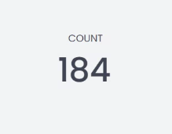
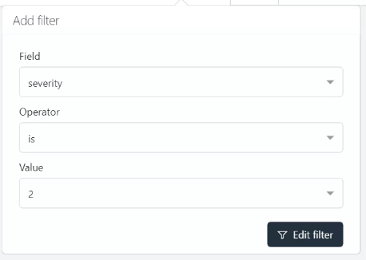
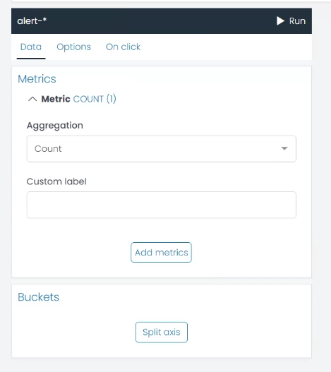

# Metric Chart

A Metric chart is a simple, yet powerful tool for visualizing a single piece of data, often used to highlight a key performance indicator (KPI) or other significant metric in your data set.

UTMStack's Metric chart allows you to customize the appearance of your metric to meet your specific needs. Let's go through the configuration settings available under the **Options** tab when creating a Metric chart:

## Metric option

* **Select icon**: This option allows you to choose an icon to represent your data. An icon can provide a visual cue that helps users understand the data more intuitively. 

* **Select color**: Use this option to choose the color of the icon you selected above. This can be useful for differentiating different metrics or to align the color with the data's semantics.

* **Decimal**: This option lets you choose how many decimal places your metric should be rounded to.

In this way, you can design a Metric chart that clearly and effectively communicates the key piece of information you want to present to your users.

### Example: Creating a Metric Chart for Severity Level 2 Alerts

Let's say you want to create a Metric chart that displays the count of severity level 2 alerts in your system, you can follow these steps:

**Step 1: Filter the Data**

Start by applying a filter to only include the severity level 2 alerts. 

* Select the field **'severity'**.
* Set the operator to **'is'**.
* Specify the value as **'2'**.

This filter ensures that your Metric chart will only count the severity level 2 alerts.

**Step 2: Select the Aggregation**

Now you need to select the aggregation for your Metric chart. For this example, we will use the **'COUNT'** aggregation. This will count the number of severity level 2 alerts.

After applying the filter and choosing the aggregation and press Run you should be able to see the count of severity level 2 alerts on your Metric chart.

