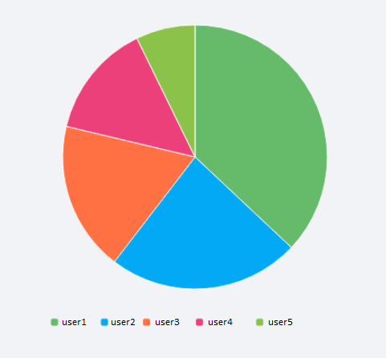

# Pie Charts

UTMStack's visualization editor also offers the option to visualize your data in the form of a Pie chart. Pie charts are excellent for displaying the proportional breakdown of different categories within a dataset.

### Chart Customization Options

You can personalize various aspects of your Pie chart to meet specific needs. The following sections explain the settings available under the Options tab when creating a Pie chart.

In the Pie options, you can find the **Pie chart is a donut?** option. By enabling this, your Pie chart will be transformed into a Donut chart.

### Legend

* **Show Legend?**: Option to display/hide the legend.
* **Legend Vertical Position**: Choose the vertical position of the legend (e.g., 'bottom').
* **Legend Horizontal Position**: Choose the horizontal position of the legend (e.g., 'center').
* **Legend Orientation**: Choose the orientation of the legend (e.g., 'horizontal').
* **Color Width/Height**: Adjust the size of the color boxes in the legend.
* **Use Custom Icon for Legend?**: Option to use a custom icon in the legend.
* **Legend Icon**: Choose the shape of the legend icons (e.g., 'roundRect').

### Toolbox

* **Show Toolbox?**: Option to display/hide the toolbox.
* **Show Magic Type Feature?**: Option to enable/disable magic type features.
* **Magic Feature**: Enable magic types to switch between different chart types.
* **Show Save as Image Feature?**: Option to enable/disable saving chart as an image.
* **Show Restore Chart Feature?**: Option to enable/disable the feature to restore the chart to its original state.
* **Show Data View Feature?**: Option to enable/disable the data view feature.
* **Show Data Zoom Feature?**: Option to enable/disable the data zoom feature.
* **Show Mark Feature?**: Option to enable/disable the mark feature.
* **Toolbox Vertical Position**: Choose the vertical position of the toolbox (e.g., 'top').
* **Toolbox Horizontal Position**: Choose the horizontal position of the toolbox (e.g., 'right').
* **Toolbox Orientation**: Choose the orientation of the toolbox (e.g., 'horizontal').
* **Width/Height**: Adjust the size of the toolbox.
* **Icon Size**: Adjust the size of the toolbox icons.

### Colors

 Adjust the color sequence for your chart data series.

### Grid
  * **Top/Left/Right/Bottom**: Adjust the chart margins.

### DataZoom

* **Show Data Zoom?**: Option to enable/disable the data zoom feature.
* **Legend Orientation**: Choose the orientation of the data zoom (e.g., 'horizontal').
* **Start/End**: Set the initial view of the data in percentage.
* **Height/Width**: Adjust the size of the data zoom control.
* **Top/Left/Right/Bottom**: Adjust the margins for the data zoom control.

