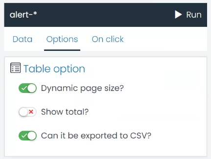
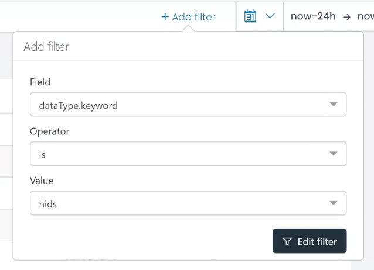
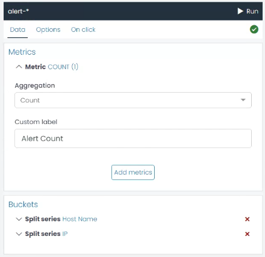
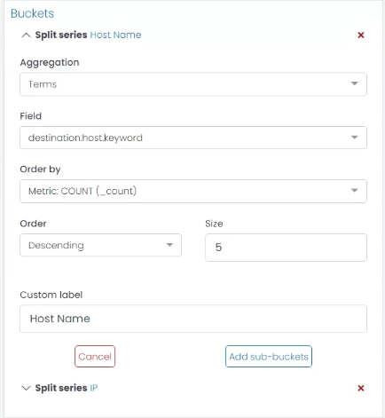
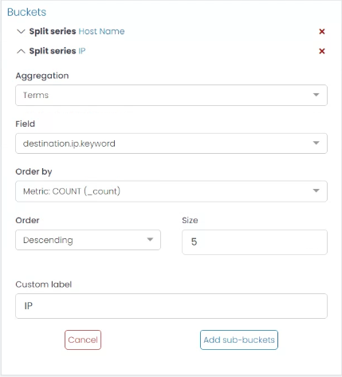
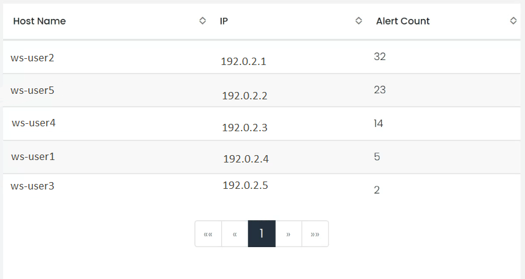

# Table Chart

The Table chart in UTMStack is an incredibly flexible tool for representing your data in a tabular format, which can be particularly helpful when you need to see precise values along with a high-level summary. In this guide, we'll discuss how to configure the different options available for a Table chart.

### Options

Here are the options you can adjust to customize your Table chart:

* **Dynamic Page Size?**: This setting allows the table to adjust the number of rows displayed based on the size of the container. Enabling this option can be beneficial when viewing the table on different devices or screen sizes, ensuring that the data is always displayed optimally.

* **Show Total?**: This option allows you to display the total for numeric fields at the bottom of the table. This can be very useful when you need to quickly assess the sum of a particular field across all rows.

* **Can it be Exported to CSV?**: By enabling this option, you allow the table data to be exported to a CSV file. This feature can be handy when you need to share data or conduct further analysis outside UTMStack.

### Example: Creating a Table Chart for HIDS Alerts by Host

1. **Filter the Data**
   Start by defining a filter for the alerts, ensuring the **data type is 'hids'**. This filter will ensure that only the HIDS alerts are included in your data set.

2. **Create a Metric Aggregation**
Next, you'll need to create a Metric Aggregation that counts the quantity of alerts. This aggregation will determine the values displayed in your table.

3. **Create a Bucket Aggregation for the Host**
Now it's time to identify the host associated with each count. Create a new Bucket Aggregation using the 'Terms' type on the 'destination.host.keyword' field. This will group the alerts by host. For clarity, you can assign a custom label like "Hostname".

4. **Create a Sub-Bucket for the IP**
For more detailed information, you can add a sub-bucket to each host bucket that identifies the IP address associated with each host. To do this, click the 'Add sub-Bucket' button, select the 'Terms' aggregation type, and choose the 'destination.ip.keyword' field. You can use the custom label "IP" for this sub-bucket.

5. **Run the Chart**
Once you've configured the aggregations, click the 'Run' button to see a preview of your chart. If you're satisfied with the results, you've successfully created a Table chart for HIDS alerts by host.

By following these steps, you can create a highly customized Table chart that fits your specific use case. Remember, the configuration can be adjusted at any time to refine the results.