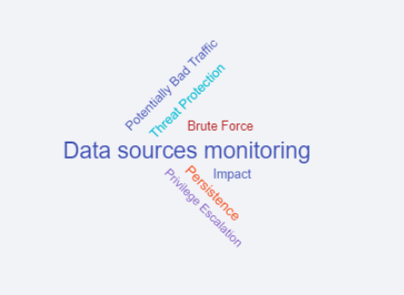
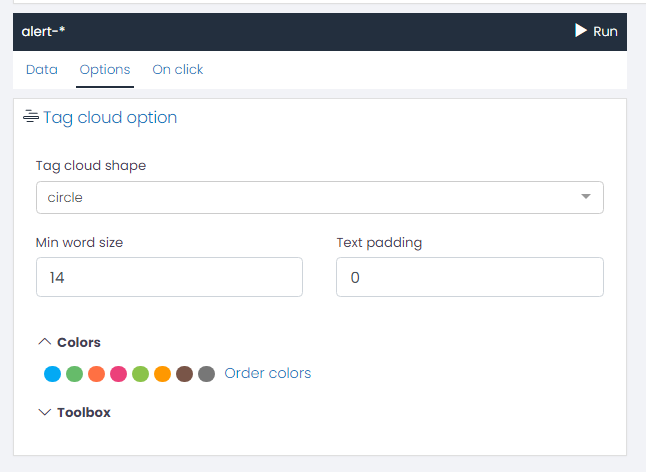
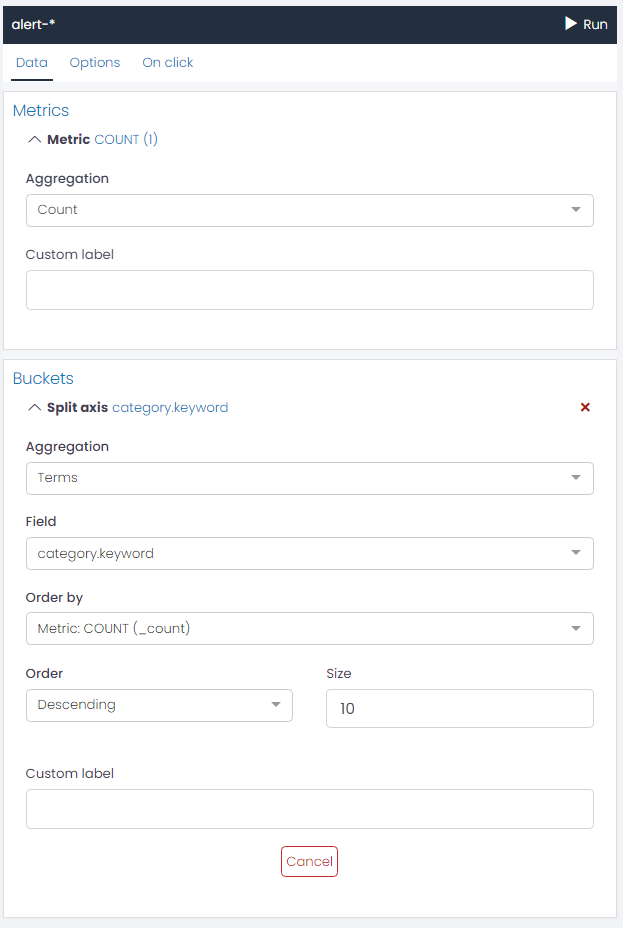

# Tag Cloud Charts

UTMStack provides a Tag Cloud chart option for visualizing text data in a way that emphasizes the frequency or importance of different tags. These charts represent data by varying the size and color of individual words or phrases (tags), allowing you to quickly see the most prominent tags in your data.

### Tag Cloud Option

* **Tag Cloud Shape**: You can choose from a variety of shapes for your Tag Cloud chart. The shape you choose will determine how the words are arranged in the cloud.

* **Min Word Size**: This setting allows you to adjust the smallest font size that will be used for the words in the tag cloud. The size of each term in the cloud represents its frequency or importance. By increasing the minimum word size, you can make the less frequent terms more visible.

* **Text Padding**: Text padding is the space between words in the tag cloud. By adjusting this setting, you can control the density of words in your cloud. A higher padding value will result in more space between the words, making the cloud look sparser. A lower value will make the words appear closer together, creating a denser cloud.

### Colors

 Adjust the color sequence for your chart data series.

### Toolbox
* **Show Toolbox?**: Option to display/hide the toolbox.
* **Show Save as Image Feature?**: Option to enable/disable saving chart as an image.
* **Show Restore Chart Feature?**: Option to enable/disable the feature to restore the chart to its original state.
* **Show Data View Feature?**: Option to enable/disable the data view feature.
* **Show Data Zoom Feature?**: Option to enable/disable the data zoom feature.
* **Show Mark Feature?**: Option to enable/disable the mark feature.
* **Toolbox Vertical Position**: Choose the vertical position of the toolbox (e.g., 'top').
* **Toolbox Horizontal Position**: Choose the horizontal position of the toolbox (e.g., 'right').
* **Toolbox Orientation**: Choose the orientation of the toolbox (e.g., 'horizontal').
* **Width/Height**: Adjust the size of the toolbox.
* **Icon Size**: Adjust the size of the toolbox icons.

### Example: Creating a Tag Cloud Chart for Top 10 Alerts Categories

Suppose you want to visualize the top 10 alert categories registered in your system using a Tag Cloud chart. Here's how you can set this up using UTMStack's visualization editor:

First, we will be using a **Bucket Aggregation** to represent the data. The steps to configure this are as follows:

1. In the visualization editor, select the **Buckets** option.
2. Choose the **Term** aggregation type. This will allow us to group the data based on a specific field.
3. For the **Field**, select category.keyword. This will ensure that the chart represents the alerts based on their categories.
4. Set the **Size** to 10. This setting will limit the display to the top 10 alert categories.
   
Your configuration should look like the following:

**Options**

Once the Bucket Aggregation is set, you can proceed to customize your Tag Cloud Chart under the Options tab:

* **Tag Cloud Shape**: Select a shape that suits your preferences.
* **Min Word Size**: Adjust this setting based on how prominent you want the less frequent categories to be.
* **Text Padding**: Determine the space between words to create the desired visual density.
  
After you have finished adjusting these settings, you can run the chart to visualize the top 10 alerts categories in your system as a Tag Cloud chart.

This personalized visualization can provide a quick and clear overview of the most frequent alert categories, aiding in system monitoring and management.