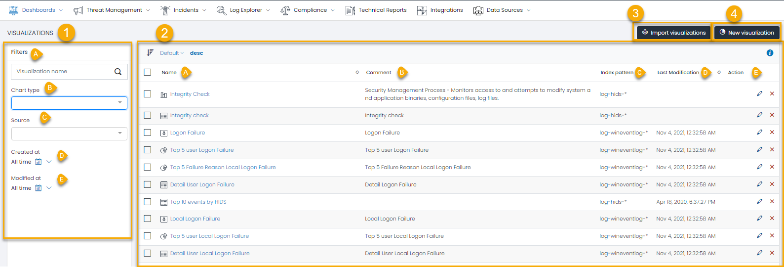
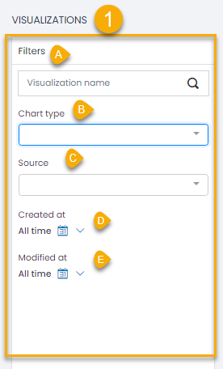
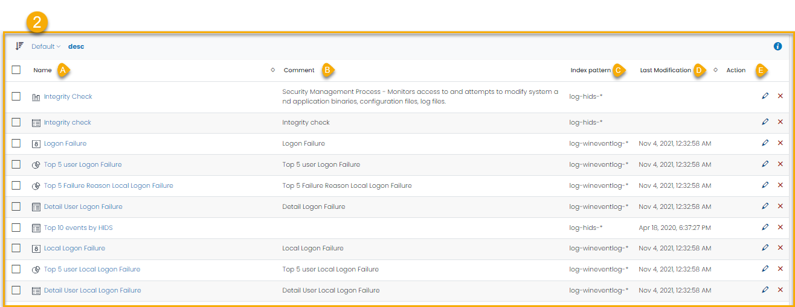
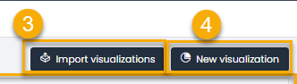

# Visualizations List

The Visualizations List in UTMStack is your central hub for managing all visualizations in one place. With a simple yet powerful interface, it offers quick access to crucial visualization details and essential operations. This guide will walk you through the main components of the Visualizations List.

1. **Filter Search**
The Filter Search panel, located on the left side of the Visualizations List, allows for efficient navigation through your visualizations.

You can filter the list based on the following parameters:

* **Visualization Name**: Filter by the name of the visualization.
* **Chart Type**: Filter by the type of chart used in the visualization (e.g., bar, line, pie).
* **Source**: Filter by the index pattern used for the visualization.
* **Created At**: Filter by the date the visualization was created.
* **Modified At**: Filter by the date the visualization was last updated.

Each filter field helps refine the visualizations displayed, aiding in quickly locating the visualization you need.

2. **List of Visualizations**
The main body of the Visualizations List displays the visualizations available to you. 

For each visualization, you'll find:

* **Name**: The unique identifier for the visualization.
* **Comments**: Any additional comments or descriptions for the visualization.
* **Index Pattern**: The specific data source pattern used in the visualization.
* **Last Modified**: The date and time of the last update made to the visualization.
* **Action** : Each visualization entry also has an Actions column, with buttons for:
    * **Edit**: Opens the visualization for modification.
    * **Delete**: Permanently removes the visualization from the list.

3. **Import Visualization**
The Import Visualization button allows you to import previously exported visualizations, facilitating easy replication of visualizations across different dashboards or UTMStack instances.

4. **New Visualization**
The New Visualization button opens the Visualization Editor, providing a platform to create custom visualizations from scratch. Here, you can define data source, set filters, and specify other parameters to build your visualization.

Understanding the Visualizations List's components empowers you to manage your visualizations more effectively, leading to efficient monitoring and analysis processes within UTMStack.