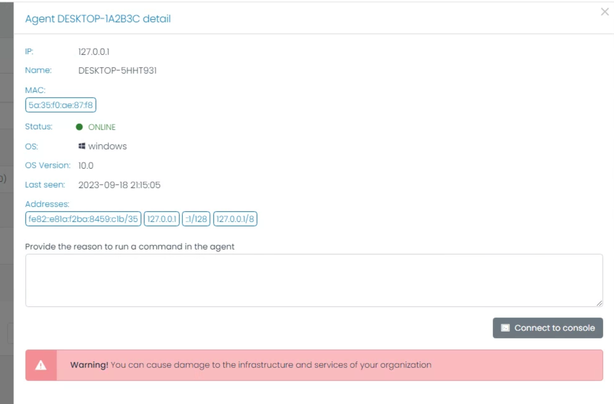
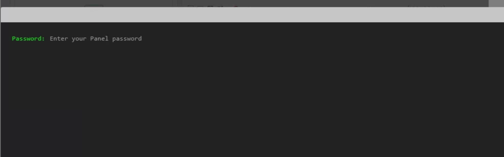
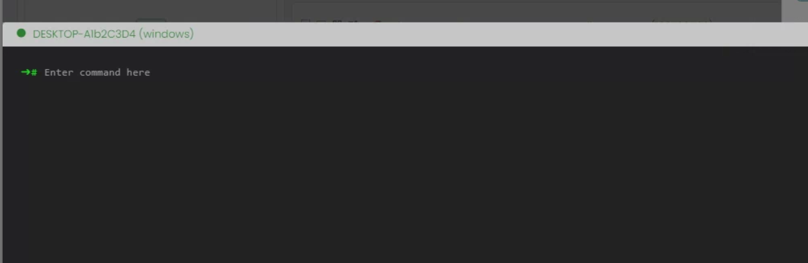
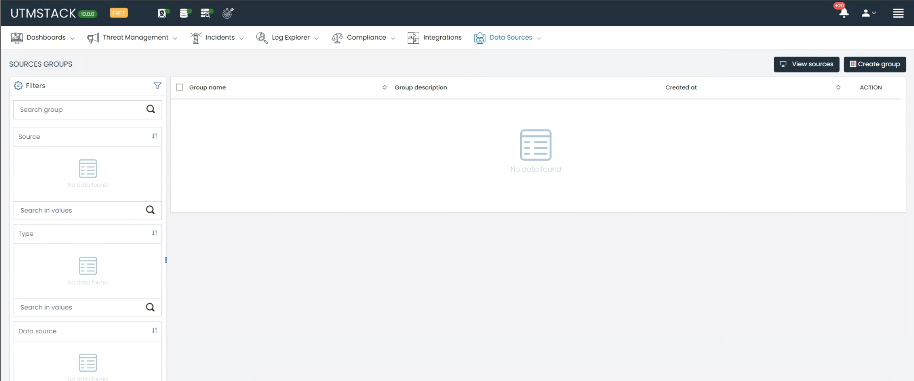

# Data Sources Management Documentation

This documentation offers a detailed insight into the **Data Sources Management** module of our software platform. This pivotal module is meticulously crafted to oversee and manage the myriad of devices assimilated within your organization's network.

## Data Sources Overview

When you delve into the Data Sources Management module, you're greeted with a comprehensive data grid. This grid showcases all devices currently under the system's surveillance, elaborating on vital details such as their status, type, last input, and available actions.

For an enhanced user experience, you can sift through the sources based on groups or types. This organized perspective promotes effortless navigation, especially when dealing with an extensive inventory of devices.

## Data Source Details

Upon selecting a data source, you're presented with an exhaustive view detailing its attributes.

Moreover, this interface grants you direct access to the device's console, enabling seamless connectivity.

## Connect to the console of the Device

When yu proporcioned a reason to run a comand in the agent, tere is going to be asked the panel password

When you entered it succesfully you can run the command you want in the agent.

## Managing Source Groups

For a structured approach to data source administration, devices can be conglomerated into specific groups. The **Source Groups Management** dashboard lays out these clusters, facilitating effortless edits. Whether your grouping rationale revolves around functionality, departmental affiliations, or any other relevant categorization, this utility simplifies the grouping dynamics.

The Data Sources Management module is a comprehensive solution designed to facilitate the organized tracking and management of your organization's data sources. By allowing for efficient sorting, grouping, and action execution, this module serves as a powerful tool in any data-driven environment. 