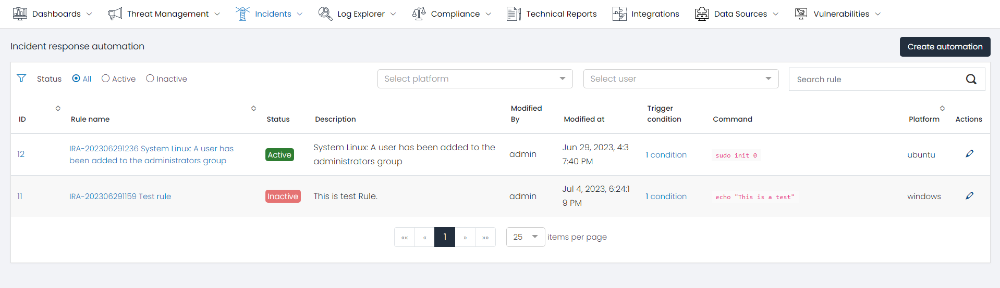
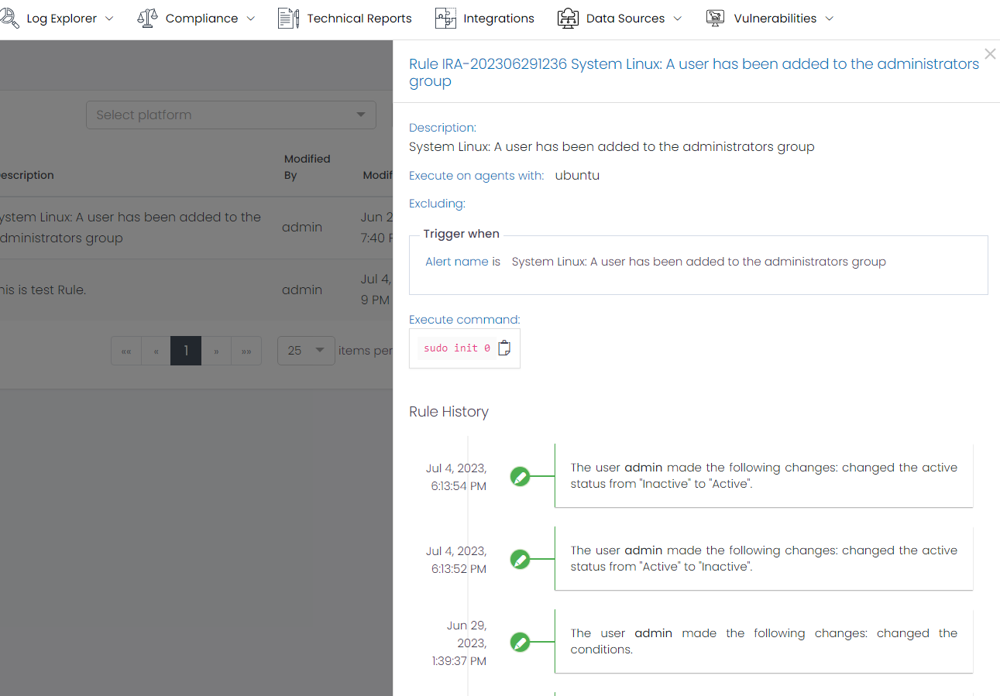
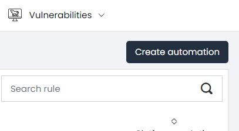
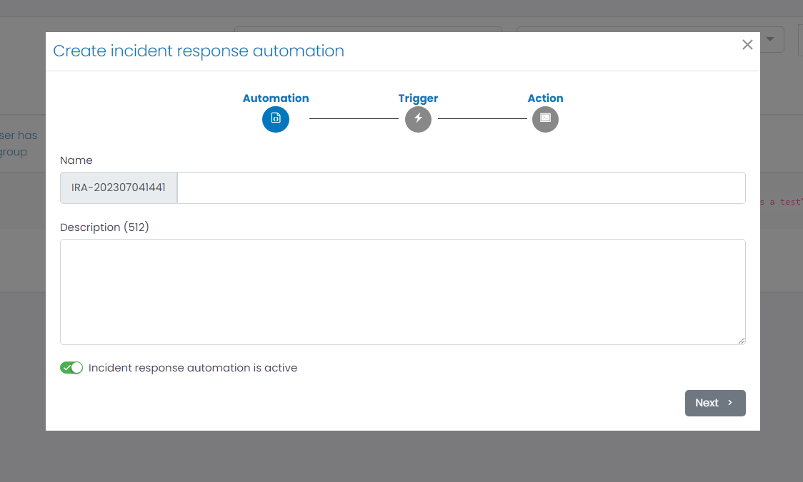
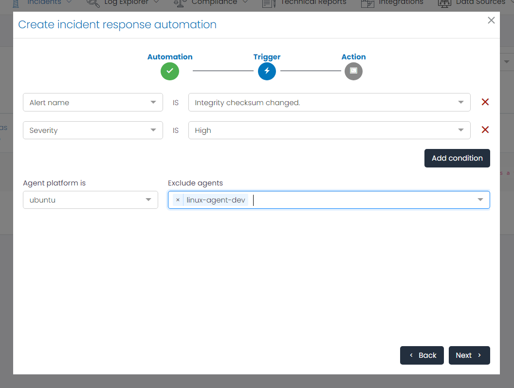
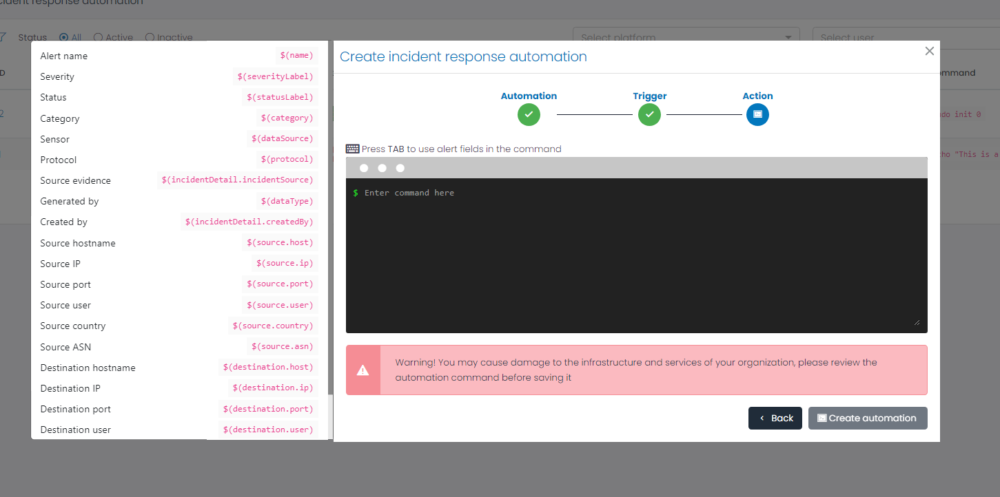

# Incident Response Automation

The Incident Response Automation feature in UTMStack empowers organizations to automate actions based on triggers in incident fields. This functionality enhances the efficiency and effectiveness of the incident response strategy by executing predefined actions automatically. By leveraging triggers and actions, organizations can streamline and expedite the incident response process.

## Incident Response Dashboard View

### Incidents response Automation Grid

The Incidents response Automation Grid is a pivotal component of the Incident Response page, providing a comprehensive snapshot of all Inciden Response Automation Rules. Each row or entry within the grid pertains to a unique command execution and unveils key details such as:

- **Rule name**: Identifies the rule name.
- **Status**: Represents the status of the rule (active, inactive).
- **Description**: Provides a description of the rule.
- **Modify By**: Displays the name of the last user who modified the rule.
- **Modify At**: Shows the date of the last modification of the rule.
- **Trigger Condition**: Indicates the total number of conditions used for this rule.
- **Command**: Displays a preview of the instruction that is going to be executed.
- **Platform**: Specifies the platform where the command is going to be executed.
- **Action**: Provides options to edit or delete the automation rule.

### Filters

To expedite the search for specific automation rules, the Incident Response Automation page features a Filters section. This allows users to refine the command list based on parameters such as status, platform, user, or rule name.

### Automation Rule Details

Clicking on an automation rule opens a new window displaying the automation rule details.

The details include:

- **Description**: Provides a description of the automation rule.
- **Execute on agents with**: Specifies the required operating system to execute the command.
- **Excluding**: Lists the agents excluded from the execution.
- **Trigger when**: Describes the rule conditions based on the incident fields that trigger the execution.
- **Execution Command**: Displays the command that is going to be executed when the alert triggers.
- **Rule History**: Shows the history of changes for the Rule.

### Create Automation Rule

The 'Create Automation' button at the top-right corner of the dashboard provides an option to create a new automation rule. It guides users through the steps for creating an Incident Response Automation.

### Step 1: Automation Information

The first step is to provide a name and description for the automation rule. Both can contain spaces.

### Step 2: Trigger Configuration

The second step is to configure the conditions for executing the command. Users can add multiple conditions based on the incident fields. The conditions are exact matches.

Users can also specify the agent platform where the command will be executed and exclude any specific agents if desired.

### Step 3: Action Configuration

The last step is to define the action through a command line that will be executed on the device. By pressing the **TAB** key, users can access alert fields and incorporate them into the command execution by simply clicking on them.

### Conclusion
By automating actions based on incident triggers, organizations can streamline their incident response process, reduce response times, minimize errors, and ensure consistent and standardized incident handling. The Incident Response Automation feature empowers organizations to enhance their incident response capabilities and mitigate the impact of security incidents more efficiently.
