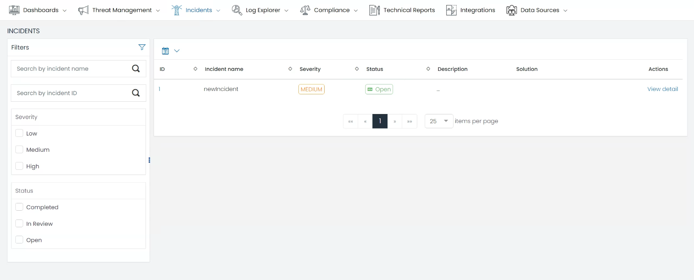
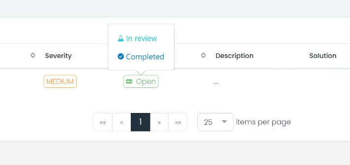
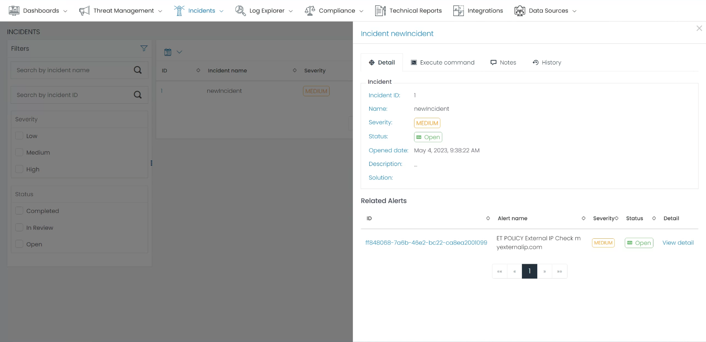

# Incident Managment
The Incident Management page is a crucial component of the UTMStack platform, dedicated to providing a comprehensive overview of all incidents within your organization. Designed to echo the layout and functionality of the Threat Management's Alert page, it ensures a seamless and consistent user experience across different modules.

## Data Grid
The heart of the Incident Management page is the Data Grid. This is where you'll find all the alerts escalated to incidents. Each row signifies a unique incident, providing crucial information like the incident's name, severity, status, proposed solution, and the action taken. The grid's contents can be sorted based on any field, allowing for a customized, user-specific view for easier navigation and handling.

## Filters
On the Incident page, the Filters section lets you drill down on specific incidents based on chosen criteria. Filterable fields include name, ID, severity, and status. This allows you to quickly find and respond to the most urgent incidents, enhancing your organization's incident response capabilities.

## Operations
The Incident Management page extends its functionality by allowing you to perform several key operations on each incident. These include updating the incident's status, adding notes for context, and executing a command for mitigation or resolution. This set of functionalities optimizes your incident response process, ensuring it remains efficient and effective.

## Incident Details and Related Alerts

By clicking on an incident, a window appears on the right side presenting detailed information about the incident, as well as alerts related to it. From this view, you can perform operations on the incident, inspect its history, or analyze associated alerts. 

This consolidated view of incidents and related alerts boosts your understanding of the security incident landscape, aiding in faster and more informed decision-making.