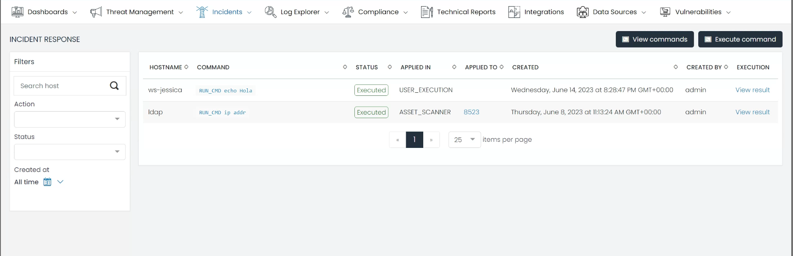
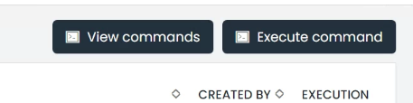
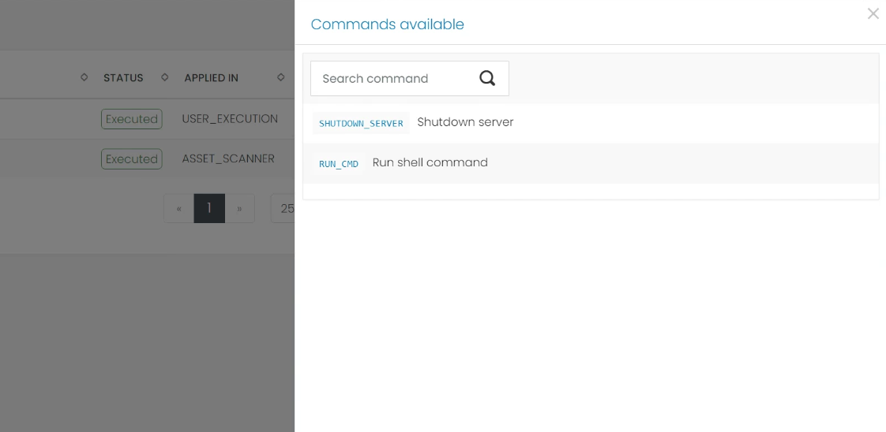
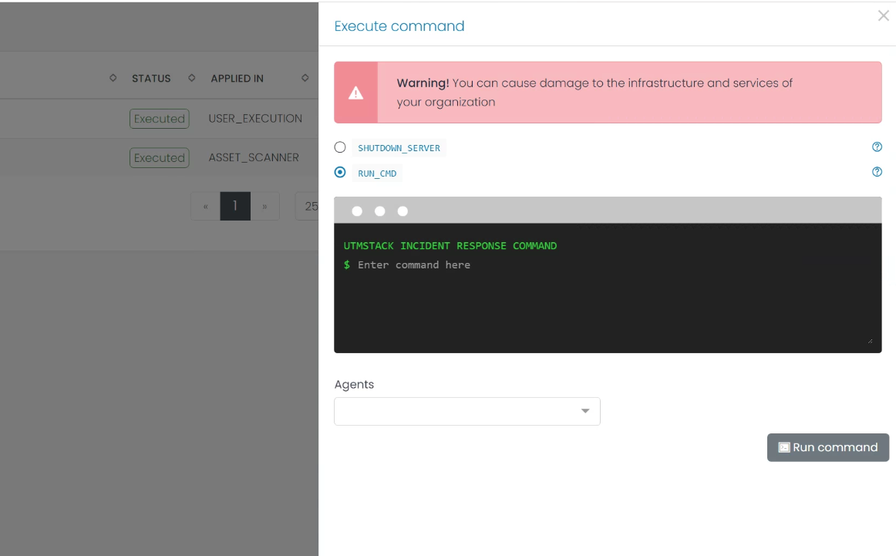

# Incident Response

The Incident Response page is a dedicated workspace within UTMStack, designed to streamline your incident response strategy. It provides a thorough record of all the commands executed during the incident response process. Each command record details crucial information such as the hostname on which it was executed, the operation result, and more.

## Incident Response Dashboard View

### Command Grid
The Command Grid is the pivotal component of the Incident Response page. It provides a comprehensive snapshot of all commands executed throughout the incident response process. Each row or entry within the grid pertains to a unique command execution, unveiling key details such as:

* **Hostname**: Identifies the system where the command was executed.
* **Command**: Outlines the specific command that was executed.
* **Status**: Represents the execution status of the command (success, failure, pending, etc.).
* **Applied In**: Signifies the asset or environment in which the command was executed.
* **Applied To**: Designates the specific asset the command was targeted at.
* **Created**: Marks the date and time when the command was created and executed.
* **Created By**: Specifies the individual who initiated the creation and execution of the command.
* **Execution**: Provides a detailed account of the command's execution outcome.

### Filters
To expedite your search for specific command executions, the Incident Response page features a Filters section. This allows you to refine your command list based on parameters such as action, status, or creation date.

### Command Operations
Command Operations serve as a critical tool in the Incident Response module and are split into two main functionalities: 'View Commands' and 'Execute Commands'. These functionalities are conveniently located at the right top corner of the Incident Response page, ensuring easy access.

### View Commands

The 'View Commands' function provides you with a detailed view of all the commands that can be executed. This feature promotes transparency in the incident response process, offering insights into possible actions, such as shutting down a compromised asset. Understanding available commands can guide you in choosing the most appropriate response strategy.

### Execute Commands

The 'Execute Commands' function facilitates immediate action by allowing you to execute specific commands on relevant assets. This proactive capability is a cornerstone in effectively managing and resolving incidents. By enabling you to take targeted action on the systems involved in an incident, UTMStack enhances your organization's incident response agility.

