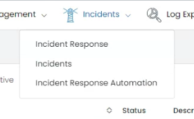

# Incident Management Module
The Incident Management Module is an essential part of UTMStack, designed to handle any incidents that arise within your organization's digital environment. This module consists of two key sections: Incident Management and Incident Response.

## Incidents
In the Incident Management section, you can manage, track, and resolve incidents that have been raised in your organization. It's designed to help your security teams efficiently manage incidents, from the initial detection and classification to the final resolution. 

## Incident Response
The Incident Response section is where your security team can execute their incident response strategy. This could involve executing a prederminated or perzonalized command. This section is designed to be flexible and adaptable, accommodating your organization's unique incident response procedures.

## Incident Response Automation

The Incident Response Automation feature empowers your organization to automate actions based on triggers in incident fields. By leveraging this automation capability, you can enhance the speed, accuracy, and consistency of your incident response process, enabling your team to focus on critical tasks and minimize the impact of security incidents.
