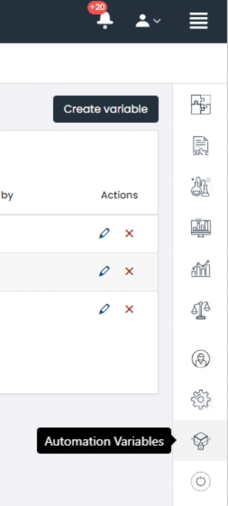
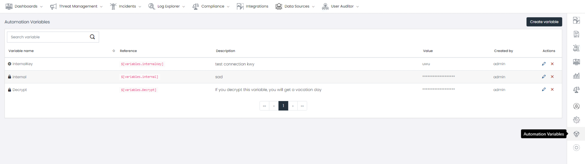
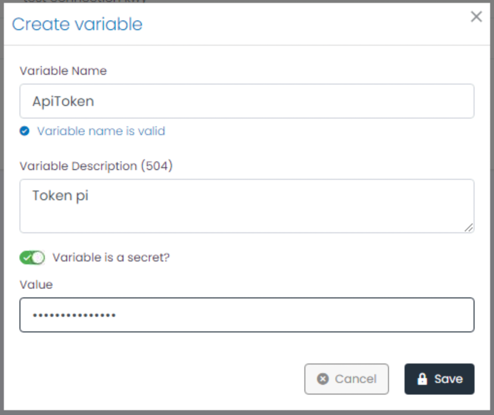
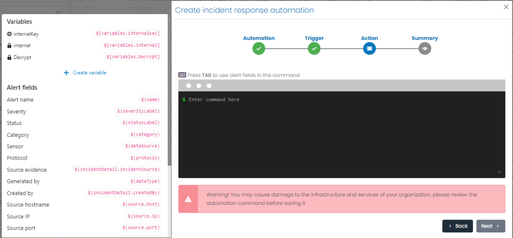

# Automation Variables

The new Automation Variables feature facilitates the creation, storage, and secure access to critical elements such as API keys and tokens within our system. Designed to standardize and enhance the inclusion of sensitive data in incident response commands, this functionality ensures that confidential information is handled and used securely, preventing its direct exposure or improper manipulation. Variables Automation serve as secure placeholders that can be easily integrated into automated processes, aligning with industry best practices and reinforcing our system's security against potential vulnerabilities.

## How to access Automation Variables
Click on the menu at the top right of the screen to locate the second last option

## Automation Variables Dashboard View

You can create "secrets", similar to environment variables, which can be securely used as placeholders in the required commands. Instead of directly including an API key in a command, you can reference a secret containing this information, thus eliminating the need to expose sensitive data.

- **Variable name**: Identifies the name of the variable.
- **Reference**: Represents a reference to the type.
- **Description**: Provides a description of the variable.
- **Value**: Shows the value in case it is not marked as secret, otherwise it will be displayed as secret.
- **Created by**: Shows the user who created the variable.
- **Action**: Provides options to edit or delete the variable.

## Create new variable
Click on the "Create Variable in the upper right corner" button. Select if you want the value to be secret in "Variable is a secret?", now you can save your variable or token securely.

### How to use variables
When creating an Incident Response automation, pressing the TAB key now allows you to view the variables you have created. If you need to create a new one, you can do so by clicking the "Create Variable" button located after the list. Access and incorporate the created variables into the command execution by simply clicking on them. This streamlined process ensures that your automation scripts are both efficient and secure, enhancing the overall response strategy.

### Conclusion
This function is essential for any process involving the handling of sensitive information, especially in incident response situations. Its implementation reinforces the integrity and security of our system, aligning it with industry-recognized security standards and improving overall operational efficiency.