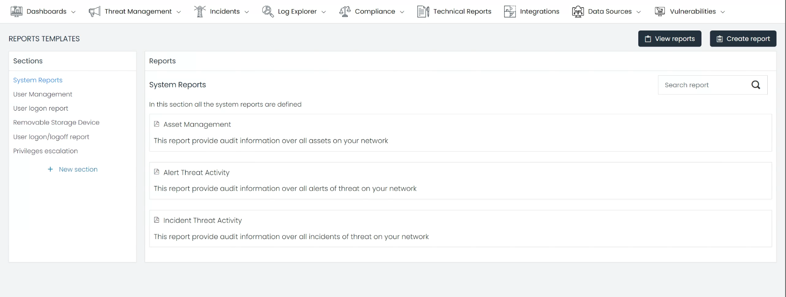
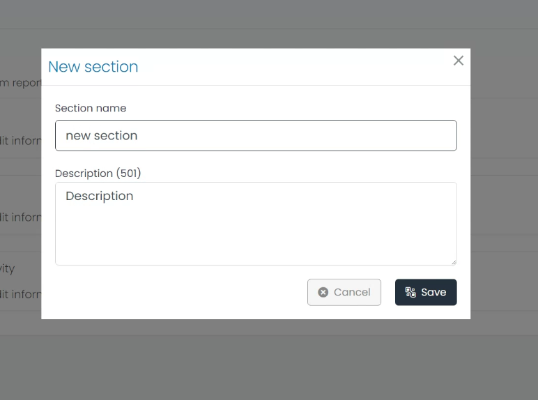
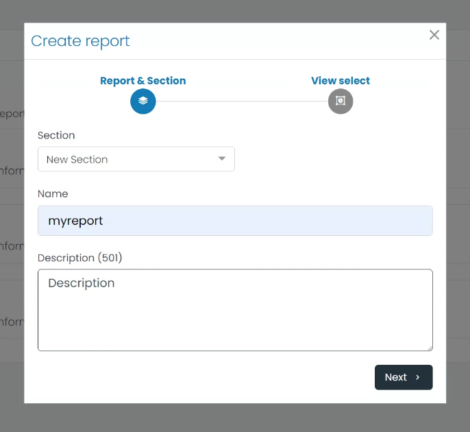
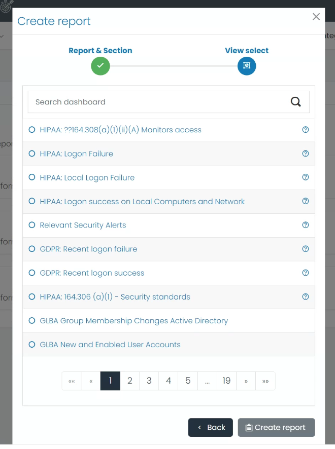
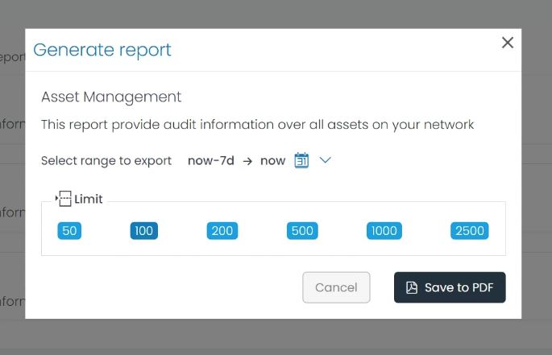

# Technical Reports Documentation

The Technical Reports module is a core component of our software platform that offers powerful, customizable reporting capabilities. With this module, you can efficiently analyze and interpret critical data related to system performance, user management, user activity, and security issues, among other operational aspects. Each report provided in this module focuses on a particular subject, offering detailed insights that assist in understanding the behavior, usage, and performance of various systems and user activities within your organization.

## Overview

The Technical Reports module is subdivided into various sections, each comprising a set of dedicated reports. These sections serve to categorize the reports based on their relevance and the type of data they analyze, allowing users to easily navigate and select the most suitable report for their needs. Here are the default sections provided:

### System Reports

This section provides a collection of reports related to your system's performance, functionality, and health. It allows you to gain a comprehensive understanding of your system's operation, helping you identify potential bottlenecks, failures, or areas that need improvement.

### User Management

The User Management section provides valuable reports that help you monitor and manage user accounts within your organization. You can analyze data on account creation, modification, deletion, and other user account activities. This aids in ensuring that user management within your organization adheres to best practices and security norms.

### User Logon Report

This section provides detailed reports on user logon activities. It helps you track when and from where users are accessing your system, making it easier to identify unusual logon patterns and potentially unauthorized access.

### Removable Storage Device

The Removable Storage Device section offers reports that monitor the usage of removable storage devices within your system. It can help track data transfers, unauthorized device usage, and more, thus aiding in data loss prevention and ensuring compliance with your organization's data handling policies.

### User Logon/Logoff Report

This section provides a comprehensive view of user logon and logoff activities. It gives you visibility into users' active and idle times, which can help you understand user behavior, work patterns, and potential security risks.

### Privilege Escalation

This section includes reports related to privilege escalation incidents. It helps you monitor changes in user privileges and identify any unauthorized or inappropriate privilege escalations, thereby enhancing your system's security.

## Creating a New Section

The Technical Reports module also offers you the flexibility to create a new section tailored to your specific needs. By clicking on the 'Create New Section' button, you can specify the name and description for the section, and subsequently, add the desired reports to this section. This allows you to group related reports together, making it more accessible and easier to navigate.

## Creating a New Report

You can create a new report from an existing dashboard and assign it to a specific section. This provides you with the ability to customize your reporting according to your organization's specific needs. The 'Create New Report' option guides you through selecting the dashboard, specifying the report's parameters, and finally, assigning it to the chosen section.

## Generating a Report

To generate a report, follow these simple steps:

1. Choose the report you wish to generate by clicking on it. A pop-up window will appear upon selection.

2. In the pop-up window, you can specify the desired 'Time Range' and set a 'Limit' on the number of elements to be included in the report. These parameters enable you to tailor the report to your specific requirements.

3. Once you've defined your parameters, click on the 'Save to PDF' button. This action generates the report based on your specifications and saves it as a PDF file.

The Technical Reports module is an integral tool for managing and interpreting the vast amount of data generated by your organization's operations. Its versatility and customizability make it a critical asset for organizations looking to derive actionable insights from their operational data.

