# Alert Management

Welcome to the Alert Management Section. This resource is tailored to guide you through the nuances and intricacies of our Alert Management system. From the mechanisms of correlation rules and alert generation to severity classifications and data visualizations, this guide encapsulates it all.

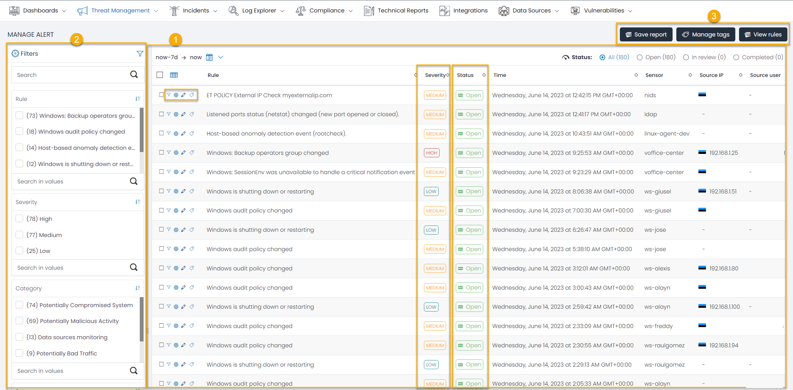

## Introduction

Alert Management isn't just a component—it's the bedrock of any effective security information and event management (SIEM) system. Its raison d'être lies in actively monitoring diverse data sources, pinpointing anomalies, detecting suspicious activities, and accordingly manifesting alerts in line with pre-configured correlation rules. The overarching objective? To empower organizations with actionable insights, ensuring the inviolability of their digital perimeter.

Our Alert Management system is fueled by a state-of-the-art correlation engine. This dynamo tirelessly processes incoming data in real-time, juxtaposes it against a matrix of defined correlation rules, and depending on the potential risk magnitude, spawns an alert with a corresponding severity.

This module acts as the nerve center for all alerts detected, showcasing pertinent details and allowing for effective alert handling. It's not just a tool; it's your vantage point to preemptively mitigate risks.

## 1. Data Grid

The heart of our Alert Management system, the Data Grid, is an interactive tableau of all detected alerts. It collates and exhibits salient details:

- **Rule Name**: The specific set of conditions that birthed the alert.
- **Severity**: The urgency quotient attached to the alert.
- **Status**: A real-time status indicator—new, under review, or resolved.
- **Sensor**: The data source or trigger point that sensed the potential jeopardy.

The Data Grid, apart from its intuitive design, allows alerts to be catalogued based on any field, defaulting to a chronological hierarchy.

### Key Alert Operations

Dive deeper with these pivotal operations:

### Converting an Alert to an Incident

Not all alerts are born equal. Some demand heightened scrutiny. Use the 'Create Incident' feature to either instantiate a new incident from an alert or annex it to an existing incident. Once an alert graduates to an incident status, an automatic email dispatch takes place, notifying stakeholders listed in the UTMStack settings. 

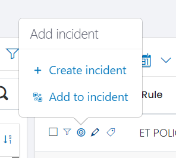

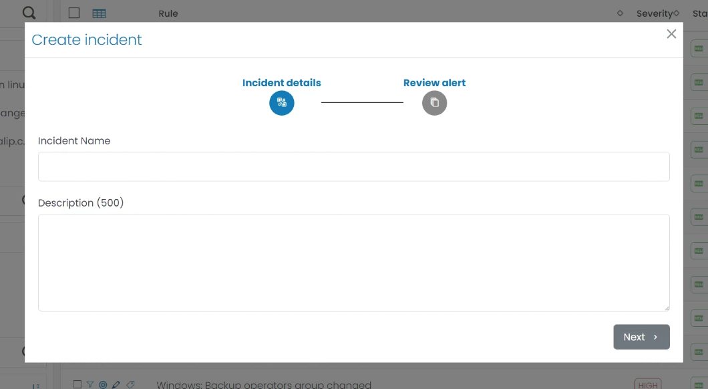

Craving more on incidents? Dive into our [Incident Guide](../Incidents/Incidents.md).

### Tagging Alerts: Beyond the False Positive

Hand-in-hand with alerts come false positives. Our system grants you the ability to create Tag Rules directly from alert fields, defaulting with the "False Positive" tag. Once tagged as a false positive through a rule, similar alerts won't bombard your dashboard.

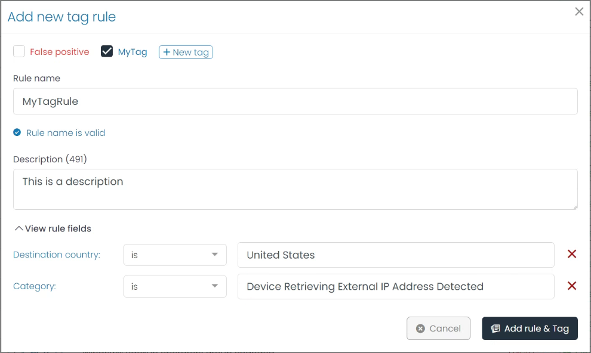

### Distilling Alerts through Filters

Harness the power of filters to refine your alert view. With a simple selection, morph your alert landscape based on attributes of your choice.

### Annotating Alerts

Collaboration is key in any cybersecurity endeavor. The ability to annotate alerts allows teams to share insights, questions, or additional context regarding the nature and potential implications of an alert. These annotations act as collaborative markers, ensuring that team members operate with a common understanding of potential threats.

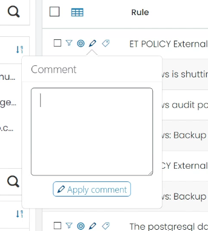

## 2. Filter

In a dynamic digital environment, the sheer volume of alerts can be overwhelming. The Filters section is designed to empower users with refined control over the alerts they see. By using powerful and customizable filtering tools, teams can focus on alerts that truly matter.

Whether you're zoning in on 'High Severity' alerts from a specific data source, or tracking down alerts generated by a particular rule, the Filter section offers you an unparalleled degree of specificity.

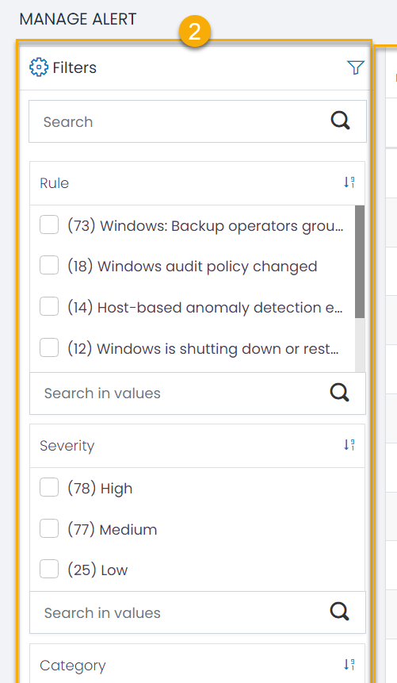

Beyond the default set of filters, the Alert Management Module is flexible enough to allow customization. This means that as your organization's needs evolve, so too can your filtering approach.

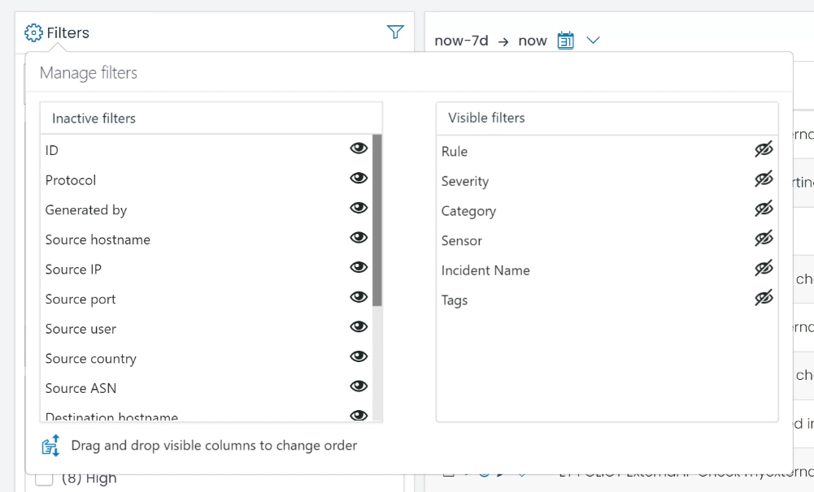

Effective utilization of the Filters section not only simplifies alert management but also elevates your organization's reactive and proactive security postures.

## 3. Additional Alert Management Features

Our Alert Management Module is brimming with features designed to ensure that you remain ahead of potential threats. At the top right of the module interface, you'll find three primary functionalities: Save Report, Manage Tags, and View Tag Rules.

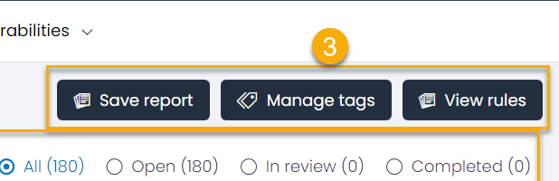

### Save Report

In some scenarios, offline analysis and record-keeping are indispensable. The 'Save Report' feature allows users to extract and download a comprehensive report of the alerts in a standard CSV format. Whether it's a deep dive into the past week's data or a broader look at alert trends, this feature facilitates flexible data export for any analytical or compliance need.

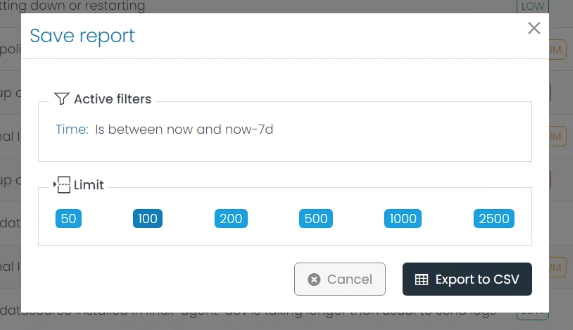

### Manage Tags

Tagging is more than just a labeling exercise—it's about classification, prioritization, and quick identification. The 'Manage Tags' feature empowers users to define their taxonomy of tags, ensuring that alerts can be swiftly categorized and acted upon.

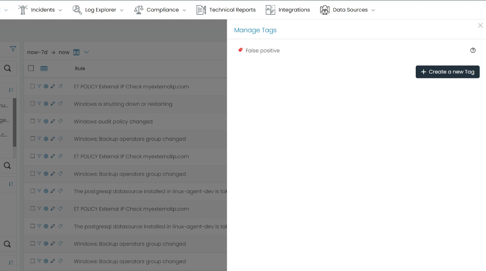

### View Tag Rules

Automation meets classification in the 'View Tag Rules' section. Here, you can define, review, and manage rules that automatically tag incoming alerts based on pre-set conditions. This auto-tagging not only streamlines alert handling but also introduces a degree of predictability in how alerts are categorized.

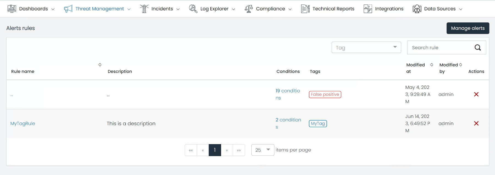
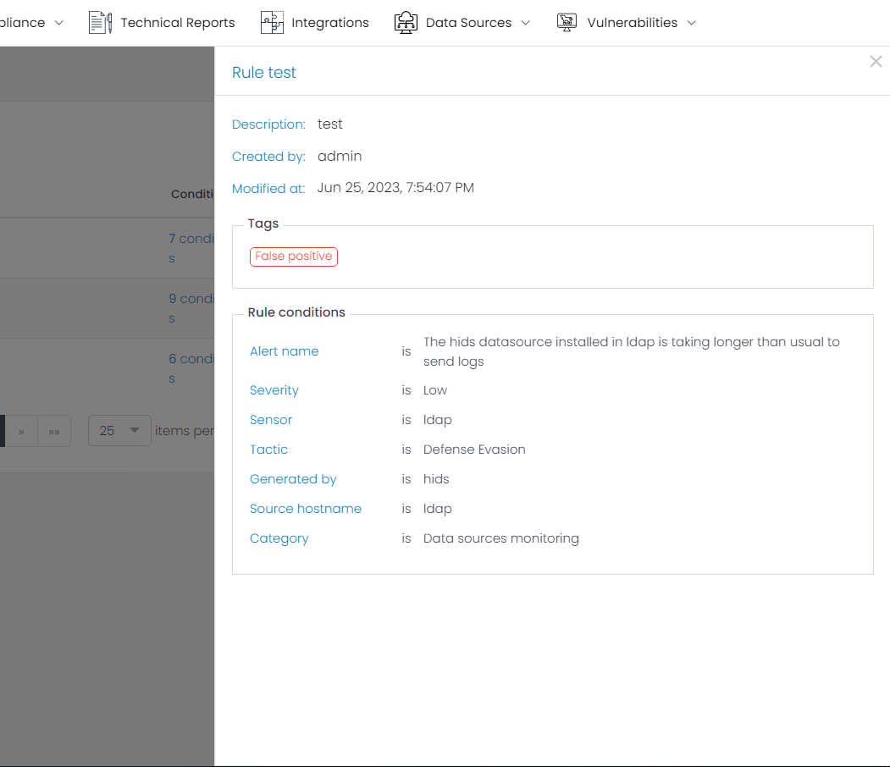

---

By embracing the full suite of features in our Alert Management Module, organizations can equip themselves to rapidly identify, classify, and react to potential threats. In a landscape where response time is paramount, we ensure you have the tools to stay ahead.
