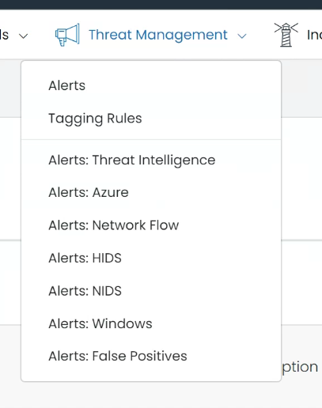

# Threat Management Module

The Threat Management Module is a vital component of the UTMStack, serving as the primary interface for security engineers and analysts. It offers a comprehensive and real-time view of all security events and potential threats within your organization.

When the UTMStack engine detects an event or anything that could be considered a threat, it is immediately directed to this module. This facilitates real-time threat detection and management, providing a continually updated overview of the security landscape within your organization.

The module is split into two key sections:

<ul>
<li ><a href="./AlerManagment">Alert Managment: </a>This is where all alerts detected by the UTMStack engine are collated and presented for your analysis and action.</li>
<li ><a href="./AlerManagment#tagginrules">Taggin Rules: </a> This is where you can manage the rules for tagging specific alerts, aiding in efficient classification and tracking of recurrent incidents.</li>
</ul>

Additionally, the module comes equipped with an array of predefined alert options. These filters can provide quick views of alerts based on various criteria, such as the source (like Azure or Windows) or the alert classification (such as false positives).

