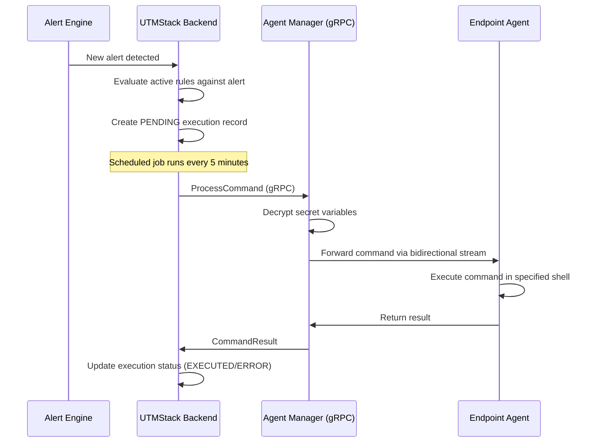

# Interactive Console & Execution


Beyond automated workflows, UTMStack SOAR provides an **Interactive Console** for running commands on agents in real time, **Automation Variables** for storing reusable values, and an **Execution Audit** view for tracking all SOAR activity.

## Interactive Console

The Interactive Console provides a live, WebSocket-based terminal to any connected UTMStack agent. Access it from the SOAR section at **SOAR > Interactive Console**.

### How It Works

1. The left sidebar displays all registered agents, searchable by hostname
2. Select an agent to open a terminal session
3. Type commands directly — they are sent to the agent and executed in real time
4. Output streams back to the console as the command runs

The console supports the same shell environments as automated workflows:

- **Windows agents**: CMD or PowerShell
- **Linux agents**: Bash
- **macOS agents**: Bash

> [!WARNING]
> Switching to a different agent terminates the current session. A confirmation dialog warns before disconnecting.

### Use Cases

- **Ad-hoc investigation**: Run forensic commands on a compromised endpoint without needing SSH/RDP access
- **Manual containment**: Execute response commands immediately when automated workflows are not configured
- **Workflow testing**: Test commands before adding them to an automated workflow
- **Troubleshooting**: Verify agent connectivity and command execution

## Automation Variables

Automation Variables are reusable key-value pairs that can be injected into SOAR workflow commands. They are managed at **SOAR > Automation Variables**.

### Variable Types

| Type | Icon | Description |
|---|---|---|
| **Regular** | Cog | Stored in plain text. Visible in logs and command output. |
| **Secret** | Lock | Encrypted at rest using AES. Decrypted only at the agent level. Values are masked with asterisks in logs and console output. |

### Using Variables in Commands

Variables are referenced in workflow commands using the `$[variables.variableName]` syntax:

```bash
curl -H "Authorization: Bearer $[variables.apiToken]" https://api.example.com/block/$[variables.firewallEndpoint]
```

At execution time, the variable placeholders are replaced with their actual values. Secret variables are decrypted only at the agent-manager level — the backend never sees the decrypted values.

### Security Protections

The system prevents commands that would expose secret variable values by detecting output commands such as `echo`, `printf`, `Write-Output`, `cat`, `type`, `console.log`, `print`, and pipe operators. Commands containing these patterns with secret variables are rejected.

### Managing Variables

| Field | Description |
|---|---|
| `variableName` | Unique name used in `$[variables.name]` references |
| `variableValue` | The stored value (encrypted for secrets) |
| `variableDescription` | Description of the variable's purpose |
| `secret` | Boolean — whether the variable is encrypted |

## Execution Flow (How Commands Reach Agents)

Understanding the execution pipeline helps with troubleshooting and performance expectations.



### Key Details

| Aspect | Detail |
|---|---|
| **Execution polling** | Pending executions are picked up every **5 minutes** |
| **Command timeout** | Commands time out after **5 minutes** at the agent level |
| **Offline agent retries** | Up to **5 retries** before marking execution as FAILED |
| **Communication protocol** | gRPC bidirectional streaming between backend and agent-manager |
| **False positive exclusion** | Alerts tagged as "False positive" are automatically excluded from rule evaluation |

### Execution Statuses

| Status | Description |
|---|---|
| `PENDING` | Execution created, waiting to be picked up by the scheduler |
| `RUNNING` | Command sent to agent, awaiting result |
| `EXECUTED` | Command completed successfully |
| `ERROR` | Command failed or agent was unreachable after retries |

### Non-Execution Causes

When a workflow cannot execute, the system records the reason:

| Cause | Description |
|---|---|
| `AGENT_OFFLINE` | The target agent is not connected (retried up to 5 times) |
| `AGENT_NOT_FOUND` | No agent found matching the alert's data source |
| `UNKNOWN` | An unexpected error occurred |

## Execution Audit

The **SOAR > Audit** view provides a real-time table (refreshing every 30 seconds) of all SOAR command executions.

### Audit Table Columns

| Column | Description |
|---|---|
| **Hostname** | Agent that executed the command |
| **Reason** | Why the command was executed |
| **Command** | The shell command that was run |
| **Applied in** | Origin type (Alert, Incident, User Execution, etc.) |
| **Applied to** | Clickable link to the related alert or incident |
| **Executed at** | Timestamp of execution |
| **Executed by** | User or system that triggered the execution |
| **Execution** | Link to view full command output |

### Filtering

The audit view supports filtering by:

- **Origin type**: Alert, Incident, Incident Response, User Execution
- **Agent**: Filter by specific agent hostname

### Origin Types

| Origin | Description |
|---|---|
| `ALERT` | Triggered automatically by an alert matching a workflow rule |
| `USER_EXECUTION` | Manually executed by a user via the Interactive Console |
| `INCIDENT` | Triggered from an incident response action |
| `INCIDENT_RESPONSE` | Triggered from the incident response module |
| `INCIDENT_RESPONSE_AUTOMATION` | Triggered by an automated SOAR workflow |

## API Endpoints

### Workflow Rules

| Method | Endpoint | Description |
|---|---|---|
| POST | `/api/utm-alert-response-rules` | Create a new workflow |
| PUT | `/api/utm-alert-response-rules` | Update an existing workflow |
| GET | `/api/utm-alert-response-rules` | List workflows (paginated, filterable) |
| GET | `/api/utm-alert-response-rules/{id}` | Get workflow by ID |
| GET | `/api/utm-alert-response-rules/resolve-filter-values` | Get available platforms and users |

### Action Templates

| Method | Endpoint | Description |
|---|---|---|
| GET | `/api/utm-alert-response-action-templates` | List all action templates |

### Execution History

| Method | Endpoint | Description |
|---|---|---|
| GET | `/api/utm-alert-response-rule-executions` | List rule execution history |
| GET | `/api/utm-alert-response-rule-histories` | List rule change audit log |

### Automation Variables

| Method | Endpoint | Description |
|---|---|---|
| POST | `/api/utm-incident-variables` | Create a variable |
| PUT | `/api/utm-incident-variables` | Update a variable |
| GET | `/api/utm-incident-variables` | List all variables |
| DELETE | `/api/utm-incident-variables/{id}` | Delete a variable |

### Jobs (Command Execution)

| Method | Endpoint | Description |
|---|---|---|
| POST | `/api/utm-incident-jobs` | Create a job (execute a command) |
| GET | `/api/utm-incident-jobs` | List jobs |
| GET | `/api/utm-incident-jobs/{id}` | Get job by ID |
| GET | `/api/utm-incident-jobs/count` | Count jobs |
| DELETE | `/api/utm-incident-jobs/{id}` | Delete a job |
