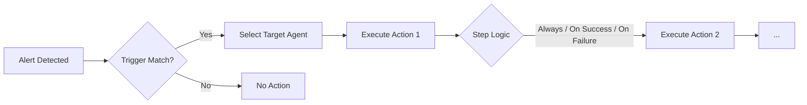

# SOAR — Security Orchestration, Automation, and Response

UTMStack SOAR enables automated incident response by executing predefined workflows when specific alert conditions are detected. Instead of requiring manual intervention for every security event, SOAR workflows can automatically take containment and remediation actions on affected endpoints within seconds of detection.

## What SOAR Does

SOAR workflows connect UTMStack alert detection directly to response actions on your endpoints. When an alert triggers, the associated workflow runs commands on the target agent — blocking IPs, killing processes, disabling compromised accounts, or isolating hosts — without waiting for an analyst to respond.

## Key Concepts

| Concept | Description |
|---|---|
| **Workflow** | A complete automation rule that links a trigger condition to one or more response actions |
| **Trigger** | The condition that activates a workflow, typically matching on an alert name or alert attributes |
| **Action** | A command executed on an endpoint agent (e.g., block an IP, kill a process, disable a user) |
| **Action Template** | A reusable, pre-built command block that can be added to any workflow |
| **Agent** | The UTMStack endpoint agent that executes the workflow commands on the target system |
| **Proxy Agent** | An agent used to run commands on devices that cannot host their own agent (firewalls, network devices) |
| **Shell** | The command interpreter used to execute actions: CMD, PowerShell (Windows), or Bash (Linux/macOS) |
| **Dynamic Variables** | Alert field placeholders (e.g., `$(adversary.ip)`) that are replaced with actual values at execution time |

## How It Works

1. A correlation rule or detection engine generates an **alert**
2. SOAR checks if any active workflow's **trigger condition** matches the alert
3. If matched, the workflow identifies the **target agent** (the agent associated with the alert source, or a configured proxy agent)
4. The workflow executes its **action sequence** on the target agent using the specified shell
5. Each action step can be configured to run **always**, **only on success**, or **only on failure** of the previous step

## Supported Platforms

| Platform | Shell Options | Example Use Cases |
|---|---|---|
| **Windows** | CMD, PowerShell | Block IPs via Windows Firewall, kill processes, disable users, manage Windows Defender |
| **Linux (Debian/Ubuntu)** | Bash | Block IPs via iptables/ufw, kill processes, disable users, stop services |
| **Linux (RHEL/CentOS)** | Bash | Block IPs via firewall-cmd, kill processes, disable users, stop services |
| **Linux (OpenSUSE)** | Bash | Block IPs via firewall-cmd, kill processes, disable users |
| **macOS** | Bash | Block IPs via pfctl, kill processes, disable users, stop services |

## Built-in Content

UTMStack ships with **73 pre-built action templates** and **23 ready-to-use playbooks** covering common response scenarios across all supported platforms. These can be used as-is or customized to fit your environment.

> [!TIP]
> Start with the built-in playbooks and customize them for your environment rather than building workflows from scratch. This saves time and ensures you follow proven response patterns.
