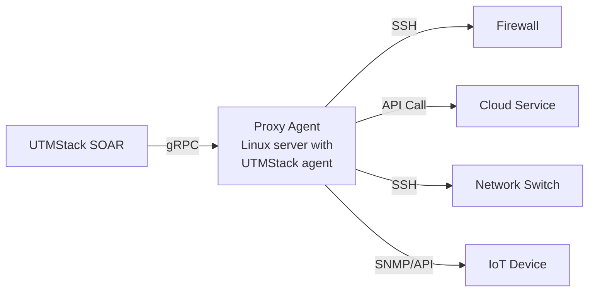

# Proxy Agents

Many devices in your network — firewalls, routers, switches, IoT appliances, and legacy systems — cannot run the UTMStack agent directly. Proxy agents solve this by allowing a machine **with** an installed UTMStack agent to execute SOAR commands **on behalf of** those unmanaged devices.

## How Proxy Agents Work



1. An alert triggers a SOAR workflow
2. Instead of running on the device that generated the alert (which may not have an agent), the workflow targets a **proxy agent**
3. The proxy agent receives the command via gRPC from UTMStack
4. The proxy agent executes the command locally — which in turn reaches the target device via SSH, API calls, or other protocols

## When to Use a Proxy Agent

| Scenario | Target Device | Proxy Approach |
|---|---|---|
| Block IP on a firewall | FortiGate, pfSense, Palo Alto, etc. | SSH into the firewall from the proxy, or call the firewall's REST API |
| Manage a network switch | Cisco, Juniper, etc. | SSH into the switch from the proxy |
| Control a cloud resource | AWS, Azure, GCP | Call cloud APIs from the proxy using CLI tools or curl |
| Remediate an IoT device | Cameras, sensors, controllers | API calls or SNMP commands from the proxy |
| Manage a legacy system | Older servers without agent support | SSH from the proxy into the legacy system |
| Interact with a SaaS platform | Office 365, Google Workspace | API calls from the proxy using stored credentials |

## Setting Up a Proxy Agent

### Step 1: Choose the Proxy Host

Select a machine that:

- **Has the UTMStack agent installed** and is showing as ONLINE
- **Has network access** to the target device (can reach it via SSH, HTTPS, API, etc.)
- **Has the necessary tools installed** (ssh client, curl, cloud CLI tools, Python, etc.)
- **Is in the correct network segment** — if the target device is on an isolated VLAN, the proxy must be able to reach it

> [!TIP]
> A Linux server is usually the best choice for a proxy agent because Bash provides the most flexibility for scripting SSH sessions, API calls, and command chaining. It also comes with curl, ssh, and Python pre-installed on most distributions.

### Step 2: Prepare Credentials

Store any credentials needed to access the target device as **Automation Variables** in UTMStack:

1. Go to **SOAR > Automation Variables**
2. Create variables for the credentials:

| Variable Name | Type | Example Value | Purpose |
|---|---|---|---|
| `firewallIp` | Regular | `192.168.1.1` | Target firewall IP |
| `firewallUser` | Regular | `admin` | Firewall SSH/API username |
| `firewallPassword` | Secret | `••••••` | Firewall password (encrypted at rest) |
| `fwSshKey` | Secret | `/home/agent/.ssh/fw_key` | Path to SSH private key on proxy |
| `fwApiToken` | Secret | `••••••` | Firewall REST API token |

> [!NOTE]
> Secret variables are encrypted at rest and decrypted only at the agent level during execution. They are never visible in logs or the UTMStack UI.

### Step 3: Test Connectivity from the Proxy

Before creating a workflow, verify the proxy can reach the target device. Use the **SOAR > Interactive Console**:

1. Select the proxy agent from the agent list
2. Test the connection:

```bash
# Test SSH access to a firewall
ssh -o StrictHostKeyChecking=no -o ConnectTimeout=5 admin@192.168.1.1 "show version"

# Test API access
curl -sk https://192.168.1.1/api/v2/monitor/system/status -H "Authorization: Bearer YOUR_TOKEN"

# Test network reachability
ping -c 3 192.168.1.1
```

### Step 4: Configure the Workflow

In the workflow builder:

1. Enable **Run on specific agent** in the Flow Actions section
2. Select the **Agent platform** matching the proxy host (e.g., `ubuntu`)
3. Select the proxy agent hostname from the **Dedicated agent** dropdown
4. Build the action commands (see examples below)

## Examples by Target Device

### Firewall: Block IP via SSH

**Scenario**: Block an attacker IP on a FortiGate firewall using SSH from a Linux proxy agent.

**Automation Variables needed**:
- `firewallIp` (regular): `10.0.0.1`
- `fwSshKey` (secret): `/home/utmstack/.ssh/fortigate_key`

**Command**:

```bash
ssh -o StrictHostKeyChecking=no -i $[variables.fwSshKey] admin@$[variables.firewallIp] "config firewall address
edit blocked-$(adversary.ip)
set subnet $(adversary.ip)/32
end
config firewall policy
edit 0
set name block-soar-$(adversary.ip)
set srcaddr blocked-$(adversary.ip)
set dstaddr all
set action deny
set schedule always
set service ALL
end"
```

### Firewall: Block IP via REST API

**Scenario**: Block an IP on a pfSense firewall using its REST API from a Linux proxy.

**Automation Variables needed**:
- `pfsenseUrl` (regular): `https://10.0.0.1`
- `pfsenseApiKey` (secret): API client ID
- `pfsenseApiToken` (secret): API client token

```bash
curl -sk -X POST "$[variables.pfsenseUrl]/api/v1/firewall/rule" \
  -H "Authorization: $[variables.pfsenseApiKey] $[variables.pfsenseApiToken]" \
  -H "Content-Type: application/json" \
  -d '{
    "type": "block",
    "interface": "wan",
    "ipprotocol": "inet",
    "protocol": "any",
    "src": "$(adversary.ip)",
    "dst": "any",
    "descr": "SOAR auto-block $(adversary.ip) from alert $(name)"
  }'
```

### Palo Alto: Block IP via API

**Automation Variables needed**:
- `paloAltoUrl` (regular): `https://10.0.0.2`
- `paloAltoApiKey` (secret): Palo Alto API key

```bash
curl -sk -X POST "$[variables.paloAltoUrl]/api/?type=config&action=set&xpath=/config/devices/entry/vsys/entry[@name='vsys1']/address/entry[@name='blocked-$(adversary.ip)']&element=<ip-netmask>$(adversary.ip)/32</ip-netmask>&key=$[variables.paloAltoApiKey]"
```

### Cloud: AWS Security Group Update

**Scenario**: Revoke an IP in an AWS security group from a proxy agent with AWS CLI installed.

```bash
aws ec2 revoke-security-group-ingress \
  --group-id $[variables.awsSecurityGroupId] \
  --protocol tcp \
  --port 0-65535 \
  --cidr $(adversary.ip)/32 \
  --region $[variables.awsRegion]
```

### Network Switch: Disable a Port via SSH

**Scenario**: Disable a switch port to isolate a compromised device.

```bash
ssh -o StrictHostKeyChecking=no admin@$[variables.switchIp] "configure terminal
interface $(adversary.port)
shutdown
exit
write memory"
```

### Remote Linux Server: Disable User via SSH

**Scenario**: Disable a user on a remote server that doesn't have a UTMStack agent.

```bash
ssh -o StrictHostKeyChecking=no -i $[variables.serverSshKey] root@$[variables.serverIp] "usermod -s /sbin/nologin $(adversary.user) && pkill -KILL -u $(adversary.user)"
```

## Proxy Agent vs Direct Agent

| Aspect | Direct Agent | Proxy Agent |
|---|---|---|
| **Agent required on target** | Yes | No — agent is on the proxy host |
| **Command execution** | Directly on the target | On the proxy, which reaches the target remotely |
| **Best for** | Servers and workstations | Firewalls, switches, cloud, IoT, legacy systems |
| **Network requirement** | Agent needs connectivity to UTMStack | Proxy needs connectivity to both UTMStack and the target |
| **Credential management** | Not needed (agent runs locally) | SSH keys, API tokens, etc. stored as Automation Variables |
| **Latency** | Lower (direct execution) | Slightly higher (extra hop through proxy) |

## Best Practices

- **Dedicated proxy host** — Use a hardened Linux server specifically designated as a SOAR proxy, rather than a general-purpose server
- **Minimal privileges** — Grant the proxy only the specific access it needs on each target device. Use read-only API tokens where full access is not required.
- **SSH key authentication** — Prefer SSH keys over passwords for automated connections. Store the key path as a secret Automation Variable.
- **Test before activating** — Always verify connectivity and command execution via the Interactive Console before enabling automated workflows
- **Monitor proxy health** — Ensure the proxy agent stays ONLINE. If the proxy goes offline, all workflows targeting it will fail after 5 retries.
- **Document your proxies** — Maintain a record of which proxy agent serves which target devices, so the team knows the dependency chain
- **Firewall rules** — Ensure firewall rules allow the proxy to reach target devices on the required ports (SSH 22, HTTPS 443, etc.)"}