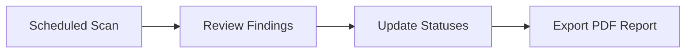

Learn how to configure advanced vulnerability scans using the UTMStack agent, automate your scanning schedules, and generate compliance reports. While network scans are great for external exposure, agent-based scans give you deep visibility into internal host vulnerabilities that network scans cannot see.

<Card title="Agent Installation Guide" icon="pi pi-download" href="/docs/agent-installation">

Before running internal scans, ensure the UTMStack agent is installed and running on your target Windows or Linux servers.

</Card>

## Understanding Scan Types

Choosing the right scan type is critical for comprehensive vulnerability management. Use the table below to determine which scan fits your current needs:

| Scan Type | Visibility | Primary Use Case |
|---|---|---|
| **Network Scan** | External | Evaluating what is exposed to the network (e.g., open ports, external services). |
| **Application Scan** | Internal (Agent) | Inspecting installed applications on the host and mapping them to known CVEs. |
| **Binary Scan** | Internal (Agent) | Detecting vulnerable embedded libraries (like outdated `log4j` components) hidden inside applications. |

> [!NOTE]
> Do not assume a network scan checks internal software or local host vulnerabilities. You must use agent-based scans to inspect internal application and component issues.

## Running Agent-Based Scans

Once your agents are deployed, you can run application and binary scans to identify internal vulnerabilities.

<Steps>
  <Step title="Verify target scope">
    Carefully verify your target IPs and scan scope to ensure you are scanning the correct systems. Confirm the agent is actively communicating with the server.
  </Step>
  <Step title="Run an application-level scan">
    Initiate an application scan to inspect the software installed on the host. Review the results to understand which installed applications have vulnerabilities mapped to known CVEs.
  </Step>
  <Step title="Run a binary scan">
    Select a binary scan to inspect deeper application components. This step is crucial for finding vulnerable embedded libraries that standard application scans might miss.
  </Step>
  <Step title="Prioritize remediation">
    Review the findings from both scans. Prioritize patching or mitigating vulnerable components that are embedded inside critical applications, as these may expose the system to compromise.
  </Step>
</Steps>
## Scheduling Scans and Exporting Reports

To maintain continuous visibility without relying on manual execution, you should configure your scans to run on an automated schedule.

1. **Automate the schedule:** Configure your application and binary scans to run on a recurring schedule.
2. **Clean up statuses:** Review the dashboard and update the status of each finding (e.g., mitigated, false positive, resolved).
3. **Generate the report:** Open the dashboard and export the results to a PDF. You can use this exported PDF as supporting documentation for compliance reviews and auditors.

> [!WARNING]
> Always update vulnerability statuses *before* exporting your reports. Exporting reports after a status cleanup reduces follow-up work for auditors and engineers and ensures the report reflects the true remediation state.

## Best Practices

<Accordion multiple={true}>
  <AccordionTab title="Managing False Positives" >

    Use caution when interpreting false positives. Always validate findings manually before closing them out to ensure you aren't ignoring a legitimate threat.

  </AccordionTab>

  <AccordionTab title="Standardizing Status Updates" >

    Keep your reporting consistent by standardizing status updates across your team. Agree on when to use specific tags like **mitigated**, **false positive**, or **resolved**.

  </AccordionTab>

  <AccordionTab title="Combining Scan Strategies" >

    For the best security posture, use network scans for external exposure checks alongside agent scans for internal host visibility. Neither approach replaces the other.

  </AccordionTab>

</Accordion>

> [!TIP]
> Keep the UTMStack installation and configuration team's contact information handy for any credential or agent setup questions you encounter during deployment.
