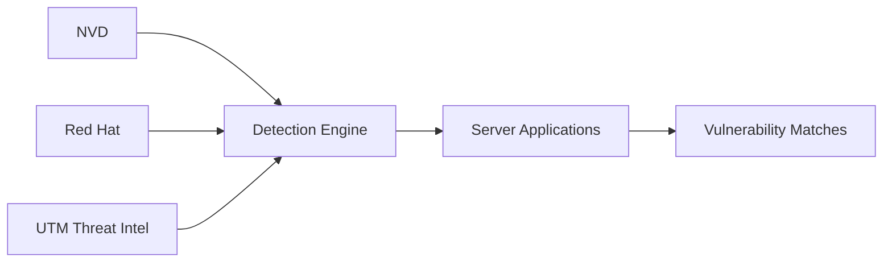

This guide provides a reference mapping of common security use cases and misconfigurations to their corresponding detection templates. You can use these templates to quickly identify, categorize, and remediate vulnerabilities across your infrastructure.

## How the Scanner Works

Our application scanner uses in-house built detection mechanisms to keep your servers secure. It continuously aggregates vulnerability data from multiple trusted sources and matches them against the applications installed on your servers.

> [!INFO]
> The scanner combines threat intelligence from the **National Vulnerability Database (NVD)**, **Red Hat**, and **UTM Stacked Threat Intelligence** to ensure you have the most up-to-date protection against known vulnerabilities.

## Detection Templates Reference

Depending on what you are trying to detect, you can utilize specific templates. Below is a mapping of common security use cases to their recommended detection templates.

| Security Use Case | Detection Template |
|---|---|
| **Detect known CVEs** | CVE-2021-44228 (Log4Shell) |
| **Identify Out-of-Band vulnerabilities** | Blind SQL Injection via OOB |
| **SQL Injection detection** | Generic SQL Injection |
| **Cross-Site Scripting (XSS)** | Reflected XSS Detection |
| **Default or weak passwords** | Default Credentials Check |
| **Secret files or data exposure** | Sensitive File Disclosure |
| **Identify open redirects** | Open Redirect Detection |
| **Detect subdomain takeovers** | Subdomain Takeover Templates |
| **Security misconfigurations** | Unprotected Jenkins Console |
| **Weak SSL/TLS configurations** | SSL Certificate Expiry |
| **Misconfigured cloud services** | Open S3 Bucket Detection |
| **Remote code execution (RCE)** | RCE Detection Templates |
| **Directory traversal attacks** | Path Traversal Detection |
| **File inclusion vulnerabilities** | Local/Remote File Inclusion |

> [!TIP]
> If you are setting up a new environment, we recommend starting with the **Default Credentials Check** and **SSL Certificate Expiry** templates, as these catch some of the most common and easily exploitable misconfigurations.

## Next Steps

Ready to put these templates to work? Check out our guides on running your first scan.

<Card title="Run a Vulnerability Scan" icon="pi pi-play" href="/docs/vulnerability-scanning/run-scan">

Learn how to configure and execute a vulnerability scan using these templates.

</Card>
