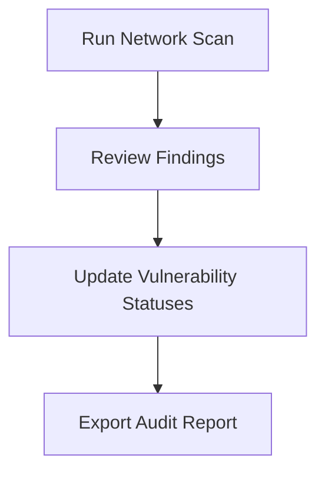

Network vulnerability scans help you identify exposed services and externally reachable vulnerabilities on your servers, websites, and web applications. In this guide, you will learn how to run an on-demand network scan, review the findings, and export an audit-ready report for your team.

Before you begin, ensure you have the IP address or hostname of your target system, as well as your login credentials for the UTMStack Vulnerability Scanner.

## Running an On-Demand Scan

On-demand network scans are ideal for immediate, external assessments of your infrastructure, such as web application servers or DNS servers.

<Steps>
  <Step title="Log in to the scanner">
    Open the UTMStack Vulnerability Scanner server in your browser. Enter the default credentials provided by your installation team and click **Login**. Confirm that the main dashboard loads successfully.
  </Step>
  <Step title="Create a new scan">
    From the main dashboard, navigate to the scan management area and choose the option to create a new scan. Select **On-demand scanning** to run the assessment immediately.
  </Step>
  <Step title="Define your target">
    Enter the target system's IP address or hostname (for example, the IP of a web server running IIS).
  </Step>
  <Step title="Verify and launch">
    Double-check both the scanner server IP and the target IP to ensure accuracy. Once verified, start the scan.
  </Step>
</Steps>
> [!INFO]
> **Understanding Scan Scope**  
> Network scans check exactly what is visible from the outside network. They do not inspect software installed internally on the host. If you need to scan internal host configurations, you will need to use an agent-based scan.

## Reviewing and Managing Results

Once your scan completes, it's important to review the findings and update their statuses to ensure your final reports are accurate.

<Steps>
  <Step title="Open the scan results">
    Navigate to your scan list and click on the completed scan to open its details.
  </Step>
  <Step title="Review the findings">
    Look through the full list of identified vulnerabilities. Click on individual findings to read their short descriptions and understand exactly what is exposed to the outside network.
  </Step>
  <Step title="Update vulnerability statuses">
    Click on each vulnerability to update its status. It is critical to ensure these statuses are accurate before generating any reports so that your team focuses only on what needs fixing.
  </Step>
  <Step title="Export the report">
    Use the export function to generate a final report. Filter the report to include only relevant, unresolved items. You can now provide this exported document to auditors or system engineers as the official record for remediation tracking.
  </Step>
</Steps>
### Vulnerability Status Definitions

When updating your findings in Step 3, use the following statuses to categorize each vulnerability:

| Status | Description |
|---|---|
| **Open / Unresolved** | The vulnerability is active, exposed, and requires remediation by your engineering team. |
| **Resolved** | The issue has already been fixed or patched. |
| **Mitigated** | The vulnerability exists, but compensating security controls are in place to prevent exploitation. |
| **False Positive** | The scanner flagged an issue that does not actually exist or is not applicable to your specific environment. |

> [!TIP]
> Always mark known false positives and mitigated items *before* exporting. This keeps your reports clean and prevents engineers from wasting time investigating non-issues.

## Next Steps

If you need deeper visibility into the internal software and configurations of your servers, a network scan won't be enough. Consider setting up agent-based scanning.

<Card title="Agent-Based Scanning" icon="pi pi-desktop" href="/docs/vulnerability-scanning/agent-scans">

Learn how to install and use the UTMStack agent to perform deep, internal vulnerability scans on your hosts.

</Card>
