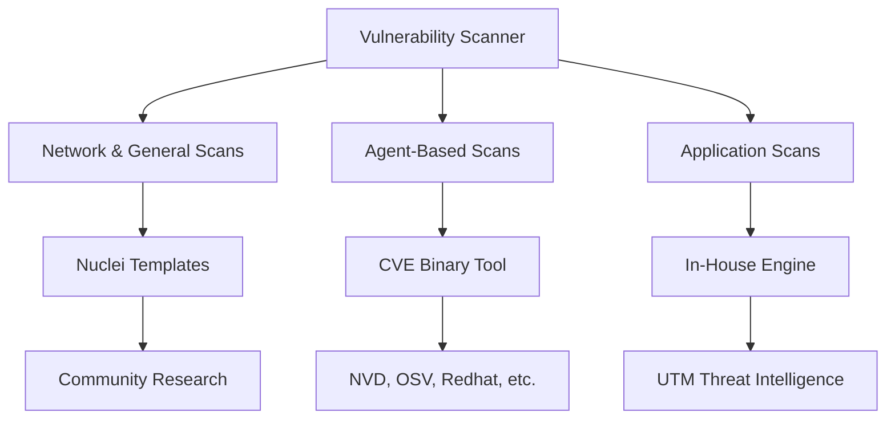

The UTMStack vulnerability scanner relies on a powerful combination of industry-standard open-source tools and proprietary threat intelligence to keep your systems secure. This page explains the core technologies powering our detection engines, including Nuclei templates, the CVE Binary Tool, and our in-house application scanner.

## Network and General Scanning

For general vulnerability detection, the platform uses the **NUCLE-A** template standard. This engine relies on Nuclei templates, which are highly extensible, YAML-based files that define exactly how security requests are sent and processed.

Because YAML is a simple, human-readable format, it allows security teams to quickly define execution processes, severity ratings, and detection methods. This open-source tool is actively developed by thousands of security researchers globally, ensuring rapid response to new threats.

<Card title="AI-Powered Nuclei Editor" icon="pi pi-code" href="#">

Try our free AI-powered Nuclei Templates Editor online to easily create, edit, and test your own custom detection templates.

</Card>

<Tip>
  The Nuclei community is driven by global security researchers. If you are interested in contributing, look into our **Pioneers** and **Bounties** programs to help improve detection capabilities for everyone.
</Tip>

## Agent-Based Scanning

When you run agent-based scans, the system utilizes the **CVE Binary Tool**, an open-source utility originally developed by Intel. This tool is designed to find known vulnerabilities in your software supply chain and can automatically generate Software Bills of Materials (SBOMs).

The CVE Binary Tool pulls vulnerability data from several trusted sources:

- National Vulnerability Database (NVD)
- Redhat
- Open Source Vulnerability Database (OSV)
- Gitlab Advisory Database (GAD)
- Curl

<Note>
  While the CVE Binary Tool actively uses the NVD API to fetch the latest vulnerability data, it is not officially endorsed or certified by the NVD.
</Note>

### Scanning Modes

The CVE Binary Tool operates in two primary modes to ensure comprehensive coverage of your environment:

| Scanning Mode | Description | Key Capabilities |
|---|---|---|
| **Binary Scanner** | Analyzes compiled software to determine which packages were included during the build. | Features over 447 checkers focusing on common open-source components like `openssl`, `libpng`, `libxml2`, and `expat`. |
| **Component List Scanner** | Scans known component lists and manifests for vulnerable versions. | Supports `.csv` files, Linux distribution package lists, language-specific package managers, and various SBOM formats. |

## Application Scanning

To detect vulnerabilities within the applications installed directly on your servers, we use a specialized **in-house detection engine**.

This application scanner combines our proprietary build detection mechanisms with a rich blend of threat intelligence. By cross-referencing installed software against the NVD, Red Hat advisories, and **UTM Stacked Threat Intelligence**, the scanner accurately matches known vulnerabilities to your specific server environments, giving you actionable insights to patch and protect your infrastructure.