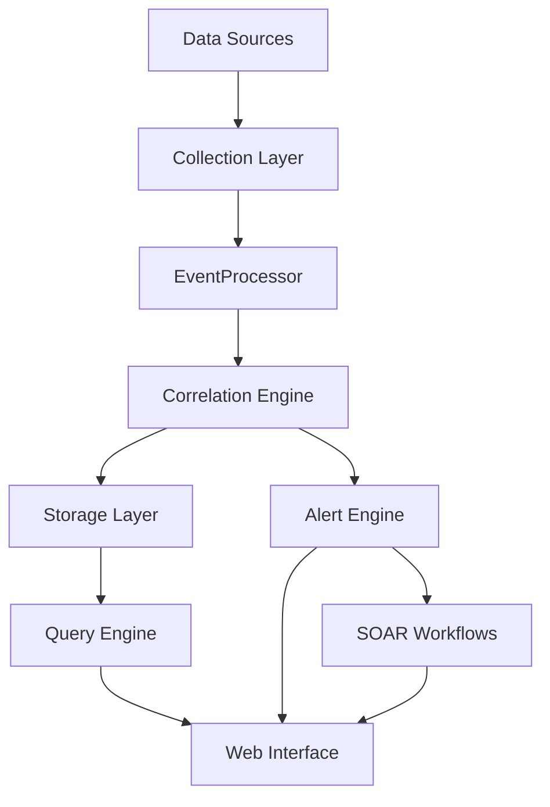

UTMStack v11 introduces a revolutionary architecture designed for modern cybersecurity operations. The platform offers flexible and scalable deployment models that adapt to organizations of any size, from small businesses to large enterprises and MSPs.

<Info>
**New in v11**: The architecture now features a manager-worker model with horizontal scalability, replacing the monolithic design of previous versions.
</Info>

---

## Core Architecture Components

### Manager and Worker Nodes

UTMStack v11 uses a distributed architecture with two primary container types:

<CardGroup cols={2}>
  <Card title="Manager Node" icon="pi pi-server" iconAlign="left" content="**Central coordination and management**     - Web interface hosting     - User authentication and authorization     - Configuration management     - Alert orchestration     - API endpoints     - Database management" />
  
  <Card title="Worker Nodes" icon="pi pi-sitemap" iconAlign="left" content="**Distributed data processing**     - Log ingestion and parsing     - Real-time correlation     - Threat detection     - Plugin execution     - Parallel processing     - Horizontal scalability" />
### Key Architectural Features

<Accordion multiple={true}>
    <AccordionTab header="EventProcessor Engine">

    Replaces Logstash with a custom-built, high-performance log processing engine developed by Threatwinds:
    - Lower resource consumption
    - Faster processing speeds
    - Better memory management
    - Native correlation capabilities
  
  </AccordionTab>
  
    <AccordionTab header="Modular Plugin System">

    Official plugin architecture for extensibility:
    - Independent feature modules
    - Easy maintenance and updates
    - Community contributions support
    - Hot-swappable components
  
  </AccordionTab>
  
    <AccordionTab header="Horizontal Scaling">

    Add worker nodes to scale processing capacity:
    - Linear performance scaling
    - No single point of failure
    - Load distribution across workers
    - Automatic failover support
  
  </AccordionTab>
</Accordion>

---

## Deployment Models

UTMStack v11 supports multiple deployment models to meet different organizational needs:

### 1. Single Node Deployment (Standalone)


**Best for**: Small to medium organizations with up to 500 data sources

A **single node deployment** combines both manager and worker functions on one server, providing:
- Complete data control and isolation
- Simplified management
- Lower infrastructure costs
- Suitable for on-premises or cloud deployment
- Full SIEM/XDR capabilities

**Characteristics**:
- All-in-one installation
- Direct log collection from devices
- Local data storage
- No external dependencies
- Enhanced security through data isolation

---

### 2. Multi-Node Deployment (Manager + Workers)


**Best for**: Large organizations with 500+ data sources requiring high performance

A **multi-node deployment** separates management from processing:
- One manager node for coordination
- Multiple worker nodes for data processing
- Horizontal scalability
- High availability options
- Load distribution

**Characteristics**:
- Scalable architecture
- Add workers as needed
- Parallel log processing
- Better resource utilization
- Handles large data volumes efficiently

---

### 3. Federated Deployment (MSP Model)


**Best for**: Managed Service Providers (MSPs) managing multiple customers

The **federated deployment model** enables centralized management across multiple UTMStack instances:
- Separate UTMStack installation per customer
- Central federation server for unified monitoring
- Multi-tenant architecture
- Centralized alerting and reporting
- Customer data isolation

**Characteristics**:
- One instance per customer network
- Central monitoring dashboard
- Unified alert management
- Efficient multi-customer oversight
- Scalable MSP operations

<Tip>
This model is commonly used by SOC teams for its simplicity and effectiveness in managing multiple client environments.
</Tip>

---

### 4. SaaS Deployment (Fully Managed)


**Best for**: Organizations preferring a fully managed solution

The **SaaS deployment model** provides a turnkey, cloud-hosted solution:
- Hosted and managed by UTMStack
- Automatic updates and scaling
- High availability included
- Professional support
- No infrastructure management

**Characteristics**:
- Cloud-based deployment
- Agents or SyslogTLS for log collection
- Automatic backups
- 24/7 monitoring
- Managed updates and maintenance
- Focus on your business, not infrastructure

---

## Data Flow Architecture



### Processing Pipeline

1. **Data Collection**: Agents, syslog, APIs collect logs from sources
2. **EventProcessor**: Parses and normalizes incoming data
3. **Correlation Engine**: Real-time correlation before storage
4. **Storage Layer**: Elasticsearch for indexed log storage
5. **Alert Engine**: Generates alerts based on correlation rules
6. **SOAR**: Automated response workflows
7. **Query Engine**: Fast search and analysis
8. **Web Interface**: User interaction and visualization

---

## Security Architecture

<CardGroup cols={2}>
  <Card title="Encryption in Transit" icon="pi pi-lock" iconAlign="left" content="- TLS 1.3 for all connections     - Certificate-based authentication     - Encrypted agent communication" />
  
  <Card title="Access Control" icon="pi pi-shield" iconAlign="left" content="- Mandatory Multi-Factor Authentication     - Role-based access control (RBAC)     - Session management     - Audit logging" />
  
  <Card title="Data Isolation" icon="pi pi-database" iconAlign="left" content="- Container isolation     - Network segmentation     - Encrypted data at rest     - Secure credential storage" />
  
  <Card title="Service Security" icon="pi pi-shield-halved" iconAlign="left" content="- Microservices architecture     - Fail2ban protection     - Regular security updates     - Vulnerability scanning" />
---

## Scalability Considerations

### When to Scale Horizontally

  ### Monitor Performance Metrics

    Watch CPU, memory, and disk I/O on your manager node
  ### Add Worker Nodes When

    - Processing more than 500 data sources
    - CPU usage consistently above 70%
    - Log ingestion delays occur
    - Real-time correlation lags
  ### Scale Gradually

    Add worker nodes one at a time and monitor improvement
  ### Optimize Distribution

    Configure plugin distribution across workers for optimal performance
---

## High Availability Options

For mission-critical deployments:

- **Database Clustering**: Elasticsearch cluster for data redundancy
- **Manager Redundancy**: Active-passive manager configuration
- **Worker Pools**: Multiple workers ensure continued processing
- **Load Balancing**: Distribute user connections across manager nodes
- **Backup Systems**: Automated backup and disaster recovery

---

## Network Architecture

### Required Connectivity

```
Manager Node:
  ← Data Sources (various ports)
  ← Worker Nodes (internal)
  ← Administrators (443/TCP)
  → Central Server (optional)

Worker Nodes:
  ← Data Sources (various ports)
  → Manager Node (internal)
  → Elasticsearch (internal)
```

### Security Zones

- **DMZ**: Agent collectors and log receivers
- **Internal**: Core processing and storage
- **Management**: Web interface and administration
- **Isolated**: Customer data in federated deployments

---

## Comparison: v10 vs v11 Architecture

| Feature | v10 | v11 |
|---------|-----|-----|
| **Processing Engine** | Logstash | EventProcessor |
| **Scalability** | Vertical only | Horizontal + Vertical |
| **Architecture** | Monolithic | Distributed (Manager/Worker) |
| **Plugin System** | Integrated | Modular |
| **Resource Usage** | Higher | Significantly lower |
| **MFA** | Optional | Mandatory |
| **Central Management** | Limited | Full support |
| **Auto Updates** | Manual | Automatic (optional) |

---

## Choosing Your Deployment Model

<CardGroup cols={2}>
  <Card title="Single Node" icon="pi pi-server" iconAlign="left" content="**Choose if**:     - < 500 data sources     - Budget-conscious     - Simple management preferred     - Single location deployment" />
  
  <Card title="Multi-Node" icon="pi pi-sitemap" iconAlign="left" content="**Choose if**:     - > 500 data sources     - High performance required     - Large data volumes     - Enterprise scale" />
  
  <Card title="Federated" icon="pi pi-network-wired" iconAlign="left" content="**Choose if**:     - MSP or MSSP     - Multiple customers     - Centralized monitoring needed     - SOC operations" />
  
  <Card title="SaaS" icon="pi pi-cloud" iconAlign="left" content="**Choose if**:     - No infrastructure team     - Prefer managed solution     - Quick deployment needed     - Focus on operations not maintenance" />
---

## Next Steps

<CardGroup cols={2}>
  <Card title="Installation Guide" icon="pi pi-download" iconAlign="left" href="/v11/Installation/installation" content="Install UTMStack v11" />
  <Card title="System Requirements" icon="pi pi-tachometer-alt" iconAlign="left" href="/v11/Installation/system_requirements" content="Check detailed requirements" />
  <Card title="Firewall Configuration" icon="pi pi-firewall" iconAlign="left" href="/v11/Installation/firewall_rules" content="Configure network access" />
  <Card title="SSL Certificate Management" icon="pi pi-shield" iconAlign="left" href="/v11/Installation/ssl_certificate" content="SSL Certificate Management" />
