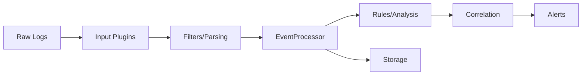

This documentation provides a comprehensive, practical reference for developers working with **rules for analysis** and **filters for data extraction, enrichment, and transformation** within the UTMStack v11 ecosystem powered by EventProcessor.

<Note>
**Target Audience**: This section is designed as a practical reference for developers implementing security detection logic and data transformation pipelines.
</Note>

---

## What is EventProcessor?

**EventProcessor** is UTMStack v11's revolutionary security event processing engine that **replaced Logstash** in the new architecture. Developed by ThreatWinds, it provides:

- **Drastically reduced resource usage** compared to Logstash
- **Improved log processing speed**
- **Plugin-based architecture** for extensibility
- **Real-time correlation** before data ingestion
- **Native security analysis** capabilities

<Info>
**New in v11**: EventProcessor is the core component that processes all security events through a flexible plugin system, enabling UTMStack to scale horizontally and process data in parallel.
</Info>

---

## Architecture Overview

The EventProcessor and UTMStack v11 integration consists of several key components:

<CardGroup cols={2}>
  <Card title="EventProcessor Core" icon="pi pi-engine" iconAlign="left" content="Core engine that processes security events, loads plugins, and manages data flow" />
  
  <Card title="EventProcessor Plugins" icon="pi pi-puzzle-piece" iconAlign="left" content="Built-in plugins for input, parsing, and analysis tasks" />
  
  <Card title="UTMStack Plugins" icon="pi pi-plug" iconAlign="left" content="Integration plugins for cloud services, correlation, and notifications" />
  
  <Card title="go-sdk" icon="pi pi-code" iconAlign="left" content="Go SDK providing common functionality and interfaces" />
### Communication Architecture

EventProcessor uses a **plugin architecture** where:
- Plugins are **separate processes**
- Communication via **gRPC over Unix sockets**
- Allows **flexible and extensible** system
- New functionality added **without modifying core engine**

---

## Core Components

### 1. EventProcessor Plugins

Built-in plugins organized by function:

**Input Plugins**
- Collect or receive logs from external sources
- Examples: `http-input`, `grpc-input`

**Parsing Plugins**
- Extract, enrich, and transform logs
- Examples: `add`, `cast`, `csv`, `delete`, `expand`, `grok`, `json`, `kv`, `reformat`, `rename`, `trim`

**Analysis Plugins**
- Process logs to detect security attacks
- Generate alerts based on correlation rules

### 2. UTMStack Plugins

Integration and specialized plugins:

**Input Plugins**
- `aws`, `azure`, `gcp`, `o365`, `sophos`, `bitdefender`
- Custom data collection from various sources

**Parsing Plugins**
- `geolocation` - IP geolocation enrichment

**Analysis Plugins**
- `events` - Event processing and analysis

**Correlation Plugins**
- `alerts` - Alert correlation
- `soc-ai` - AI-powered analysis

**Notification Plugins**
- `stats` - Statistics and notifications

**Sidecar Plugins**
- `config` - Configuration management
- Background tasks for system health

---

## Rules vs Filters: Understanding the Difference

### Rules

<Accordion multiple={true}>
    <AccordionTab header="What are Rules?">

    **Rules** are YAML files that define **how to analyze events to detect security threats**.
    
    **Purpose**:
    - Detect security attacks and anomalies
    - Generate alerts when conditions are met
    - Correlate events across time windows
    - Deduplicate similar alerts
    
    **Used by**: Analysis plugin to generate security alerts
    
    **Example Use Cases**:
    - Brute force attack detection
    - Data exfiltration monitoring
    - Insider threat detection
    - Lateral movement detection
  
  </AccordionTab>
</Accordion>

### Filters

<Accordion multiple={true}>
    <AccordionTab header="What are Filters?">

    **Filters** are YAML files that define **how to extract and transform raw event data**.
    
    **Purpose**:
    - Parse raw log data into structured format
    - Extract relevant fields from logs
    - Normalize field names
    - Enrich data with additional context
    - Transform data types
    
    **Used by**: Parsing plugin to standardize events
    
    **Example Use Cases**:
    - Parse Apache access logs
    - Extract fields from Cisco ASA logs
    - Normalize Windows Event logs
    - Enrich with geolocation data
  
  </AccordionTab>
</Accordion>

---

## Data Flow Pipeline



### Processing Stages

  ### Data Collection

    Input plugins collect raw logs from various sources (agents, syslog, APIs)
  ### Parsing & Transformation

    Filters extract and transform raw data into standardized format using parsing plugins
  ### Event Processing

    EventProcessor routes events to appropriate plugins based on data type
  ### Security Analysis

    Rules analyze events to detect threats and generate alerts
  ### Alert Correlation

    Correlation plugins detect relationships between alerts
  ### Notification & Storage

    Alerts are stored and notifications sent to configured systems
---

## Key Features

### Plugin-Based Architecture

<CardGroup cols={2}>
  <Card title="Modular Design" icon="pi pi-blocks" iconAlign="left" content="Each plugin serves a specific purpose in the processing pipeline" />
  
  <Card title="Independent Processes" icon="pi pi-server" iconAlign="left" content="Plugins run as separate processes, improving stability" />
  
  <Card title="gRPC Communication" icon="pi pi-comments" iconAlign="left" content="Fast, efficient communication via gRPC over Unix sockets" />
  
  <Card title="Hot Swappable" icon="pi pi-sync" iconAlign="left" content="Add or update plugins without restarting core engine" />
### Real-Time Correlation

<Info>
**UTMStack's Advantage**: Correlation happens **before data ingestion**, reducing workload and improving response times compared to traditional SIEM systems.
</Info>

### Horizontal Scalability

With v11's manager-worker architecture:
- Add worker nodes to scale processing capacity
- Distribute plugins across workers
- Linear performance scaling
- No single point of failure

---

## Developer Tools: go-sdk

The **go-sdk** provides essential functionality for plugin development:

### Key Components

**Protocol Buffers Definition**
```
plugins/plugins.proto
```
Defines messages and services for plugin communication

**Configuration Management**
```
plugins/config.go
```
Provides configuration functionality for plugins

**Expression Language (CEL)**
```
plugins/cel.go
```
Common Expression Language support for rules

---

## File Structure

### Rules Directory Structure

```
rules/
├── authentication/
│   ├── brute_force.yaml
│   └── failed_login.yaml
├── network/
│   ├── port_scan.yaml
│   └── data_exfiltration.yaml
└── malware/
    └── malicious_file.yaml
```

### Filters Directory Structure

```
filters/
├── apache/
│   └── access_log.yaml
├── cisco/
│   ├── asa.yaml
│   └── firepower.yaml
└── windows/
    └── event_log.yaml
```

---

## Rule and Filter Basics

### Rule Structure (Simplified)

```yaml
- id: 1
  dataTypes:
    - windows
  name: Suspicious Login
  where: failed_login_count > 5
  afterEvents:
    - indexPattern: v11-log-*
      with:
        - field: origin.ip
          operator: filter_term
          value: '{{origin.ip}}'
      within: now-1h
      count: 5
```

### Filter Structure (Simplified)

```yaml
pipeline:
  - dataTypes:
      - apache
    steps:
      - json:
          source: raw
      - grok:
          patterns:
            - fieldName: origin.ip
              pattern: '{{.ipv4}}'
          source: log.message
      - cast:
          fields:
            - statusCode
          to: int
```

---

## Development Workflow

  ### Understand the Requirement

    Identify what security threat to detect (rules) or what data source to parse (filters)
  ### Examine Sample Data

    Collect and analyze sample events or logs
  ### Create YAML Definition

    Write rule or filter using appropriate syntax
  ### Test Locally

    Test with sample data in development environment
  ### Deploy

    Deploy to UTMStack and monitor performance
  ### Refine

    Adjust based on real-world results and feedback
---

## Best Practices

### For Rules

<Check>
- **Start simple** and refine based on results
- **Test thoroughly** with various event types
- **Use clear descriptions** and references
- **Consider performance** impact of complex expressions
- **Implement deduplication** to prevent alert fatigue
</Check>

### For Filters

<Check>
- **Standardize field names** across all filters
- **Remove unnecessary fields** to reduce storage
- **Handle edge cases** and malformed data gracefully
- **Document complex patterns** with comments
- **Test with real production data** samples
</Check>

---

## Performance Considerations

### Optimization Tips

**Rules Optimization**
- Limit data types to reduce evaluation overhead
- Use efficient CEL expressions
- Limit afterEvents search windows
- Implement proper deduplication

**Filters Optimization**
- Apply steps conditionally when possible
- Remove fields early in pipeline
- Use efficient parsing methods (grok patterns)
- Avoid unnecessary transformations

### Resource Management

<CardGroup cols={2}>
  <Card title="CPU Usage" icon="pi pi-microchip" iconAlign="left" content="Complex rules and filters consume more CPU     - Monitor CPU usage per plugin     - Optimize expressions and patterns" />
  
  <Card title="Memory Usage" icon="pi pi-memory" iconAlign="left" content="Large event volumes require more memory     - Set appropriate buffer sizes     - Clean up unnecessary data early" />
---

## Getting Started

Ready to start developing rules and filters?

<CardGroup cols={2}>
  <Card title="Implementing Rules" icon="pi pi-shield" iconAlign="left" href="/v11/rules-and-filters/implementing-rules" content="Learn how to create correlation rules to detect security threats" />
  
  <Card title="Implementing Filters" icon="pi pi-filter" iconAlign="left" href="/v11/rules-and-filters/implementing-filters" content="Learn how to create filters for data extraction and transformation" />
  
  <Card title="Custom Plugins" icon="pi pi-plug" iconAlign="left" href="/v11/rules-and-filters/custom-plugins" content="Develop custom plugins to extend EventProcessor functionality" />
  
  <Card title="Best Practices" icon="pi pi-star" iconAlign="left" href="/v11/rules-and-filters/best-practices" content="Learn optimization techniques and common patterns" />
---

## Community and Support

<CardGroup cols={2}>
  <Card title="GitHub Repository" icon="pi pi-github" iconAlign="left" href="https://github.com/utmstack/UTMStack" content="View source code and contribute" />
  
  <Card title="Rules Repository" icon="pi pi-git" iconAlign="left" href="https://github.com/utmstack/rules" content="Community correlation rules" />
  
  <Card title="Discord Community" icon="pi pi-discord" iconAlign="left" href="https://discord.gg/ZznvZ8xcHh" content="Get help from the community" />
  
  <Card title="Documentation" icon="pi pi-book" iconAlign="left" href="https://documentation.utmstack.com/v11/introduction" content="Browse complete documentation" />
---

## Next Steps

<Note>
This section provides a **practical developer reference**. Each guide includes real-world examples, code snippets, and best practices for implementing security detection and data transformation in UTMStack v11.
</Note>

Continue to the specific guides:
- **[Implementing Rules](/v11/rules-and-filters/implementing-rules)** - Comprehensive rule development guide
- **[Implementing Filters](/v11/rules-and-filters/implementing-filters)** - Complete filter creation reference
- **[Custom Plugin Development](/v11/rules-and-filters/custom-plugins)** - Extend EventProcessor with custom plugins
